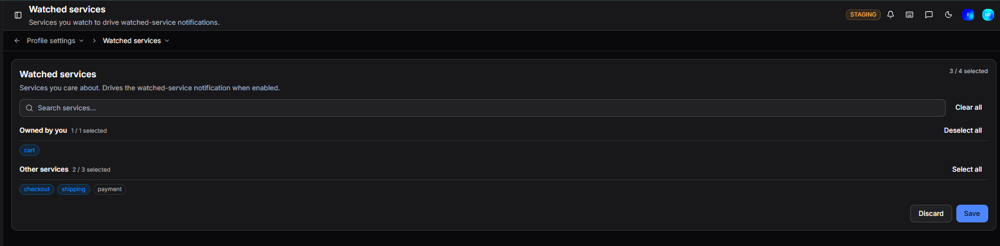

# Watched Services

Services you watch to drive watched-service notifications. Navigate to **Profile settings > Watched services** to open it.

Select the services you want to watch. When a watched service has an incident, you will receive a notification if that notification type is enabled in [Notifications](notifications.md).

Services are grouped into two sections:

| Section | Description |
|---|---|
| **Owned by you** | Services where you are listed as an owner |
| **Other services** | All other services in your organisation |

Use **Select all** or **Deselect all** on each group to bulk-select, or **Clear all** to deselect everything. A counter shows how many are currently selected out of the total available.

Click **Save** to apply changes or **Discard** to cancel.

!!! question "Need more help?"
    Contact support in the chat bubble and let us know how we can assist.
