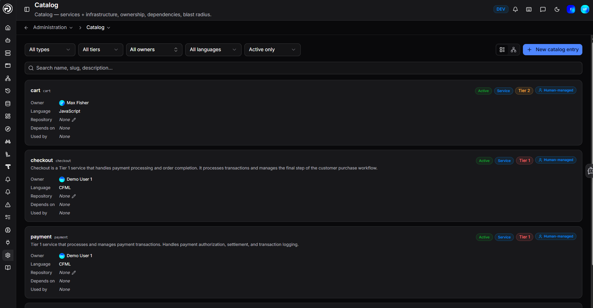
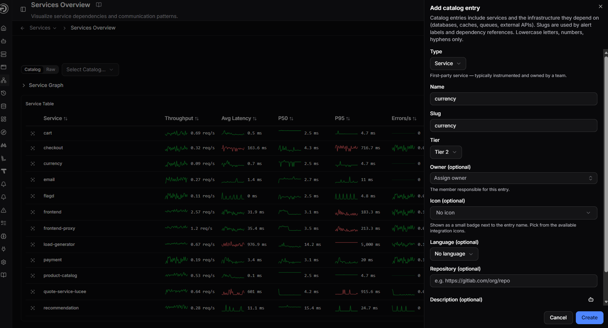
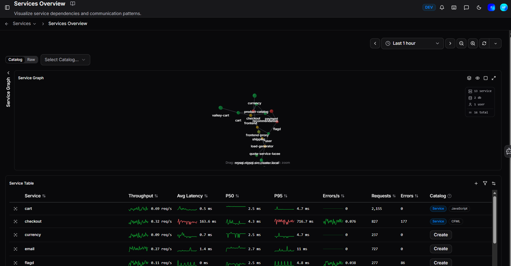

# Service Catalog

The Service Catalog is a persistent record of everything you run - your services and the infrastructure they depend on. Unlike the Services overview, which only shows what is currently sending telemetry, the catalog tracks entries whether they are active or quiet. It gives every service an owner, a tier, and a home, so when something breaks at 2am, nobody has to guess who to contact or what is affected.

The catalog also powers incident response: affected services on an incident link directly to their catalog entries, runbooks surface based on catalog service matches, and Analytics surfaces which catalog entries appear most frequently in incidents.

## Adding a catalog entry

You can add entries from two places:

**From Administration > Catalog** - click **+ New catalog entry** to open the form.

**From the Services overview** - the Service Table includes a **Catalog** column. Any service appearing in your telemetry that does not yet have a catalog entry shows a **Create** button. Click it to register the service directly from where you spotted it.

## Entry fields

| Field | Description |
|---|---|
| **Type** | The kind of entry - see [Entry types](#entry-types) |
| **Name** | The display name for the entry |
| **Slug** | A unique identifier using lowercase letters, numbers, and hyphens only. Used by alert labels and dependency references. |
| **Tier** | The criticality tier of the service |
| **Owner** | The team member responsible for this entry (optional) |
| **Icon** | A badge shown next to the entry name, picked from available integration icons (optional) |
| **Language** | The primary language the service is built in (optional) |
| **Repository** | A link to the service's source repository (optional) |
| **Description** | Any additional context about the entry (optional) |

The slug is the key linking mechanism - it connects alert labels, runbook attachments, and incident services to the correct catalog entry, so choose something stable and unambiguous.

## Entry detail view

Clicking an entry opens its detail page, which shows the full picture for that service:

### Dependencies

The **Dependencies** panel maps the relationships between catalog entries:

- **Depends on (upstream)** - the services and infrastructure this entry relies on
- **Used by (downstream)** - the services that depend on this one, directly or transitively

The downstream view is particularly valuable during incidents. If a service is affected, everything listed under Used by could also be impacted - giving you an immediate blast radius picture without having to trace dependencies manually.

### Metadata

The **Metadata** panel lets you attach custom key/value data to an entry - anything your team finds useful that does not fit the standard fields. Click **Add** to create a new key/value pair.

### Runbooks

The **Runbooks** panel shows which runbooks are currently attached to this catalog entry. These are the runbooks that will surface automatically on incidents affecting this service. See [Runbooks](../Features/Incidents/runbooks.md) for how to create and attach them.

### Watching an entry

Click the eye icon on the entry detail page to follow a service. This opens **Administration > Preferences > Services** where you can confirm your watched services selection and save. You will then receive a notification any time that service is directly affected by an incident or falls within its blast radius. See [Notifications](../Features/Notifications/notifications.md) for more.

### Entry types

| Type | Description |
|---|---|
| **Service** | A first-party service - typically instrumented and owned by a team |
| **Database** | A database dependency |
| **Messaging** | A message queue or event bus |
| **Cache** | A caching layer |
| **External** | A third-party or external API dependency |

### Languages

Supported language options: .NET, C++, CFML, Erlang, Go, Java, JavaScript, PHP, Python, Ruby, Rust, Swift.

## Managing entries

### Filtering and search

Use the filters at the top of the catalog page to narrow entries by type, tier, owner, language, or status. The search bar matches against name, slug, and description.

By default the catalog shows active entries only. Switch to **All entries** or **Deprecated only** using the status filter.

### Deprecating an entry

When a service is retired, mark it as deprecated rather than deleting it. This keeps the historical record intact while removing it from the default active view. Point deprecated entries to their replacements to keep the catalog accurate as your system evolves.

## Catalog in the Services overview

The Services overview has a **Catalog / Raw** toggle on the service graph. Catalog view enriches each node with its catalog details alongside the live metrics. Raw view shows telemetry data only.

The **Select Catalog** dropdown filters the graph and table to a specific catalog entry.

Services that appear in your telemetry but are not yet in the catalog show a **Create** button in the Catalog column of the Service Table - a quick way to fill gaps as you work.

---

!!! question "Need more help?"
    Contact support in the chat bubble and let us know how we can assist.
