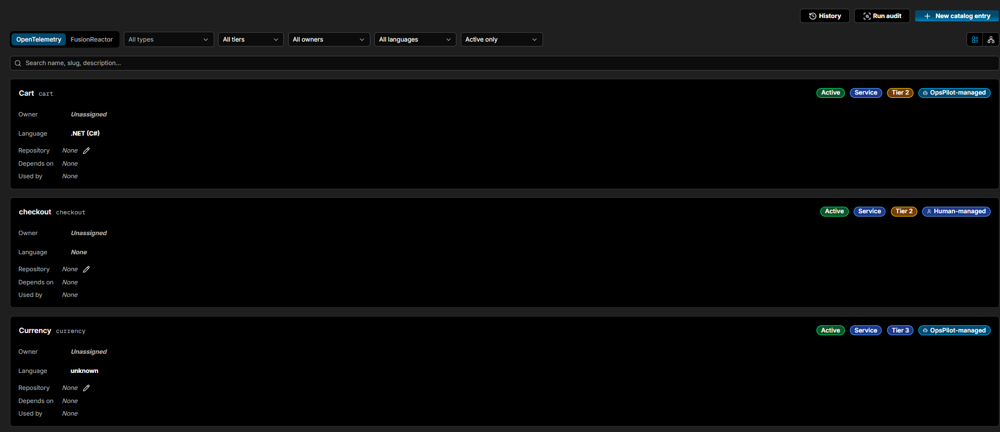
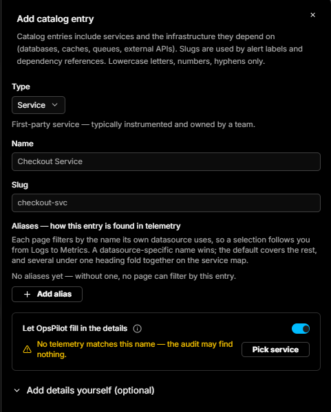
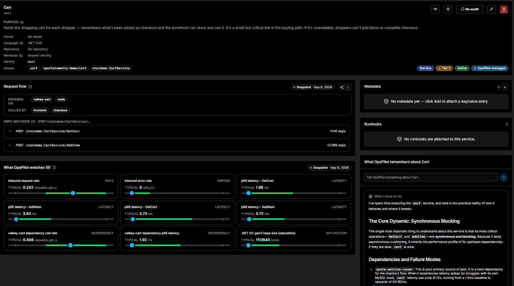
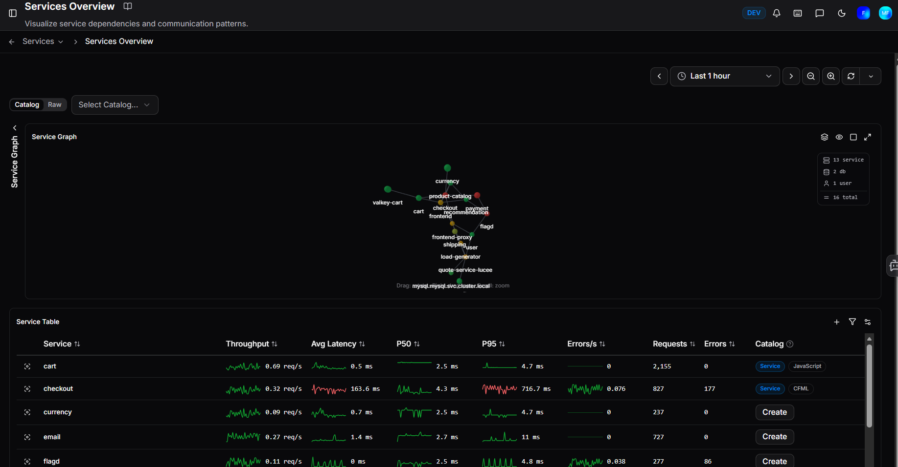

# Service Catalog

The Service Catalog is a persistent record of everything you run - your services and the infrastructure they depend on. Unlike the Services overview, which only shows what is currently sending telemetry, the catalog tracks entries whether they are active or quiet. It gives every service an owner, a tier, and a home, so when something breaks at 2am, nobody has to guess who to contact or what is affected.

The catalog is also the brain behind Coworker. When Coworker investigates an alert or runs a check, it draws on catalog entries to understand what a service does, who owns it, what it depends on, and what has happened to it before. That pre-loaded context means Coworker spends fewer AI Tokens rediscovering information it could already know - and produces better investigations as a result. The more complete your catalog, the more effective Coworker becomes.

The catalog also powers incident response: affected services on an incident link directly to their catalog entries, runbooks surface based on catalog service matches, and Analytics surfaces which catalog entries appear most frequently in incidents.

## Adding a catalog entry

You can populate the catalog three ways:

1. **Run an audit** - click **Run audit** at the top of the catalog page to re-discover services from your telemetry. This is the same discovery Coworker offers during [onboarding](../../Data-insights/Features/OpsPilot/Coworker/getting-started.md).

    - Coworker **creates catalog entries** for services that aren't cataloged yet, and **refreshes the existing entries you select**.
    - A confirmation dialog (**Audit service catalog**) notes that it runs in the background and shows the estimated **OpsPilot AI Token** usage per service. Click **Audit everything** to run it, or **Cancel**.
    - When it finishes, a green banner reports the result. Click **History** to open the audit history panel, which lists every audit this billing period - what each one audited or updated, when, and its **OpsPilot AI Token** cost - with each entry expandable for detail.

    !!! info "Your initial catalog creation is included"
        Creating your catalog for the first time is part of getting you set up. OpsPilot covers the cost of the initial creation, so it does not use your AI Token allowance.

        Any catalog audits you manually trigger afterwards - for example, to discover new services or refresh existing entries - use your [AI Token allowance](../../Data-insights/Features/OpsPilot/Coworker/usage.md#ai-token-allowance). This is why the audit dialog shows an estimated AI Token cost per service.

    A service needs enough telemetry for Coworker to catalog it - very quiet or barely-instrumented services may not be picked up.

2. **From the Catalog page** - click **+ New catalog entry** to open the form.

3. **From the Services overview** - the Service Table includes a **Catalog** column. Any service appearing in your telemetry that does not yet have a catalog entry shows a **Create** button. Click it to register the service directly from where you spotted it.

Each entry shows how it is maintained:

| Label | Meaning |
|---|---|
| **Human-managed** | Created or edited by a person. Its details stay exactly as you set them |
| **OpsPilot-managed** | Discovered by an audit, or a human-managed entry switched over. OpsPilot keeps these entries updated periodically with the latest details - for any field that isn't locked |

On an entry's detail page, click **Let OpsPilot manage** to hand it over. OpsPilot is then free to refresh aliases, type, and other auto-populated fields - but only where it has new evidence, and your current edits are preserved. The entry switches back to **Human-managed** the next time someone edits a field. Use **Re-audit** to re-run discovery for that single entry.

## Entry fields

An entry starts with its **Type**, **Name**, and **Slug**, plus **Aliases** that tell OpsPilot how to find it in your telemetry. Leave **Let OpsPilot fill in the details** on to have an audit populate the remaining fields (use **Pick service** to match it to observed telemetry), or expand **Add details yourself** to set them by hand.

| Field | Description |
|---|---|
| **Type** | The kind of entry - see [Entry types](#entry-types) |
| **Name** | The display name for the entry |
| **Slug** | A unique identifier using lowercase letters, numbers, and hyphens only. Used by alert labels and dependency references. |
| **Aliases** | The names this entry goes by in telemetry, so pages can filter to it. Each datasource may use a different name - a datasource-specific alias wins, and several under one heading fold together on the service map. Without an alias, no page can filter by the entry |
| **Tier** | The criticality tier of the service |
| **Owner** | The team member responsible for this entry (optional) |
| **Icon** | A badge shown next to the entry name, picked from available integration icons (optional) |
| **Language** | The primary language the service is built in (optional) |
| **Repository** | A link to the service's source repository (optional) |
| **Description** | Any additional context about the entry (optional) |

The slug is the key linking mechanism - it connects alert labels, runbook attachments, and incident services to the correct catalog entry, so choose something stable and unambiguous.

## Entry detail view

Clicking an entry opens its detail page, which shows the full picture for that service. The header carries a **Purpose** summary and the entry's key fields - **Owner**, **Language**, **Repository**, **Workload**, **Identity**, and **Aliases** - alongside its badges, with actions to watch it (eye icon), open its settings, **Re-audit**, edit, or delete. For a human-managed entry, a **Let OpsPilot manage** action also appears.

### Request flow

The **Request flow** panel maps the operations and dependencies OpsPilot has observed for the service from its telemetry, captured as a dated **Snapshot**:

- **Depends on** - the services and infrastructure this entry relies on
- **Called by** - the services that call this one, directly or transitively

It also lists the service's **operations** - for example gRPC or HTTP methods - with their observed request rates.

The Called-by view is particularly valuable during incidents. If a service is affected, everything listed under Called by could also be impacted - giving you an immediate blast radius picture without having to trace dependencies manually.

Until OpsPilot has seen the service in telemetry, the panel shows *"OpsPilot hasn't observed any operations or dependencies for this service yet."*

### What OpsPilot watches

The **What OpsPilot watches** panel shows the health signals OpsPilot monitors for the service - the same baselines that power [Heartbeat](../../Data-insights/Features/OpsPilot/Coworker/heartbeat.md). Each card names a signal and its category (**rate**, **errors**, **latency**, **dependency**, or **saturation**), with a **TYPICAL** value and a bar showing the signal's normal range. Examples include inbound request and error rates, p95 and p99 latency per operation, dependency call rates and latencies, and runtime saturation such as GC heap size. Like the request flow, it is captured as a dated **Snapshot**.

### Metadata

The **Metadata** panel lets you attach custom key/value data to an entry - anything your team finds useful that does not fit the standard fields. Click **Add** to create a new key/value pair.

### Runbooks

The **Runbooks** panel shows which runbooks are currently attached to this catalog entry. These are the runbooks that will surface automatically on incidents affecting this service. See [Runbooks](../../Data-insights/Features/Incidents/runbooks.md) for how to create and attach them.

### What OpsPilot remembers

The **What OpsPilot remembers about [service]** panel shows what Coworker has learned about the service over time, written up as a **What I know so far** narrative - the practical reality of how the service behaves and where it breaks, covering its core dynamics, dependencies, and failure modes. Type in the **Tell OpsPilot something about [service]** box to add context yourself. See [Coworker Knowledge](../../Data-insights/Features/OpsPilot/Coworker/knowledge.md) for how memory works.

### Watching an entry

Click the eye icon on the entry detail page to follow a service. This opens your [watched services](../Account/Cloud/watched-services.md) settings, where you can confirm your selection and save. You will then receive a notification any time that service is directly affected by an incident or falls within its blast radius. See [Notifications](../../Data-insights/Features/Notifications/notifications.md) for more.

### Entry types

| Type | Description |
|---|---|
| **Service** | A first-party service - typically instrumented and owned by a team |
| **Database** | A database dependency |
| **Messaging** | A message queue or event bus |
| **Cache** | A caching layer |
| **External** | A third-party or external API dependency |

### Languages

Supported language options: .NET, C++, CFML, Erlang, Go, Java, JavaScript, PHP, Python, Ruby, Rust, Swift.

## Managing entries

### Filtering and search

Use the filters at the top of the catalog page to narrow entries by type, tier, owner, language, or status. The search bar matches against name, slug, and description.

By default the catalog shows active entries only. Switch to **All entries** or **Deprecated only** using the status filter.

Two further controls sit above the entries: an **OpenTelemetry / FusionReactor** switch that scopes the catalog by data source - your OpenTelemetry services, or the FusionReactor server and application structure - and a **list / graph** view toggle in the top right that swaps between the entry list and a dependency graph of the catalog.

### Deprecating an entry

When a service is retired, mark it as deprecated rather than deleting it. This keeps the historical record intact while removing it from the default active view. Point deprecated entries to their replacements to keep the catalog accurate as your system evolves.

## Catalog in the Services overview

The Services overview has a **Catalog / Raw** toggle on the service graph. Catalog view enriches each node with its catalog details alongside the live metrics. Raw view shows telemetry data only.

The **Select Catalog** dropdown filters the graph and table to a specific catalog entry. On the observability dashboards, this selection is pre-filled from your [watched services](../Account/Cloud/watched-services.md), so the catalog entries you care about are chosen automatically.

Services that appear in your telemetry but are not yet in the catalog show a **Create** button in the Catalog column of the Service Table - a quick way to fill gaps as you work.

---

!!! question "Need more help?"
    Contact support in the chat bubble and let us know how we can assist.
