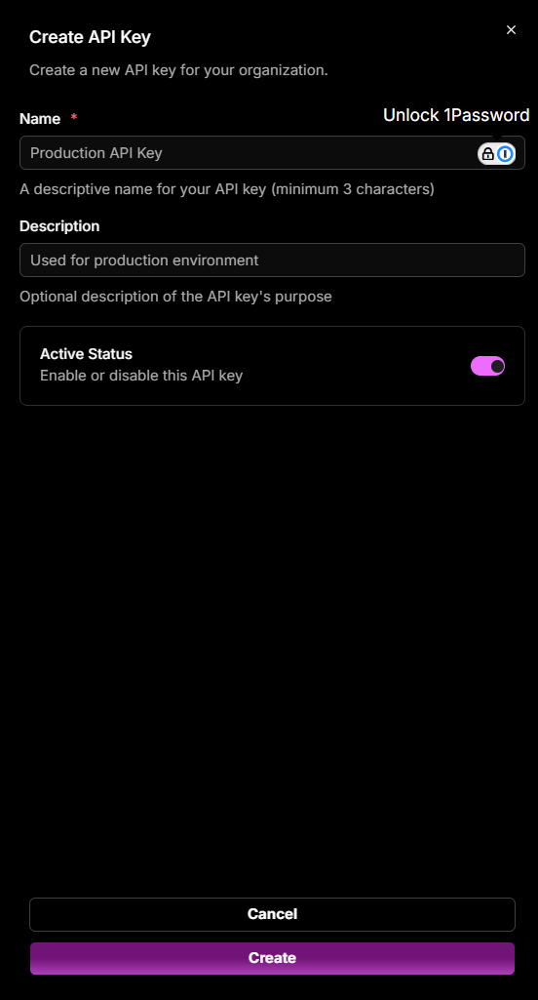

# API Keys

The **API Keys** page lets you manage access credentials used by services and agents to communicate with OpsPilot.

## Viewing & managing keys

Each listed API key displays:

| Field | Description |
|---|---|
| **Name** | A user-defined label for the key |
| **Description** | A short explanation of the key's purpose |
| **Status toggle** | Temporarily enable or disable the key |
| **Copy icon** | Copies the key value to your clipboard |
| **Actions (...)** | Edit the key's name or description, or permanently remove it |

!!! note
    Deleting a key immediately revokes access for anything using it.

## Creating a new key

Click **+ Create API Key** to open the create form:

1. Enter a **Name** (required, minimum 3 characters).
2. Enter a **Description** (optional).
3. Leave **Active Status** enabled to activate the key immediately, or toggle it off to create it disabled.
4. Click **Create**.

Copy the key immediately after creation - it will not be shown again in full.

---

!!! question "Need more help?"
    Contact support in the chat bubble and let us know how we can assist.
