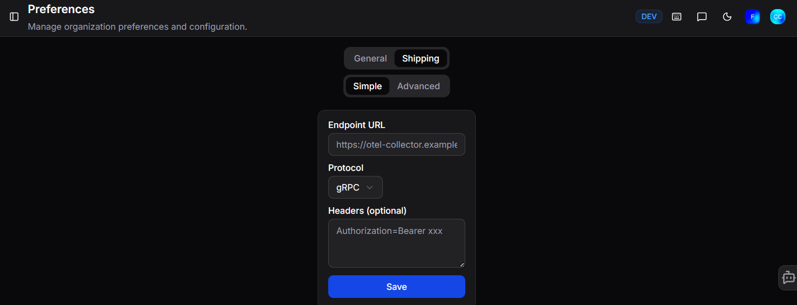
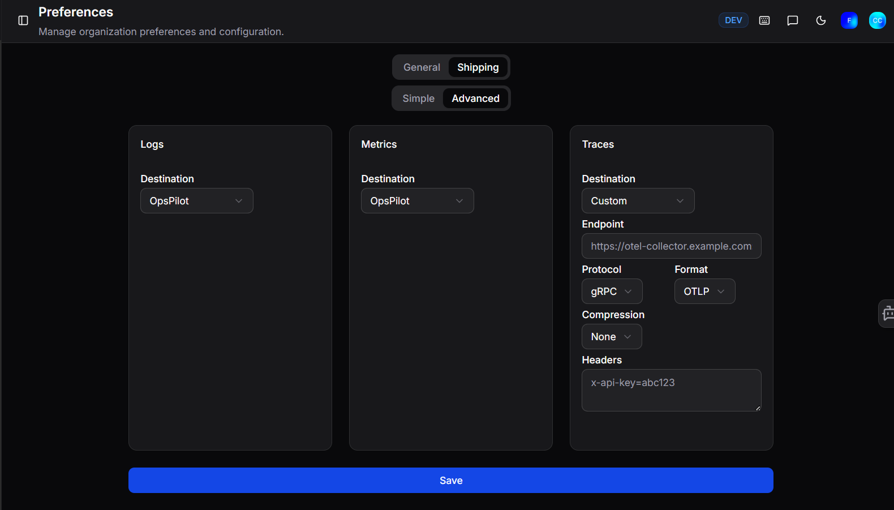

# Shipping

Configure where the FusionReactor agent sends its telemetry data. Navigate to **Data and Licenses > Shipping** to open it.

By default the agent ships to OpsPilot, but you can configure it to send to any OTel-compatible provider - such as Datadog, Grafana Cloud, or your own OTel collector.

!!! note
    Shipping is only available if Metric Shipping is included on your plan.

## Simple

Configure a single destination for all signal types:

| Field | Description |
|---|---|
| **Endpoint URL** | The destination URL for your OTel collector (e.g. `https://otel-collector.example.com`) |
| **Protocol** | The transport protocol - **gRPC** or **HTTP** |
| **Headers** (optional) | Any authentication headers required by your collector (e.g. `Authorization=Bearer xxx`) |

## Advanced

Configure a separate destination for each signal type - **Logs**, **Metrics**, and **Traces** can each be sent to a different endpoint. This is useful if you want to route different data types to different providers.

Set the **Destination** for each signal type:

| Option | Description |
|---|---|
| **OpsPilot** | Send the signal to OpsPilot (default) |
| **Custom** | Send to a third-party OTel-compatible endpoint |
| **Disabled** | Stop shipping that signal type entirely |

When **Custom** is selected, the following fields are available:

| Field | Description |
|---|---|
| **Endpoint** | The destination URL (e.g. `https://otel-collector.example.com`) |
| **Protocol** | The transport protocol - **gRPC** or **HTTP** |
| **Format** | The data format - **OTLP** |
| **Compression** | Optional compression - **None** or **gzip** |
| **Headers** | Any authentication headers (e.g. `x-api-key=abc123`) |

Click **Save** to apply your changes.

!!! info "OTel shipping endpoints"
    For a full list of provider-specific endpoints (Datadog, Grafana Cloud, etc.), see the [FusionReactor OTel shipping configuration](https://docs.fusionreactor.io/Monitor-your-data/FR-Agent/Configuration/OTel-shipping-config/).

!!! question "Need more help?"
    Contact support in the chat bubble and let us know how we can assist.
