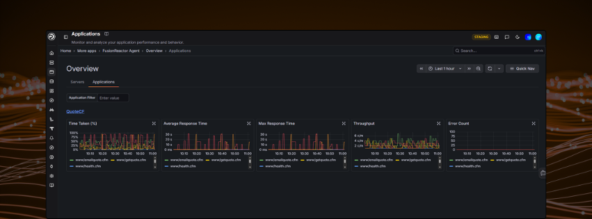

# Applications Overview

Monitor and analyze your application performance and behavior.

Navigate to **Applications** > **Applications Overview** from the left-hand sidebar to view performance metrics across all your instrumented applications.

---

## The applications table

Your instrumented applications are listed in a single **Applications** table, one row per application with its key metrics over the selected time range. Use the **Application Filter** to search for a specific application by name.

The metric columns show a sparkline alongside the current value:

| Column | Description |
|---|---|
| **Application** | The application name |
| **Span Name Count** | The number of distinct span (operation) names recorded for the application |
| **Top Time Taken** | The highest time-taken percentage among the application's operations |
| **Avg Response** | Average response time across all transactions |
| **Max Response** | The slowest response time recorded in the period |
| **Throughput** | Requests per minute (c/m) |
| **Errors/s** | Errors per second |
| **Catalog** | **Create** adds the application to your [Catalog](../../../Admin-and-data/Catalog/catalog.md) |

---

## Expanding an application

Click the arrow at the start of an application's row to expand it into five graphs, each breaking a metric down by span (operation) name over the selected time range:

- **Time Taken (%)**
- **Avg Response Time**
- **Max Response Time**
- **Throughput**
- **Errors/s**

A legend under each graph lists the operations (for example `www.getquote.cfm` and `www.health.cfm`). Hover over any graph to see the values at a specific point in time.

---

## Time range

Use the **time picker** in the top right to adjust the time range for all graphs on the page - it defaults to the **Last 1 hour**. You can also highlight a section of a graph to zoom into that timeframe, and **Clear all** resets the filters.

---

!!! question "Need more help?"
    Contact support in the chat bubble and let us know how we can assist.
