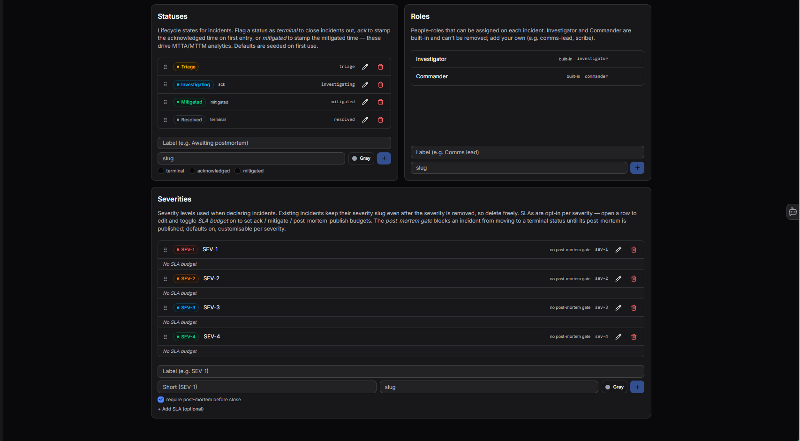

# Settings

Configure incident roles, statuses, and severities. Navigate to **Incidents > Settings** to open it.

## Statuses

Lifecycle states for incidents. These drive MTTA/MTTM analytics and defaults are seeded on first use.

Each status can be flagged with one or more behaviours:

| Flag | Effect |
|---|---|
| **terminal** | Closes the incident when this status is set |
| **acknowledged** | Stamps the acknowledged time on first entry - used for MTTA calculation |
| **mitigated** | Stamps the mitigated time - used for MTTM calculation |

Default statuses:

| Status | Flag | Slug |
|---|---|---|
| Triage | - | `triage` |
| Investigating | acknowledged | `investigating` |
| Mitigated | mitigated | `mitigated` |
| Resolved | terminal | `resolved` |

To add a status, enter a label, slug, and colour then click **+**. Existing statuses can be edited or deleted.

## Roles

People-roles that can be assigned on each incident. **Investigator** and **Commander** are built-in and cannot be removed. Add your own (e.g. comms-lead, scribe) by entering a label and slug then clicking **+**.

## Severities

Severity levels used when declaring incidents. Existing incidents keep their severity slug even after the severity is removed, so you can delete freely.

Default severities: **SEV-1**, **SEV-2**, **SEV-3**, **SEV-4**.

Options per severity:

- **SLA budget** - opt-in per severity. Toggle on when editing a row to set ack / mitigate / post-mortem-publish time budgets.
- **Post-mortem gate** - blocks an incident from moving to a terminal status until its post-mortem is published. On by default, customisable per severity.

To add a severity, enter a label, short name, slug, and colour then click **+**.

!!! question "Need more help?"
    Contact support in the chat bubble and let us know how we can assist.
