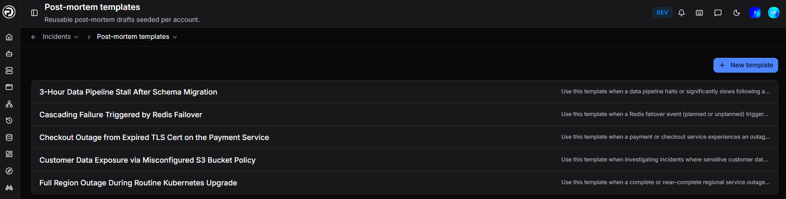
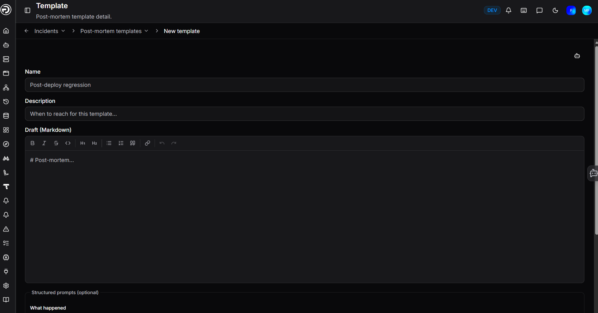

# Post-mortem templates

A good post-mortem is one that actually gets written. Templates remove the blank-page problem by giving your team a consistent structure to fill in rather than having to start from scratch when they are tired and ready to move on.

Consistent post-mortems also build institutional knowledge over time - the same sections, the same questions, the same level of detail - making it easier to spot patterns across incidents and demonstrate improvement to stakeholders.

Create a template once and it becomes available to select from the Post-mortem tab on any incident.

## Creating a template

Navigate to **Incidents > Post-mortem templates** and click **+ New template**.

| Field | Description |
|---|---|
| **Name** | A descriptive name for the template (e.g. Post-deploy regression) |
| **Description** | Guidance on when to reach for this template (optional) |
| **Draft** | The template body, written in Markdown. Use this for headings, standard sections, and boilerplate text your team fills in each time. |
| **Structured prompts** | Optional labelled fields - What happened, Impact, Root cause - that prompt writers to cover the key areas. |

Click **Create** to save the template.

## Using a template

When an incident is resolved, open the **Post-mortem** tab on the incident detail page and click **Choose a starting point**. Your saved templates appear as options alongside a blank page. Select one to open the editor pre-populated with the template content.

Write or edit the post-mortem in the Markdown editor, then export it when done. Exports are available as PDF, Markdown, or HTML.

## Managing templates

All templates are listed on the **Incidents > Post-mortem templates** page. Edit or delete any template at any time. Changes do not affect post-mortems already in progress on existing incidents.

---

!!! question "Need more help?"
    Contact support in the chat bubble and let us know how we can assist.
