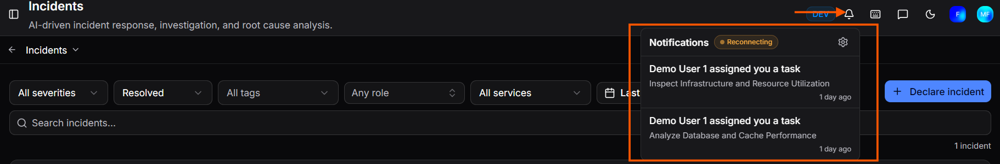
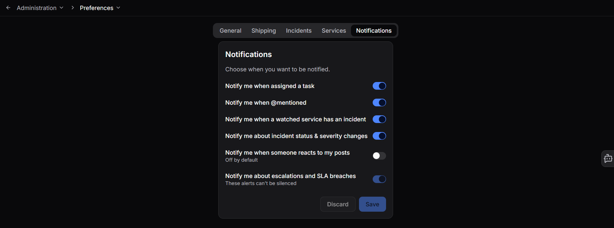

# Notifications

Notifications keep you informed about the things that matter without requiring you to constantly check in. You stay in control of what you hear about, so the signal stays useful rather than becoming noise. Access your notifications by clicking the bell icon in the top navigation bar.

Notifications currently focus on incidents - being pulled in at the right moment during a fast-moving situation can mean the difference between a quick resolution and a prolonged one. The system is built to expand over time as more notification types are added.

## What triggers a notification

| Trigger | Default |
|---|---|
| You are assigned a task | On |
| You are @mentioned on an incident timeline | On |
| A service you are watching has an incident | On |
| An incident you are involved in changes status or severity | On |
| Someone reacts to one of your posts | Off |
| An SLA is breached or an escalation occurs | On - cannot be silenced |

SLA breach and escalation notifications cannot be turned off. All others can be managed in your preferences.

## Managing your preferences

Click the gear icon in the notifications panel, or navigate to **Administration > Preferences > Notifications**, to toggle individual notification types on or off.

## Watching services

If you own or care about a particular service, you should know the moment it is caught up in an incident - not find out after the fact. Add services to your watched list in **Administration > Preferences > Services** and you will be notified any time a watched service is directly affected by an incident or falls within its blast radius.

The watched services list is split into two groups:

- **Owned by you** - services where you are set as the owner in the catalog. These are the services you are most likely to want to watch.
- **Other services** - services you do not own but want to follow.

You can also watch a service directly from its catalog entry page by clicking the eye icon. This takes you to the same preferences panel with that service pre-selected.

---

!!! question "Need more help?"
    Contact support in the chat bubble and let us know how we can assist.
