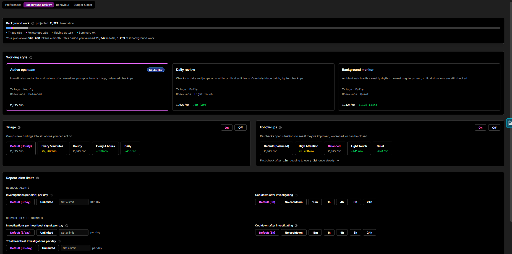

# Background activity

The **Background activity** tab controls the work Coworker does on its own - grouping new findings, re-checking open situations, and how often each runs. Turning this work down, or off, is the main lever for reducing ongoing AI Token spend without losing coverage of critical situations.

## Background work

The meter at the top projects how many AI Tokens your current background settings will use per month, broken down across **Follow-ups**, **Tidying up**, **Triage**, and **Summary**. Below it you can see your plan allowance and this period's usage - both the total used and the portion spent on background work - so you can gauge the impact of a change before you commit to it.

## Working style

Working style presets set your triage frequency and check-up cadence together, so you can pick a rhythm in one click rather than tuning each control by hand:

| Preset | Behaviour | Triage | Check-ups |
|---|---|---|---|
| **Active ops team** | Investigates and actions situations of all severities promptly | Hourly | Balanced |
| **Daily review** | Checks in daily and jumps on anything critical as it lands. One daily triage batch, lighter checkups | Daily | Light Touch |
| **Background monitor** | Ambient watch with a weekly rhythm. Lowest ongoing spend; critical situations are still checked | Daily | Quiet |

Selecting a preset fills in the **Triage** and **Follow-ups** controls below. You can still override either one individually afterwards.

## Triage

Triage groups new findings into situations you can act on. Use the **On / Off** toggle to pause it - while paused, findings keep accumulating and are swept up the next time you turn it back on.

Frequency options: **Every 5 minutes**, **Hourly** (default), **Every 4 hours**, or **Daily**.

## Follow-ups

Follow-ups re-check open situations to see whether they have improved, worsened, or can be closed. Use the **On / Off** toggle to pause them - while paused, open situations are not re-checked and none will close on their own until you turn this back on.

Cadence options: **High Attention**, **Balanced** (default), **Light Touch**, or **Quiet**. Each mode eases off over time - the panel shows the resulting schedule, for example *"First check after 12m, easing to every 2d once steady."*

## Repeat-alert limits

These limits stop Coworker from repeatedly investigating the same signal and running up spend. They are split into two groups.

**Webhook alerts**

| Control | Description |
|---|---|
| **Investigations per alert, per day** | How many times Coworker will investigate a single alert in a day: **3/day** (default), **Unlimited**, or a custom limit you set |
| **Cooldown after investigating** | How long to wait before investigating the same alert again: **8h** (default), **No cooldown**, **15m**, **1h**, **4h**, **8h**, or **24h** |

**Service health signals**

These apply to [Heartbeat](../heartbeat.md) signals - the silent, catalog-based health checks Coworker runs in the background:

| Control | Description |
|---|---|
| **Investigations per heartbeat signal, per day** | How many times Coworker will investigate a single heartbeat signal in a day: **3/day** (default), **Unlimited**, or a custom limit |
| **Cooldown after investigating** | How long to wait before investigating the same heartbeat signal again: **8h** (default), **No cooldown**, **15m**, **1h**, **4h**, **8h**, or **24h** |
| **Total heartbeat investigations per day** | A cap on heartbeat investigations across all signals combined: **30/day** (default), **Unlimited**, or a custom limit |

## Summary

Controls how often the standup line on your home page is rewritten. Options: **Every 6h**, **Every 12h**, or **Every 24h**.

---

!!! question "Need more help?"
    Contact support in the chat bubble and let us know how we can assist.
