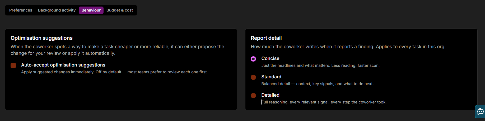

# Behavior

Adjust how Coworker investigates and communicates across your organisation.

## Report detail

Controls how much Coworker writes when it reports a finding. Applies to every task in your organisation.

| Mode | Description |
|---|---|
| **Concise** | Just the headlines and what matters. Less reading, faster scan |
| **Standard** | Balanced detail - context, key signals, and what to do next |
| **Detailed** | Full reasoning, every relevant signal, every step Coworker took |

## Optimisation suggestions

When Coworker spots a way to make a task cheaper or more reliable, it can either propose the change for your review or apply it automatically.

**Auto-accept optimisation suggestions** - apply suggested changes immediately. Off by default; most teams prefer to review each one first.

---

!!! question "Need more help?"
    Contact support in the chat bubble and let us know how we can assist.
