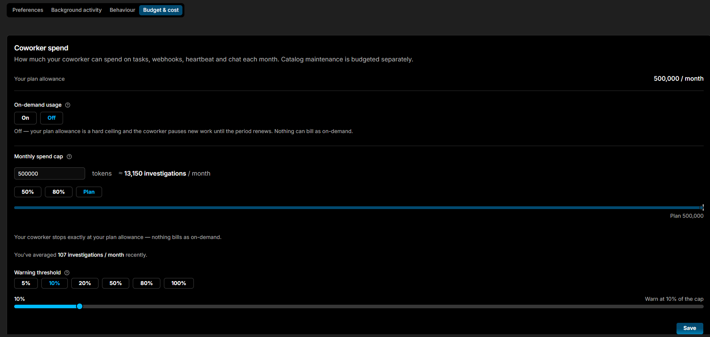

# Budget & cost

The **Budget & cost** tab is a single **Coworker allowance** card that controls how much Coworker can spend each month and what happens as it approaches the limit. The allowance covers tasks, webhooks, heartbeat, and chat; catalog maintenance is budgeted separately.

| Control | Description |
|---|---|
| **Your plan allowance** | Your organisation's total monthly AI Token allowance (read-only) |
| **Coworker's share** | The portion of the plan allowance Coworker may spend. Enter a token amount - the panel shows the approximate number of investigations that buys per month, alongside your recent monthly average for comparison |
| **On-demand usage** | **On / Off**, off by default. When on, Coworker keeps working past the allowance instead of holding off until the period renews. Turning it on reveals a **Stop after** field - a hard cap on the extra tokens Coworker may use beyond the allowance, shown with its equivalent cost and approximate investigation count |
| **Warning threshold** | Sends a notification when spend reaches this percentage of the allowance. Pick a preset (5%-100%) or drag the slider. Defaults to 80% |
| **Halt threshold** | Coworker holds off on new work when spend reaches this percentage of the allowance. Pick a preset (5%-100%) or drag the slider. Defaults to 100% |

!!! warning "On-demand usage can exceed your allowance"
    With **On-demand usage** on, Coworker keeps spending past your allowance until the period renews. Set a **Stop after** cap to bound the extra cost.

Click **Save** to apply your changes. See [AI Tokens](../usage.md#ai-token-allowance) for full usage details and optimisation suggestions.

---

!!! question "Need more help?"
    Contact support in the chat bubble and let us know how we can assist.
