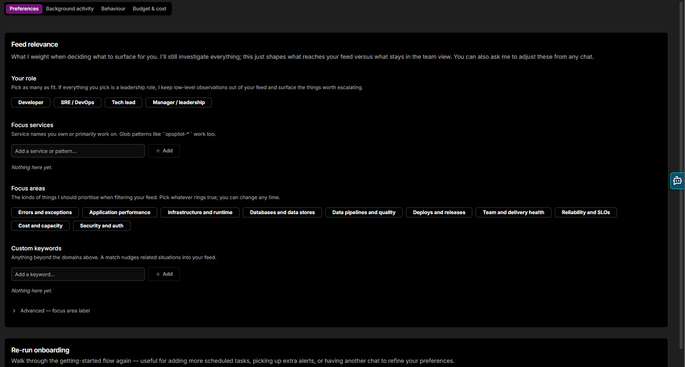

# Preferences

The **Preferences** tab controls what reaches your personal feed. It has two cards: **Feed relevance** and **Re-run onboarding**.

## Feed relevance

Feed relevance shapes what reaches your personal feed without changing what Coworker investigates. Coworker still investigates everything - this just controls what surfaces for you versus what stays in the team view. You can also ask Coworker to adjust these from any chat.

| Setting | Description |
|---|---|
| **Your role** | Pick as many roles as fit: Developer, SRE / DevOps, Tech lead, or Manager / leadership. If every role you pick is a leadership one, Coworker keeps low-level observations out of your feed and surfaces only the things worth escalating |
| **Focus services** | Service names you own or primarily work on. Glob patterns like `opspilot-*` work too. Situations affecting these services are prioritised in your feed |
| **Focus areas** | The kinds of things Coworker should prioritise when filtering your feed: Errors and exceptions, Application performance, Infrastructure and runtime, Databases and data stores, Data pipelines and quality, Deploys and releases, Team and delivery health, Reliability and SLOs, Cost and capacity, Security and auth |
| **Custom keywords** | Anything beyond the domains above. A match nudges related situations into your feed |
| **Advanced - focus area label** | A free-form team or area label that boosts situations tagged with it (e.g. `payments`, `platform infra`). Usually filled in automatically when you mention it during onboarding; set directly here if needed |

## Re-run onboarding

Click **Open onboarding** to walk through the getting-started flow again. Useful for adding more scheduled tasks, picking up extra alerts, or having another chat to refine your preferences. Re-running does not delete anything you already have - your tasks, situations, alert subscriptions, and preferences stay in place. You can opt into more from the takeover, or skip straight to the chat.

---

!!! question "Need more help?"
    Contact support in the chat bubble and let us know how we can assist.
