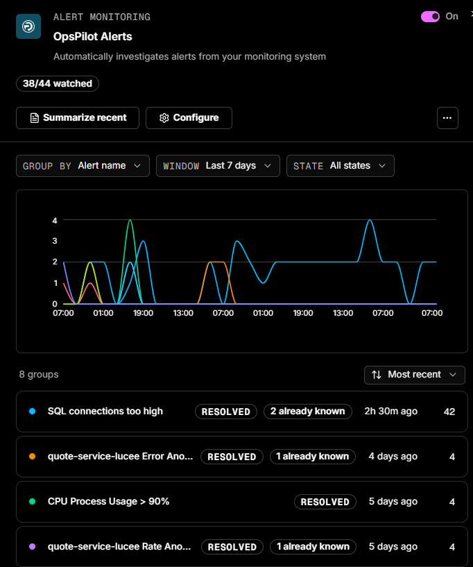
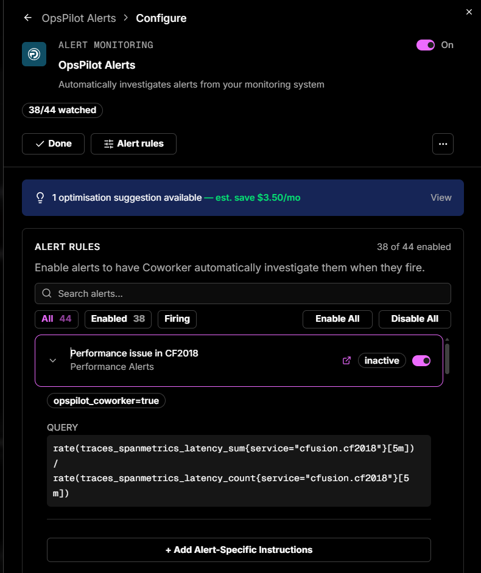

# Event sources

Event sources let Coworker react the moment something happens in another tool - a deploy, an incident, an external alert - and investigate it straight away, rather than waiting for the next scheduled run. They listen for webhooks from external systems and kick off an investigation on each event.

---

## OpsPilot Alerts

One event source is always present for every user: **OpsPilot Alerts**. It lets Coworker investigate your alerts the moment they fire, checking metrics and logs, working out what changed, and posting one clean situation instead of a stream of raw alert noise.

!!! tip "Connect OpsPilot Alerts first"
    Connecting OpsPilot Alerts is the single most valuable thing you can do to get value from Coworker.

You're offered this during onboarding, but you can connect it at any time by opening the tasks panel, going to **Event Sources**, clicking **OpsPilot Alerts**, and then **Configure**.

From then on, every watched alert gets investigated automatically and shows up in your feed as a situation.

Use the toggle at the top to enable or disable OpsPilot Alerts entirely. The header also shows how many alerts are watched (e.g. *38/44 watched*), alongside **Done** to save and close, an **Alert rules** button, and a **...** menu.

If Coworker has optimisation suggestions for your alert setup, a banner appears at the top of the configure panel showing the estimated monthly saving. Click **View** to see the suggestion.

Under **Alert Rules**, you can:

- Search alerts by name
- Filter by **All**, **Enabled**, or **Firing**
- **Enable All** or **Disable All** in bulk
- Toggle individual alerts on or off
- Expand an alert to see its current **status** (*inactive* or firing), its **labels**, and the underlying **query** - and to add alert-specific instructions via **+ Add Alert-Specific Instructions** (e.g. *"Check the Redis connection pool first"*). A link icon opens the alert rule

You can also add **General Alert Instructions** that apply to every alert investigation - useful for pointing Coworker at common starting points or known patterns. These sit below the alert rules list.

---

## Creating an event source

To set up a new event source, open a new thread, select **Set up a task**, and describe the webhook you want to connect.

| Field | Description |
|---|---|
| **Type** | The webhook type, e.g. Generic Webhook |
| **Name** | A name for the event source (e.g. Production Alerts) |
| **Description** | What events this webhook will receive |
| **Custom Instructions** (optional) | Guides how events are investigated, e.g. *"Focus on database-related issues and suggest query optimisations"* |
| **Model Tier** | Controls how the event is investigated. **Thorough** for critical or complex events; **Efficient** for high-volume, routine events |
| **Monthly Budget** (optional) | A token budget for this event source. If not set, the org budget is the only cap. |

---

!!! question "Need more help?"
    Contact support in the chat bubble and let us know how we can assist.
