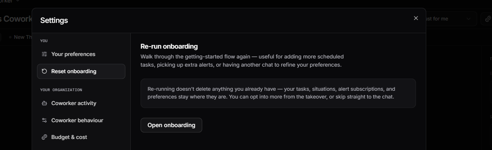

# Coworker FAQ

## Getting started

### How do I get started with Coworker?

When you first open Coworker, a [guided setup conversation](overview.md#getting-started) walks you through setting your preferences and creating your first task. The quickest way to get value is to enable [OpsPilot Alerts](overview.md#opspilot-alerts), which connects Coworker to your existing alert rules so it automatically investigates whenever one fires.

### Can I have more than one Coworker?

Each user has their own personalised Coworker. It is not possible to create multiple Coworkers for a single user.

### Can my team share a Coworker?

Each Coworker is personal to the user it belongs to. However, you can switch from the **Just for me** view to a broader team view from the dropdown at the top of the dashboard to see what Coworker has raised across your whole organisation.

### Can I restart the setup?

Yes. Click the settings icon on the Coworker dashboard, select **Reset onboarding**, and click **Open onboarding** to walk through the setup flow again. Re-running does not delete anything you already have.

---

## Tasks

### How many tasks should I create?

Start with one or two [scheduled tasks](overview.md#scheduled-tasks) covering your most critical services, and enable [OpsPilot Alerts](overview.md#opspilot-alerts). Add more tasks over time as you identify gaps. Too many tasks running frequently can increase AI Token usage.

### How often should I run scheduled tasks?

This depends on how dynamic your environment is. Daily is a good starting point for most teams. Hourly is useful for high-traffic or critical services where issues can escalate quickly.

!!! info "Learn more"
    [Scheduled tasks](overview.md#scheduled-tasks)

### Why isn't my task finding anything?

It may take a few runs for Coworker to build enough context to surface meaningful insights. If a task consistently finds nothing, consider adjusting the description to be more specific about what you want it to investigate.

### What is the difference between a scheduled task and a monitoring task?

A [scheduled task](overview.md#scheduled-tasks) runs on a recurring interval and produces a general report of findings. A [monitoring task](overview.md#monitoring-tasks) is focused on a specific pattern or issue (created from an insight) and tracks whether that pattern is improving, worsening, or stable over time.

---

## Insights

### What is the difference between Resolve and Ignore?

**Resolve** marks an insight as handled and it will appear in your resolved insights history. **Ignore** dismisses it from your priority list without marking it as resolved. Use Resolve when you've taken action; use Ignore when the insight isn't relevant to you.

!!! info "Learn more"
    [Insights](overview.md#insights)

### Why am I seeing the same insight repeatedly?

If the underlying issue hasn't been fixed, Coworker will continue to surface it. The occurrence history on each insight shows whether it is a recurring pattern. Use **Watch** to create a [monitoring task](overview.md#monitoring-tasks) that tracks whether the issue improves.

### How do I change what types of insights I see?

Click **Change what I show you** on the dashboard to adjust your severity and category preferences (Errors, Performance, Notable, Coverage), or use **Update via chat** to describe your preferences in plain language.

!!! info "Learn more"
    [Preferences](overview.md#preferences)

---

## Costs

### What are OpsPilot AI Tokens?

OpsPilot AI Tokens are the usage allowance for Coworker's AI-powered work, including chat, alert investigations, scheduled checks, telemetry analysis and recommendations. Your plan includes a fixed monthly allowance, and OpsPilot gives you clear usage visibility, forecasting and controls so there are no surprises.

!!! info "Learn more"
    [Understanding OpsPilot AI Tokens](usage.md#understanding-opspilot-ai-tokens)

### What uses AI Tokens?

AI Tokens are used whenever Coworker performs AI-powered work:

- Answering questions in chat
- Investigating alerts and situations
- Analysing telemetry and service behaviour
- Running scheduled checks
- Generating recommendations, suggested fixes and debriefs
- Updating situations and producing findings

### Does every Coworker action use the same number of AI Tokens?

No. Usage depends on the amount of telemetry, context and reasoning required. A simple chat question typically uses fewer AI Tokens than a deeper investigation that reviews metrics, logs, prior findings and service context before generating a recommendation.

### Can I forecast my AI Token usage?

Yes. The **Projected monthly** metric in the Usage view estimates your end-of-month AI Token consumption based on current usage patterns, so you can see whether you are on track to stay within your plan allowance.

!!! info "Learn more"
    [Activity tab](usage.md#activity-tab)

### How much does Coworker cost to run?

Cost depends on how many tasks you have, how frequently they run, and the [model tier](tasks.md#model-tier) selected (Thorough uses more AI Tokens than Efficient). You can set a monthly task allowance to control spend, with configurable warning and halt thresholds to prevent overruns.

!!! info "Learn more"
    [Cost and Optimisation](usage.md)

### How do I reduce AI Token usage?

- Review **Optimization Suggestions** in the [AI Tokens tab](usage.md#optimization-suggestions); these appear automatically after a task has run a few times and Coworker detects ways it could be improved
- **Apply** an optimisation suggestion to apply the recommended change immediately
- Click **Analyse & Optimise** to trigger an on-demand optimisation review at any time
- Switch high-volume or routine tasks to the [Efficient model tier](tasks.md#model-tier)
- Reduce the frequency of scheduled tasks that run often but find little
- Review the **AI Token Breakdown** table to identify the most expensive tasks and consolidate or adjust them

### What happens when I reach my task allowance?

Coworker will stop running tasks once spend reaches the **Halt threshold**, which by default is set to 100% of your task allowance. You can lower this threshold to stop tasks earlier and protect your allowance. A separate **Warning threshold** notifies you before the halt is reached.

!!! info "Learn more"
    [Allowance](usage.md#ai-token-allowance)

### Can I get warned before hitting my allowance limit?

Yes. The **Warning threshold** in Settings > Budget & cost triggers a notification when your spend reaches a set percentage of your task allowance (e.g. 80%). This gives you time to adjust tasks or increase your allowance before tasks are halted.

!!! info "Learn more"
    [Allowance](usage.md#ai-token-allowance)

### How do I accept or dismiss an optimisation suggestion?

Open the **AI Tokens** tab in Usage and scroll to **Optimization Suggestions**. Expand any suggestion to see the reasoning under **Why this suggestion** and the proposed change under **Instruction changes**. Click **Apply** to apply it immediately, or **Dismiss** to ignore it.

!!! info "Learn more"
    [Optimization Suggestions](usage.md#optimization-suggestions)

### What is the difference between Thorough and Efficient model tiers?

**Thorough** handles any task and is more capable. Use it for critical alerts and complex investigations where depth matters. **Efficient** is suited to simpler, focused tasks and costs less. Use it for routine or high-volume tasks to keep spend down. You can set the model tier per task or per event source.

!!! info "Learn more"
    [Model tier](tasks.md#model-tier)

### Why use AI Tokens instead of unlimited AI?

AI-powered investigations consume compute and reasoning resources. OpsPilot AI Tokens give your team a predictable, fixed allowance for Coworker's work, with full visibility into what was used and what it delivered. This keeps AI usage transparent and controllable for both teams and budgets.

---

## Memory

### How long does it take for Coworker to become useful?

Coworker starts providing value immediately, but becomes noticeably smarter after a few days of running tasks. As it builds [memory](overview.md#memory) about your services and patterns, its insights become more relevant and its task analysis more accurate.

### Can I clear Coworker's memory?

Please contact support if you need to reset Coworker's [memory](overview.md#memory).

---

## Privacy and data

### What data does Coworker have access to?

Coworker has access to the observability data in your OpsPilot account: metrics, logs, traces, and alert rules. It does not have access to data outside your organisation's account.

---

!!! question "Need more help?"
    Contact support in the chat bubble and let us know how we can assist.
