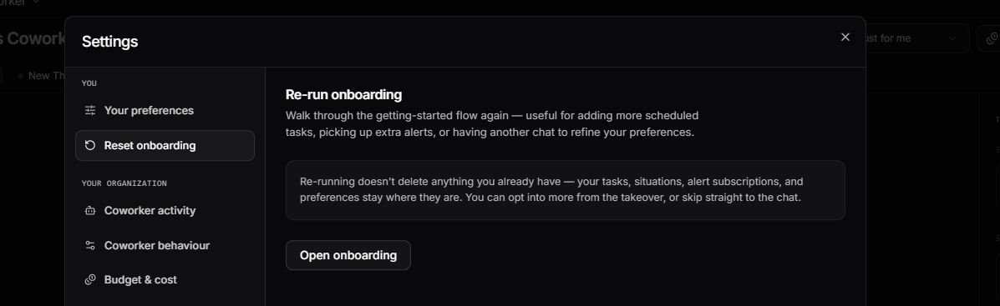

# Coworker FAQ

## Getting started

### How do I get started with Coworker?

When you first open Coworker, a short [six-step setup](getting-started.md) tailors it to you - your role, the services you own, and what you want it to focus on. The quickest way to get value is to enable [OpsPilot Alerts](event-sources.md#opspilot-alerts), which connects Coworker to your existing alert rules so it automatically investigates whenever one fires.

### Can I have more than one Coworker?

No. Each user has one Coworker. Your feed and preferences are personal to you, but tasks and investigations are shared across your organisation - everyone on the team can see what Coworker has raised.

### Can my team share a Coworker?

Tasks and investigations are already shared across your organisation. Use the **Just for me** dropdown at the top of the dashboard to toggle between your personalised feed and the full team view.

### Can I restart the setup?

Yes. Open **Settings** from the Coworker menu, go to the [**Preferences**](Settings/preferences.md#re-run-onboarding) tab, and click **Open onboarding** under **Re-run onboarding** to walk through the setup flow again. Re-running does not delete anything you already have.

---

## Tasks

### How many tasks should I create?

Start with one or two [scheduled tasks](scheduled.md) covering your most critical services, and enable [OpsPilot Alerts](event-sources.md#opspilot-alerts). Add more tasks over time as you identify gaps. Too many tasks running frequently can increase AI Token usage.

### How often should I run scheduled tasks?

Daily is the most common cadence and a good starting point. Every 6 hours works well for services that need closer attention. Weekly is often enough for higher-level system reviews.

If you find yourself wanting very frequent checks on a specific pattern, a [monitoring task](tasks.md#monitoring-tasks) is usually a better fit than a high-frequency scheduled task. If something needs near-real-time response, connecting an alert rule via OpsPilot Alerts will be more effective and much cheaper.

!!! info "Learn more"
    [Scheduled tasks](scheduled.md)

### Why isn't my task finding anything?

It may take a few runs for Coworker to build enough context to surface meaningful insights. If a task consistently finds nothing, consider adjusting the description to be more specific about what you want it to investigate.

### What is the difference between a scheduled task and a monitoring task?

A [scheduled task](scheduled.md) runs on a recurring interval and produces a general report of findings. A [monitoring task](tasks.md#monitoring-tasks) is focused on a specific pattern or issue (created from an insight) and tracks whether that pattern is improving, worsening, or stable over time.

---

## Heartbeat

### What is Heartbeat and how is it different from alerts?

Heartbeat is Coworker's always-on health screen. Once your services are cataloged, it learns what "normal" looks like for each one and re-checks those signals every few minutes - no alert rules to write. When a signal drifts out of its normal range and stays there, Coworker investigates on its own and writes up what it found.

Unlike a traditional alert, Heartbeat doesn't just fire a notification - it investigates. It's also private to Coworker: it never creates Grafana or Alertmanager alerts, and won't page your on-call.

!!! info "Learn more"
    [Heartbeat](heartbeat.md)

---

## Insights

### What is the difference between Resolved and Dismissed?

When you close a situation with **Set status**, **Resolved** means it's handled - you've taken action and the problem is dealt with. **Dismissed** closes it as not a real problem, or not relevant to you. Either way Coworker asks for a quick reason, which also teaches it what not to raise next time.

!!! info "Learn more"
    [Severity and status](situations.md#severity-and-status)

### Why am I seeing the same insight repeatedly?

If the underlying issue hasn't been fixed, Coworker will continue to surface it. The occurrence history on each insight shows whether it is a recurring pattern. Use **Watch This** on the insight to create a [monitoring task](tasks.md#monitoring-tasks) that tracks whether the issue improves.

### How do I change what types of insights I see?

Open **Settings > Preferences** and adjust **Feed relevance** - your role, focus services, focus areas (the domains Coworker prioritises), and custom keywords. You can also just ask Coworker to adjust these from any chat. This changes what reaches your feed, not what Coworker investigates across your organisation.

!!! info "Learn more"
    [Preferences](Settings/preferences.md)

---

## Situations

### What do the situation statuses mean?

A situation moves through four statuses: **Open** (newly raised, not yet actioned), **In progress** (someone is working it), **Resolved** (handled), and **Dismissed** (not a real problem). Status is separate from severity (Critical, Warning, or Info) - a Critical can be In progress, and a Warning can sit Open.

!!! info "Learn more"
    [Severity and status](situations.md#severity-and-status)

### How do I hand a situation to a teammate?

Open the situation and click **Assign**. Choose **I'll take this** to assign it to yourself, or search members and pick a teammate.

!!! info "Learn more"
    [Situations and threads](situations.md#situations-and-threads)

---

## Costs

### What are OpsPilot AI Tokens?

OpsPilot AI Tokens are the usage allowance for Coworker's AI-powered work, including chat, alert investigations, scheduled checks, telemetry analysis and recommendations. Your plan includes a fixed monthly allowance, and OpsPilot gives you clear usage visibility, forecasting and controls so there are no surprises.

!!! info "Learn more"
    [Understanding OpsPilot AI Tokens](usage.md#understanding-opspilot-ai-tokens)

### What uses AI Tokens?

AI Tokens are used whenever Coworker performs AI-powered work:

- Answering questions in chat
- Investigating alerts and situations
- Triaging and performing background checkups on open situations
- Analysing telemetry and service behaviour
- Running scheduled checks
- Generating recommendations, suggested fixes and debriefs
- Updating situations and producing findings

### Does every Coworker action use the same number of AI Tokens?

No. Usage depends on the amount of telemetry, context and reasoning required. A simple chat question typically uses fewer AI Tokens than a deeper investigation that reviews metrics, logs, prior findings and service context before generating a recommendation.

### Can I forecast my AI Token usage?

Yes. The **Projected monthly** metric in the Usage view estimates your end-of-month AI Token consumption based on current usage patterns, so you can see whether you are on track to stay within your plan allowance.

!!! info "Learn more"
    [Activity tab](usage.md#activity-tab)

### How much does Coworker cost to run?

Cost depends on several factors:

- How many tasks you have and how frequently they run
- The [model tier](tasks.md#model-tier) selected (Thorough uses more AI Tokens than Efficient)
- The number of events received from your event sources - the more alerts that fire, the more investigations Coworker runs
- The number of open situations - more open situations means more background checkups running continuously

You can set a monthly task allowance to control spend, with configurable warning and halt thresholds to prevent overruns.

!!! info "Learn more"
    [Cost and Optimisation](usage.md)

### How do I reduce AI Token usage?

- Review **Optimization Suggestions** in the [AI Tokens tab](usage.md#optimization-suggestions); these appear automatically after a task has run a few times and Coworker detects ways it could be improved
- **Apply** an optimisation suggestion to apply the recommended change immediately
- Click **Analyse & Optimise** to trigger an on-demand optimisation review at any time
- Switch high-volume or routine tasks to the [Efficient model tier](tasks.md#model-tier)
- Reduce the frequency of scheduled tasks that run often but find little
- Review the **AI Token Breakdown** table to identify the most expensive tasks and consolidate or adjust them
- If noisy alerts are driving up costs, consider disabling Coworker from investigating them. Click on the **OpsPilot Alerts** event source in the sidebar and sort by **Most events** to see which alert rules are firing most frequently - those are the best candidates to review or exclude

### What happens when I reach my task allowance?

Coworker will stop running tasks once spend reaches the **Halt threshold**, which by default is set to 100% of your task allowance. You can lower this threshold to stop tasks earlier and protect your allowance. A separate **Warning threshold** notifies you before the halt is reached.

!!! info "Learn more"
    [Allowance](usage.md#ai-token-allowance)

### Can I get warned before hitting my allowance limit?

Yes. The **Warning threshold** in Settings > Budget & cost triggers a notification when your spend reaches a set percentage of your task allowance (e.g. 80%). This gives you time to adjust tasks or increase your allowance before tasks are halted.

!!! info "Learn more"
    [Allowance](usage.md#ai-token-allowance)

### How do I accept or dismiss an optimisation suggestion?

Open the **AI Tokens** tab in Usage and scroll to **Optimization Suggestions**. Expand any suggestion to see the reasoning under **Why this suggestion** and the proposed change under **Instruction changes**. Click **Apply** to apply it immediately, or **Dismiss** to ignore it.

!!! info "Learn more"
    [Optimization Suggestions](usage.md#optimization-suggestions)

### What is the difference between Thorough and Efficient model tiers?

**Thorough** handles any task and is more capable. Use it for critical alerts and complex investigations where depth matters. **Efficient** is suited to simpler, focused tasks and costs less. Use it for routine or high-volume tasks to keep spend down. You can set the model tier per task or per event source.

!!! info "Learn more"
    [Model tier](tasks.md#model-tier)

### Why use AI Tokens instead of unlimited AI?

AI-powered investigations consume compute and reasoning resources. OpsPilot AI Tokens give your team a predictable, fixed allowance for Coworker's work, with full visibility into what was used and what it delivered. This keeps AI usage transparent and controllable for both teams and budgets.

### Does creating my catalog use AI Tokens?

No - creating your catalog for the first time is funded by OpsPilot as part of getting you set up, so it does not use your AI Token allowance. Catalog audits you run manually afterwards, to add new services or refresh entries, do use your allowance.

!!! info "Learn more"
    [Service Catalog](../../../../Admin-and-data/Catalog/catalog.md)

---

## Memory

### How long does it take for Coworker to become useful?

Coworker starts providing value immediately, but becomes noticeably smarter after a few days of running tasks. As it builds [memory](overview.md#memory) about your services and patterns, its insights become more relevant and its task analysis more accurate.

### Can I clear Coworker's memory?

Please contact support if you need to reset Coworker's [memory](overview.md#memory).

---

## Privacy and data

### What data does Coworker have access to?

Coworker has access to the observability data in your OpsPilot account: metrics, logs, traces, and alert rules. It does not have access to data outside your organisation's account.

---

!!! question "Need more help?"
    Contact support in the chat bubble and let us know how we can assist.
