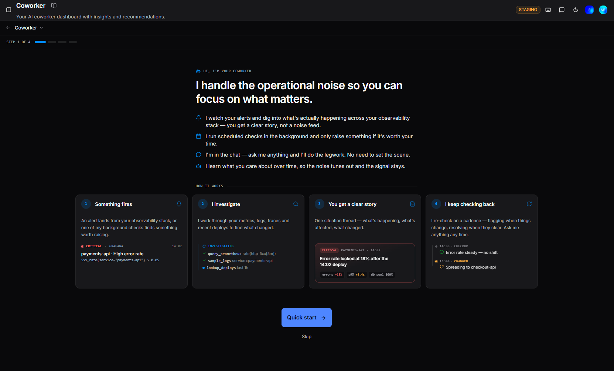
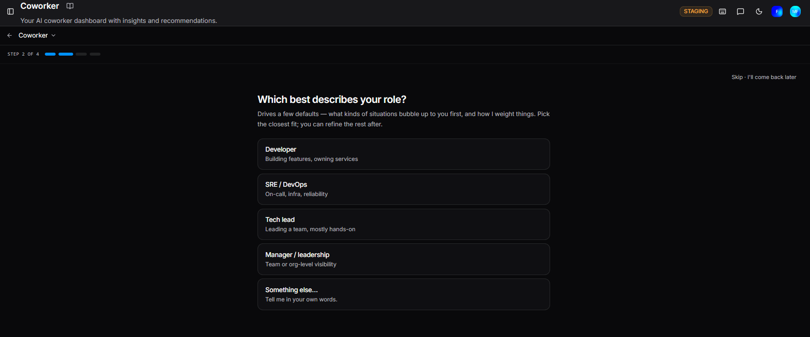
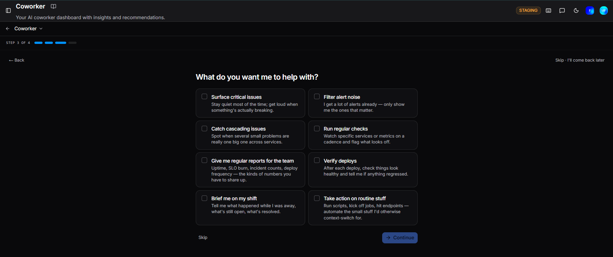
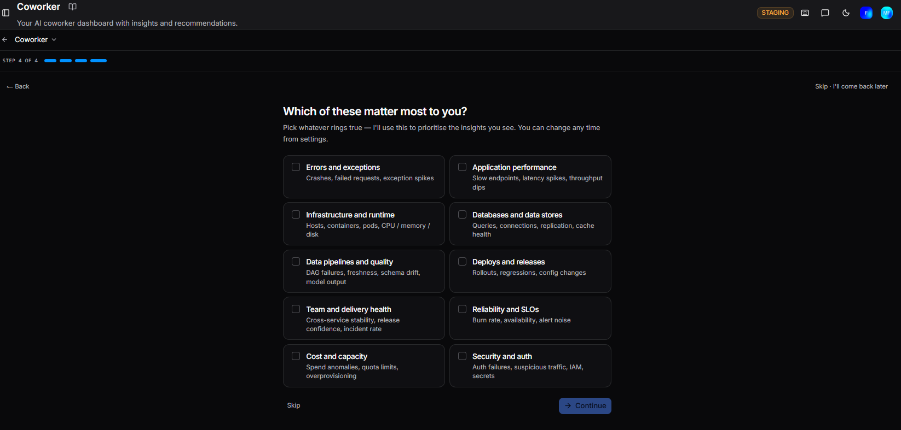

# Getting started with Coworker

## Onboarding

When you first access Coworker, a short guided setup walks you through personalising your experience. You can skip it at any time and still get a working Coworker, though you'll see a broader, less tailored view until you configure your preferences.

### Step 1: Introduction

Step 1 introduces what Coworker does and how it works, with four cards showing the flow: something fires, Coworker investigates, you get a clear story, and it keeps checking back. Click **Quick start** to begin, or **Skip** to go straight to the dashboard.

---

### Step 2: Your role

Coworker asks which role best describes you. This sets the defaults for which kinds of situations are surfaced to you first:

| Role | Description |
|---|---|
| **Developer** | Building features, owning services |
| **SRE / DevOps** | On-call, infra, reliability |
| **Tech lead** | Leading a team, mostly hands-on |
| **Manager / leadership** | Team or org-level visibility |
| **Something else…** | Tell me in your own words |

Pick the closest fit. Select **Skip - I'll come back later** to proceed without setting a role.

---

### Step 3: What do you want me to help with?

Select as many as apply:

| Option | Description |
|---|---|
| **Surface critical issues** | Stay quiet most of the time; get loud when something's actually breaking |
| **Filter alert noise** | I get a lot of alerts already - only show me the ones that matter |
| **Catch cascading issues** | Spot when several small problems are really one big one across services |
| **Run regular checks** | Watch specific services or metrics on a cadence and flag what looks off |
| **Give me regular reports for the team** | Uptime, SLO burn, incident counts, deploy frequency - the kinds of numbers you have to share up |
| **Verify deploys** | After each deploy, check things look healthy and tell me if anything regressed |
| **Brief me on my shift** | Tell me what happened while I was away, what's still open, what's resolved |
| **Take action on routine stuff** | Run scripts, kick off jobs, hit endpoints - automate the small stuff I'd otherwise context-switch for |

Click **Continue** when done, or **Skip** to proceed without selecting any.

---

### Step 4: Which of these matter most to you?

The final step. Select the domains you want Coworker to prioritise in your feed:

| Area | What it covers |
|---|---|
| **Errors and exceptions** | Crashes, failed requests, exception spikes |
| **Application performance** | Slow endpoints, latency spikes, throughput dips |
| **Infrastructure and runtime** | Hosts, containers, pods, CPU / memory / disk |
| **Databases and data stores** | Queries, connections, replication, cache health |
| **Data pipelines and quality** | DAG failures, freshness, schema drift, model output |
| **Deploys and releases** | Rollouts, regressions, config changes |
| **Team and delivery health** | Cross-service stability, release confidence, incident rate |
| **Reliability and SLOs** | Burn rate, availability, alert noise |
| **Cost and capacity** | Spend anomalies, quota limits, overprovisioning |
| **Security and auth** | Auth failures, suspicious traffic, IAM, secrets |

Select as many as apply. These can be updated at any time from **Settings > Your preferences**.

---

## Configuring your view

Whether set during onboarding or later from Settings, three controls decide what appears in your Coworker feed:

| Setting | Description |
|---|---|
| **Focus services** | The specific services you own or care about, by name or glob pattern (e.g. `payments-*`). Situations touching these are prioritised in your feed. |
| **Focus areas** | The domains you want prioritised: Errors and exceptions, Application performance, Infrastructure and runtime, Databases and data stores, Data pipelines and quality, Deploys and releases, Team and delivery health, Reliability and SLOs, Cost and capacity, Security and auth. |
| **Custom keywords** | Any terms beyond the focus areas above - a library, technology, or feature name specific to your stack. A match nudges related situations into your feed. |

None of these change what Coworker investigates or raises across your organisation. They only change what reaches your personal feed.

---

## Settings

Open **Settings** from the Coworker dashboard to access your preferences, check-in cadence, behaviour, and budget controls. You don't need to configure all of this up front — sensible defaults are in place, and you can ask Coworker directly in any chat to update your preferences conversationally.

See [Settings](settings.md) for full details.

---

!!! question "Need more help?"
    Contact support in the chat bubble and let us know how we can assist.
