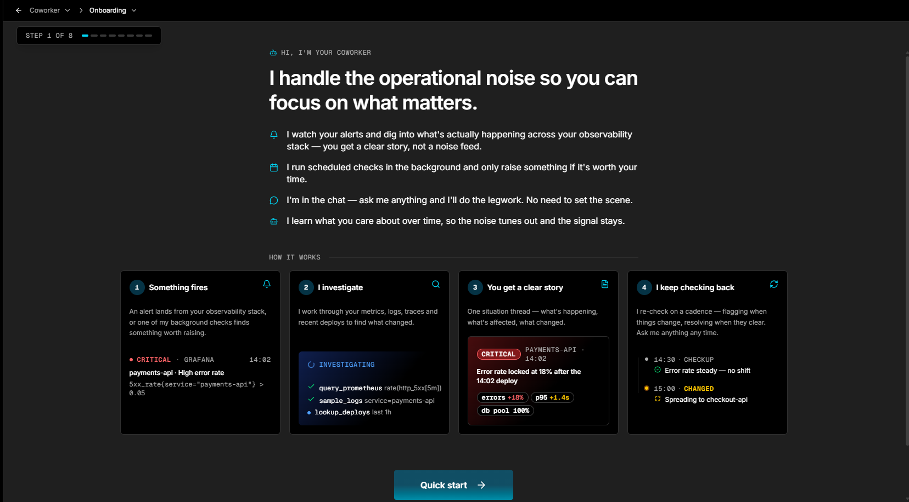
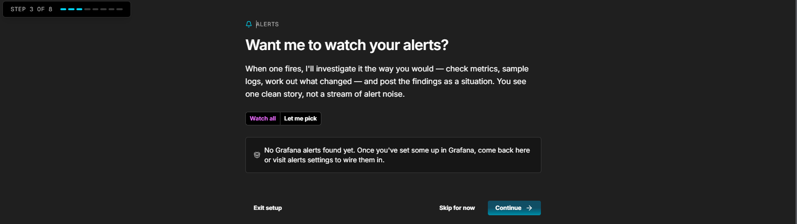
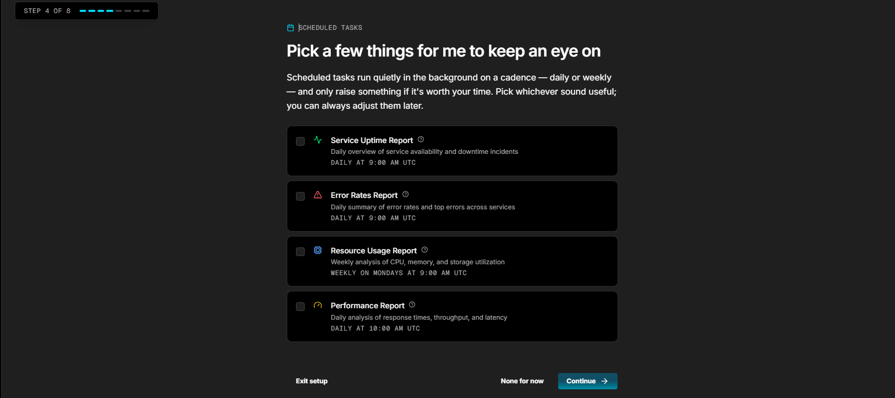
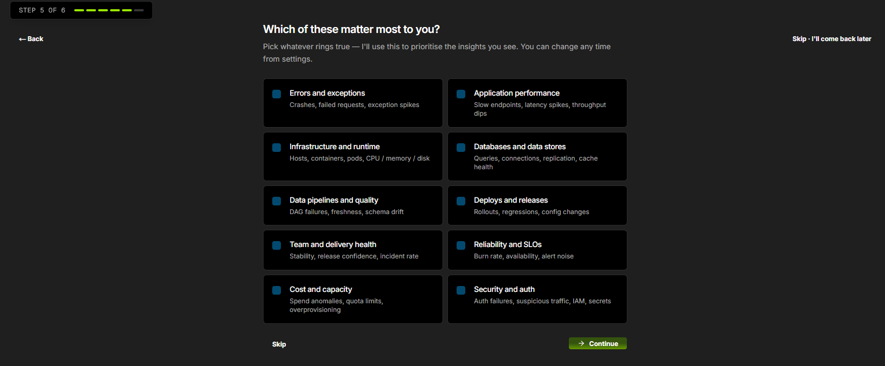
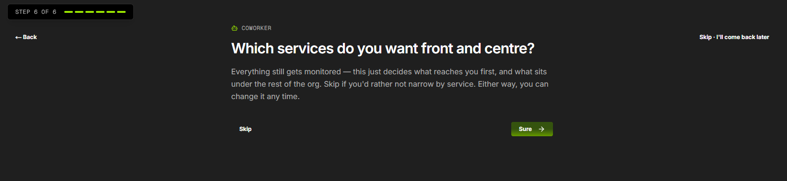

# Getting started with Coworker

## Onboarding

The more Coworker knows about you and your services, the better it filters the noise. A short eight-step setup, shown the first time you open Coworker, tailors it to you. You can skip any step and still get a working Coworker - you'll just see a broader, less tailored view until you set your preferences.

### Step 1: Introduction

Step 1 introduces what Coworker does:

> *"I handle the operational noise so you can focus on what matters."*

And how it helps:

- Watches your alerts and digs into what's actually happening across your observability stack, so you get a clear story rather than a noise feed
- Runs scheduled checks in the background and only raises something if it's worth your time
- Answers questions in the chat and does the legwork, with no need to set the scene
- Learns what you care about over time, so the noise tunes out and the signal stays

A **How it works** flow shows four cards: something fires, Coworker investigates, you get a clear story, and it keeps checking back. Click **Quick start** to begin, or **Skip** to go straight to the dashboard.

---

### Step 2: Health screen

Coworker can watch every service's health automatically - no setup from you. This is [Heartbeat](heartbeat.md), its always-on health screen:

> *"Once your services are cataloged, I watch each one's health signals every few minutes. When something drifts out of its normal range and stays there, I investigate and write it up, the same way I handle an alert."*

If your services are already cataloged, this step shows what Heartbeat is already watching - for example *"Already watching 120 signals across 15 services"* - with the list of services covered. You can turn individual signals or services off at any time from the [Heartbeat panel](heartbeat.md#configuring-signals). Click **Continue**.

If nothing is cataloged yet, choose how to proceed:

- **Catalog my services** - discover your services from your telemetry and start health screening. It runs in the background, so you can carry on with setup and review what Coworker found on the [Catalog](../../../../Admin-and-data/Catalog/catalog.md) page.
- **Skip for now** or **Skip** - move on without cataloging.

---

### Step 3: Alerts

Coworker can watch your alerts and investigate each one the moment it fires:

> *"When one fires, I'll investigate it the way you would - check metrics, sample logs, work out what changed - and post the findings as a situation. You see one clean story, not a stream of alert noise."*

Choose how much to hand over:

- **Watch all** - Coworker investigates every alert that fires.
- **Let me pick** - choose which alerts Coworker watches.

If no alerts are connected yet, you'll see a note such as *"No Grafana alerts found yet"* - set some up in Grafana, then come back here or wire them in from alerts settings. Click **Continue**, or **Skip for now** to move on.

---

### Step 4: Scheduled tasks

Pick a few background checks for Coworker to run on a cadence:

> *"Scheduled tasks run quietly in the background on a cadence - daily or weekly - and only raise something if it's worth your time. Pick whichever sound useful; you can always adjust them later."*

Select any of the ready-made reports:

| Report | What it covers | Cadence |
|---|---|---|
| **Service Uptime Report** | Service availability and downtime incidents | Daily at 9:00 AM UTC |
| **Error Rates Report** | Error rates and top errors across services | Daily at 9:00 AM UTC |
| **Resource Usage Report** | CPU, memory, and storage utilization | Weekly on Mondays at 9:00 AM UTC |
| **Performance Report** | Response times, throughput, and latency | Daily at 10:00 AM UTC |

Click **Continue**, or **None for now** to skip. You can add, edit, or remove scheduled tasks at any time - see [Tasks](tasks.md).

---

### Step 5: Your role

Coworker asks what you do. Pick as many roles as fit - this drives a few defaults, such as which kinds of situations surface to you first and how things are weighted:

| Role | Description |
|---|---|
| **Developer** | Building features, owning services |
| **SRE / DevOps** | On-call, infra, reliability |
| **Tech lead** | Leading a team |
| **Manager / leadership** | Team or org-level visibility |
| **Something else…** | Tell me in your own words |

Select **Skip - I'll come back later** to proceed without setting a role.

---

### Step 6: What do you want me to help with?

Select as many as apply:

| Option | Description |
|---|---|
| **Surface critical issues** | Quiet by default, loud when it matters |
| **Filter alert noise** | Only the alerts worth your attention |
| **Catch cascading issues** | Spot when small problems are one big one |
| **Run regular checks** | Watch services on a cadence |
| **Report to the team** | Uptime, SLO burn, incident counts |
| **Verify deploys** | Check health after each release |
| **Brief me on my shift** | What happened while you were away |
| **Take action on routine stuff** | Run scripts and jobs on your behalf |

Click **Continue** when done, or **Skip** to proceed without selecting any.

---

### Step 7: Which of these matter most to you?

Select the domains you want Coworker to prioritise in your feed:

| Area | What it covers |
|---|---|
| **Errors and exceptions** | Crashes, failed requests, exception spikes |
| **Application performance** | Slow endpoints, latency spikes, throughput dips |
| **Infrastructure and runtime** | Hosts, containers, pods, CPU / memory / disk |
| **Databases and data stores** | Queries, connections, replication, cache health |
| **Data pipelines and quality** | DAG failures, freshness, schema drift, model output |
| **Deploys and releases** | Rollouts, regressions, config changes |
| **Team and delivery health** | Cross-service stability, release confidence, incident rate |
| **Reliability and SLOs** | Burn rate, availability, alert noise |
| **Cost and capacity** | Spend anomalies, quota limits, overprovisioning |
| **Security and auth** | Auth failures, suspicious traffic, IAM, secrets |

Select as many as apply. These can be updated at any time from **Settings > Preferences**.

---

### Step 8: Which services are yours?

Coworker offers to work out which services you own, so it can filter the noise down to what's yours:

> *"The more I know what you own, the better I can filter the noise. I'll ask a few questions."*

Choose how to proceed:

- **Sure** - describe in a sentence or two what you work on (a team, a product area, the services you own, anything you've been burned by lately) and click **Investigate**. Coworker maps those services to you and prioritises them in your feed.
- **Skip** - finish onboarding without it.

---

## Configuring your view

Whether set during onboarding or later from Settings, three controls decide what appears in your Coworker feed:

| Setting | Description |
|---|---|
| **Focus services** | The specific services you own or care about, by name or glob pattern (e.g. `payments-*`). Situations touching these are prioritised in your feed. |
| **Focus areas** | The domains you want prioritised: Errors and exceptions, Application performance, Infrastructure and runtime, Databases and data stores, Data pipelines and quality, Deploys and releases, Team and delivery health, Reliability and SLOs, Cost and capacity, Security and auth. |
| **Custom keywords** | Any terms beyond the focus areas above - a library, technology, or feature name specific to your stack. A match nudges related situations into your feed. |

!!! info "Feed filtering only"
    None of these change what Coworker investigates or raises across your organisation - they only change what reaches your personal feed.

---

## Settings

Open **Settings** from the Coworker dashboard for your preferences, check-in cadence, behavior, and budget controls. You don't need to set all this up front - sensible defaults are in place, and you can ask Coworker to adjust your preferences in any chat.

See [Settings](Settings/overview.md) for full details.

---

!!! question "Need more help?"
    Contact support in the chat bubble and let us know how we can assist.
