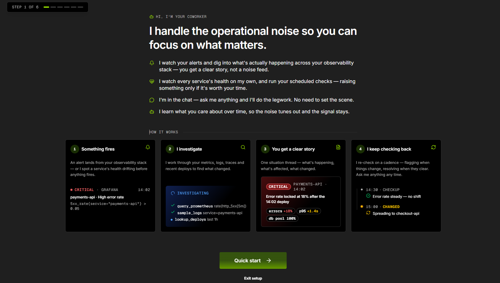
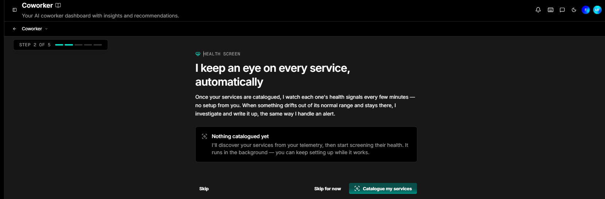
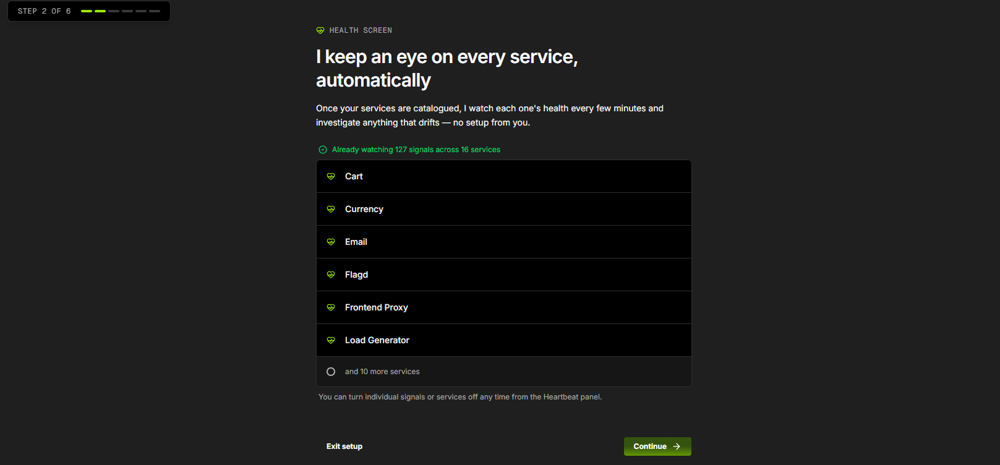
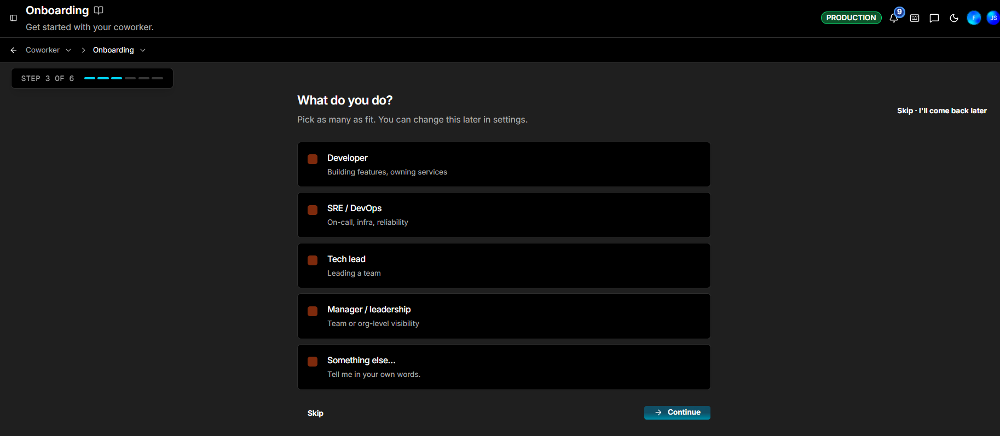
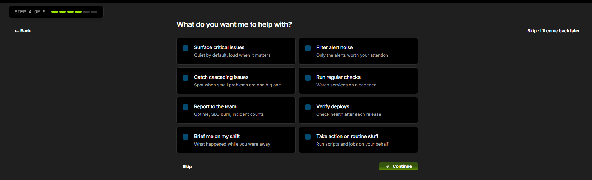

# Getting started with Coworker

## Onboarding

When you first open Coworker, a five-step guided setup helps you personalise it. You can skip any step and still get a working Coworker - you'll just see a broader, less tailored view until you set your preferences.

### Step 1: Introduction

Step 1 introduces what Coworker does - *"I handle the operational noise so you can focus on what matters"* - and how it helps:

- Watches your alerts and digs into what's actually happening across your observability stack, so you get a clear story rather than a noise feed
- Runs scheduled checks in the background and only raises something if it's worth your time
- Answers questions in the chat and does the legwork, with no need to set the scene
- Learns what you care about over time, so the noise tunes out and the signal stays

A **How it works** flow shows four cards: something fires, Coworker investigates, you get a clear story, and it keeps checking back. Click **Quick start** to begin, or **Skip** to go straight to the dashboard.

---

### Step 2: Health screen

Coworker can watch every service's health automatically - no setup from you. This is [Heartbeat](heartbeat.md), its always-on health screen:

> *"Once your services are catalogued, I watch each one's health signals every few minutes. When something drifts out of its normal range and stays there, I investigate and write it up, the same way I handle an alert."*

Choose how to proceed:

- **Catalogue my services** - discover your services from your telemetry and start health screening. It runs in the background, so you can carry on with setup and review what Coworker found on the [Catalog](../../../../Admin-and-data/Catalog/catalog.md) page. Once it starts, click **Continue**.
- **Skip for now** or **Skip** - move on without cataloguing.

---

### Step 3: Your role

Coworker asks which role best describes you. This drives a few defaults - which kinds of situations surface to you first, and how things are weighted:

| Role | Description |
|---|---|
| **Developer** | Building features, owning services |
| **SRE / DevOps** | On-call, infra, reliability |
| **Tech lead** | Leading a team, mostly hands-on |
| **Manager / leadership** | Team or org-level visibility |
| **Something else…** | Tell me in your own words |

Pick the closest fit. Select **Skip - I'll come back later** to proceed without setting a role.

---

### Step 4: What do you want me to help with?

Select as many as apply:

| Option | Description |
|---|---|
| **Surface critical issues** | Stay quiet most of the time; get loud when something's actually breaking |
| **Filter alert noise** | I get a lot of alerts already - only show me the ones that matter |
| **Catch cascading issues** | Spot when several small problems are really one big one across services |
| **Run regular checks** | Watch specific services or metrics on a cadence and flag what looks off |
| **Give me regular reports for the team** | Uptime, SLO burn, incident counts, deploy frequency - the kinds of numbers you have to share up |
| **Verify deploys** | After each deploy, check things look healthy and tell me if anything regressed |
| **Brief me on my shift** | Tell me what happened while I was away, what's still open, what's resolved |
| **Take action on routine stuff** | Run scripts, kick off jobs, hit endpoints - automate the small stuff I'd otherwise context-switch for |

Click **Continue** when done, or **Skip** to proceed without selecting any.

---

### Step 5: Which of these matter most to you?

The final step. Select the domains you want Coworker to prioritise in your feed:

| Area | What it covers |
|---|---|
| **Errors and exceptions** | Crashes, failed requests, exception spikes |
| **Application performance** | Slow endpoints, latency spikes, throughput dips |
| **Infrastructure and runtime** | Hosts, containers, pods, CPU / memory / disk |
| **Databases and data stores** | Queries, connections, replication, cache health |
| **Data pipelines and quality** | DAG failures, freshness, schema drift, model output |
| **Deploys and releases** | Rollouts, regressions, config changes |
| **Team and delivery health** | Cross-service stability, release confidence, incident rate |
| **Reliability and SLOs** | Burn rate, availability, alert noise |
| **Cost and capacity** | Spend anomalies, quota limits, overprovisioning |
| **Security and auth** | Auth failures, suspicious traffic, IAM, secrets |

Select as many as apply. These can be updated at any time from **Settings > Preferences**.

After you continue, Coworker offers to work out which services are yours:

> *"The more I know what you own, the better I can filter the noise."*

Choose how to proceed:

- **Sure** - describe in a sentence or two what you work on (a team, a product area, the services you own, anything you've been burned by lately) and click **Investigate**. Coworker maps those services to you and prioritises them in your feed.
- **Skip** - finish onboarding without it.

---

## Configuring your view

Whether set during onboarding or later from Settings, three controls decide what appears in your Coworker feed:

| Setting | Description |
|---|---|
| **Focus services** | The specific services you own or care about, by name or glob pattern (e.g. `payments-*`). Situations touching these are prioritised in your feed. |
| **Focus areas** | The domains you want prioritised: Errors and exceptions, Application performance, Infrastructure and runtime, Databases and data stores, Data pipelines and quality, Deploys and releases, Team and delivery health, Reliability and SLOs, Cost and capacity, Security and auth. |
| **Custom keywords** | Any terms beyond the focus areas above - a library, technology, or feature name specific to your stack. A match nudges related situations into your feed. |

None of these change what Coworker investigates or raises across your organisation. They only change what reaches your personal feed.

---

## Settings

Open **Settings** from the Coworker dashboard for your preferences, check-in cadence, behaviour, and budget controls. You don't need to set all this up front - sensible defaults are in place, and you can ask Coworker to adjust your preferences in any chat.

See [Settings](Settings/overview.md) for full details.

---

!!! question "Need more help?"
    Contact support in the chat bubble and let us know how we can assist.
