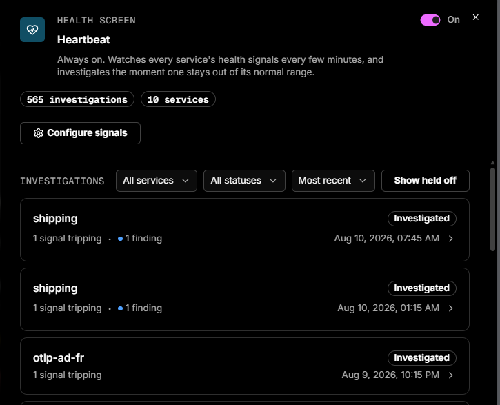
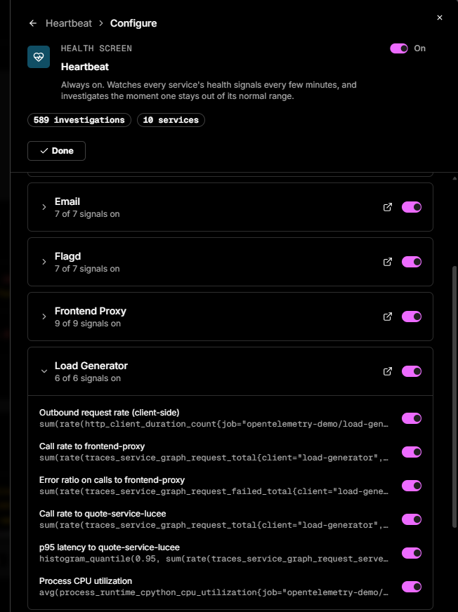

# Heartbeat

Heartbeat is Coworker's always-on health screen. It quietly watches each of your services against a set of health signals, and when something looks off it investigates on its own and tells you what it found - with no alert rules to write and no dashboards to monitor.

Once your services are [catalogued](../../../../Admin-and-data/Catalog/catalog.md), Coworker automatically learns what "normal" looks like for each one - request rate, latency, error rate, saturation, and more. Heartbeat re-checks those signals every few minutes in the background. When a signal moves outside its normal range and stays there, Coworker opens an investigation, gathers the relevant metrics, logs, and traces, works out whether it's a genuine issue or just noise, and records what it found. You can watch this happen on the Coworker page in real time. Over time, Heartbeat learns to suppress signals that repeatedly produce false alarms, so it becomes quieter and more reliable.

!!! info "Private to Coworker"
    Heartbeat's checks stay inside Coworker - it never creates Grafana or Alertmanager alerts and won't page your on-call.

---

## How it works

1. **Cataloguing** discovers each service's operations, dependencies, and health signals, and learns a baseline for each signal.
2. A lightweight background check runs **every five minutes**, comparing current values against those learned ranges.
3. **Sustained** deviations across several consecutive checks trigger a full investigation - a one-off spike won't.
4. Related signal trips are **grouped into a single investigation** where it makes sense.
5. Heartbeat **continuously re-tunes** noisy signals based on the outcome of its investigations.

---

## What you see

Heartbeat lives on the **Coworker page** as its own task type. A subtle pulse animation marks each completed health check.

| Area | What it shows |
|---|---|
| **Onboarding** | If services are already catalogued, Heartbeat starts watching straight away and shows what's covered. If nothing is catalogued yet, you can run a one-time catalogue audit during onboarding, or skip for now. See [Getting started](getting-started.md) |
| **Heartbeat panel** | An **On/Off** toggle, a **Configure** button (see [Configuring signals](#configuring-signals)), the signals watched per service (with links to the service catalog), investigation history, and snapshots captured when a check fires. Until services are catalogued it shows *"No services to watch yet"* with a **Catalogue my services** button |
| **Individual investigations** | The triggering signal, the affected service, how far it deviated from the learned baseline, and Coworker's conclusion with supporting evidence |

---

## Configuring signals

Click **Configure** on the Heartbeat panel to choose exactly which services and signals Heartbeat watches. The header carries the global **On/Off** toggle and running totals (investigations run, services covered); click **Done** to close.

Each **service** appears as a card showing how many of its signals are active (e.g. *6 of 6 signals on*), with a toggle to include or exclude the whole service, an expand chevron, and a link to the service in the catalog.

Expand a service to see its individual **signals** - each shows the underlying metric (p95 latency, error ratio, request rate, CPU utilisation, and so on) and has its own toggle, so you can silence a specific noisy signal without turning off the whole service.

---

## What makes Heartbeat different

- **No rules to write** - signals and baselines are learned automatically.
- **It investigates**, rather than simply raising an alert.
- **It's private to Coworker** - Heartbeat never creates Grafana or Alertmanager alerts.
- **It gets more accurate over time** through self-tuning.

---

## Requirements and scope

- Requires at least one **catalogued service**.
- Monitoring runs **per service** using learned baselines.
- Investigation history is **organisation-wide**.
- Heartbeat activity is tracked so you have visibility into noise and cost.

---

## Frequently asked questions

**Do I need to set up alert rules?**
No. Once a service is catalogued, Coworker already knows what to watch. You can review the watched signals in the service catalog.

**Will this page my on-call or show up in my alerting tools?**
No. Heartbeat's checks are private to Coworker and never create Grafana or Alertmanager alerts.

**How often does it check?**
Every five minutes.

**Why didn't it react to a one-off spike?**
Heartbeat waits for sustained abnormal behaviour across several consecutive checks before it investigates.

**It investigated something that turned out to be benign - is that a problem?**
No. Those outcomes are exactly what Coworker uses to re-tune noisy signals over time.

**What's the difference between Heartbeat and an incident or alert?**
Heartbeat is Coworker's always-on background health screen. Incidents and alert-driven situations come from other sources, but they all appear together on the Coworker page.

!!! question "Need more help?"
    Contact support in the chat bubble and let us know how we can assist.
