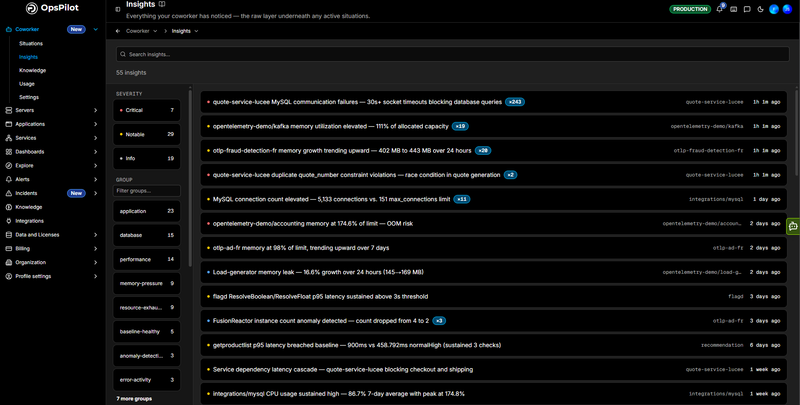
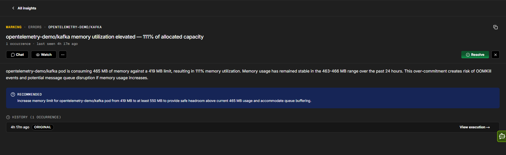
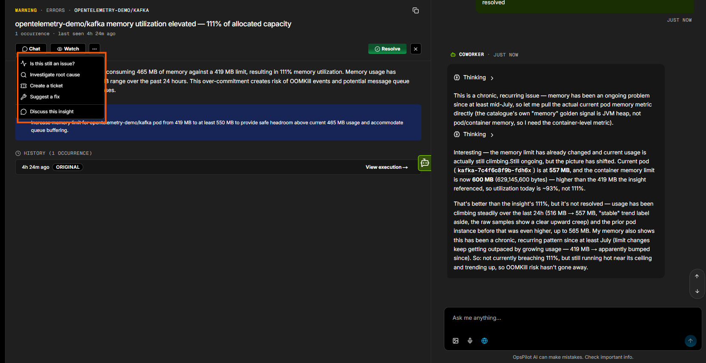
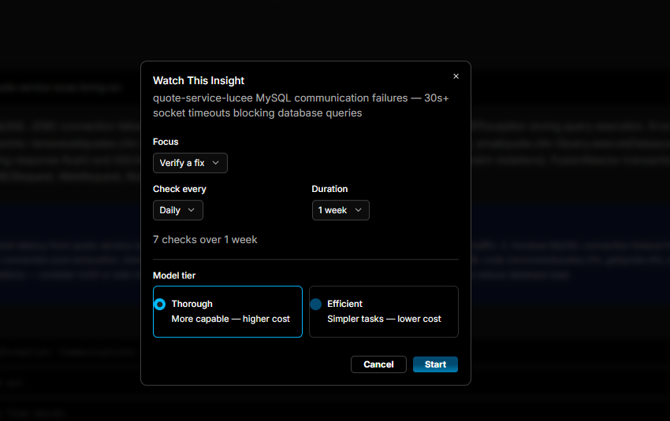

# Insights

**Insights are the core of Coworker** - every observation, anomaly, and error pattern it records while investigating. [Situations](situations.md) are the curated stories Coworker builds from them and surfaces in your feed; the **Insights** page is the complete, unfiltered layer underneath.

Come here when you want the full picture rather than only what Coworker chose to raise: browse everything it has noticed, filter to a specific service or category, catch patterns before they escalate into a situation, and see how often each has recurred. It's the ground truth of what Coworker has seen.

Navigate to **Coworker > Insights** to open it.

The header shows the total insight count, and the **Search insights** box finds one by keyword. The filter rails on the left narrow the list by severity, group, age, and service.

## Filtering

A filter bar runs across the top of the list, with the number of matching insights shown beneath it. Alongside the filters described below, it offers:

| Control | What it does |
|---|---|
| **Search insights** | Find an insight by its title |
| **Status** | Narrow to a state such as **Unresolved** |
| **Not in a situation** | Show only insights Coworker recorded without raising a [situation](situations.md) from them - the quiet majority of what it finds |
| **Sort** | Order the list, **Newest first** by default |
| **Clear all** | Drop every filter at once |

Arriving from **Help me see more** on the Coworker dashboard lands you here with the filters already set, so you see that slice rather than everything.

### Category

Insights are sorted into broad categories. Pick one to show only its insights, or **Any category** for all of them:

| Category | What it holds |
|---|---|
| **Errors** | Things failing |
| **Performance** | Things degrading |
| **Points of interest** | Things worth knowing about that are not faults |
| **Coverage gaps** | Things Coworker cannot see - a service not shipping telemetry, a metric it expected and is not getting |

**Coverage gaps** is what the dashboard's **Help me see more** panel is showing you. These are worth clearing first: everything else Coworker does depends on what reaches it.

### Severity

Each insight is ranked by severity - **Critical**, **Notable**, or **Info**, from most to least important. Select a severity to show only insights at that level; the count beside each shows how many insights it contains.

### Group

Insights are also grouped by category - for example **application**, **database**, **performance**, **memory-pressure**, **resource-exhaustion**, **baseline-healthy**, **anomaly-detection**, and **error-activity**. Use **Filter groups** to find a group by name, then select one to show only its insights. The count beside each group shows how many insights it holds.

### Age

Filter by how recently an insight was last seen - **Last 24h**, **Last 7 days**, or **Last 30 days**. The count beside each shows how many insights fall within that window.

### Service

Filter to a specific affected service. Use **Filter services** to find one by name, then select it to show only that service's insights. The count beside each shows how many insights it has.

## The insight list

Each row shows:

- A **severity dot** - Critical, Notable, or Info
- The **insight title** - a one-line summary of what Coworker found
- A **count badge** (for example `×4`) - how many times the insight has occurred (its recurrence count)
- The **affected service or group**
- When it was **last seen**

Click any row to open the insight in full.

## Insight detail

Opening an insight shows the full write-up:

- **Header** - the severity, category, and affected service, plus the title, occurrence count, when it was last seen, and tags such as the service name or `observability-gap`
- **Part of** - if the insight belongs to a situation, a banner links through to that [situation](situations.md)
- **Description** - what Coworker found, with root-cause detail
- **Recommended** - concrete next steps Coworker suggests, often linking to the documentation for whatever it is asking you to set up
- **Evidence** - the supporting signals behind the finding. These can be log lines, exceptions and transaction IDs, or metric series shown as charts, each with **Open in Explore** to take it further
- **History** - each occurrence of the insight over time. Click **View execution** to see the investigation run that produced it

### Acting on an insight

| Action | Description |
|---|---|
| **Chat** | Open a free-form conversation about the insight, with its full context already loaded (see below) |
| **Ask** | Put one of four preset questions to Coworker - **Is this still an issue?**, **Investigate root cause**, **Create a ticket**, or **Suggest a fix** |
| **Watch** | Set up a recurring check on the insight - opens the **Watch This Insight** dialog (see below) |
| **Resolve** | Mark the insight resolved |
| **...** | More actions: **Hide similar** (stop surfacing insights like this one) and **Not right** (tell Coworker the insight is off the mark, so it learns) |
| **✕** | Close the detail and return to the list |

### Chatting about an insight

**Ask** opens a menu of preset questions, each sending the insight to Coworker with its full context already loaded:

| Question | What it does |
|---|---|
| **Is this still an issue?** | Checks the current state to see if the problem is ongoing or resolved |
| **Investigate root cause** | Kicks off a root cause analysis |
| **Create a ticket** | Creates a ticket for the issue |
| **Suggest a fix** | Recommends remediation steps or best practices |

**Chat** opens a free-form conversation about the insight instead, for anything those four don't cover.

### Watching an insight

**Watch** opens the **Watch This Insight** dialog, which schedules a recurring check so Coworker keeps an eye on the insight for you:

| Field | Description |
|---|---|
| **Focus** | What each check should focus on - for example, **Verify a fix** |
| **Check every** | How often to run the check - for example, **Daily** |
| **Duration** | How long to keep watching - for example, **1 week** |
| **Model tier** | **Thorough** (more capable, higher cost) or **Efficient** (simpler tasks, lower cost) |

A summary line (for example, *"7 checks over 1 week"*) shows how many checks the schedule adds up to. Click **Start** to begin watching, or **Cancel** to close.

---

!!! question "Need more help?"
    Contact support in the chat bubble and let us know how we can assist.
