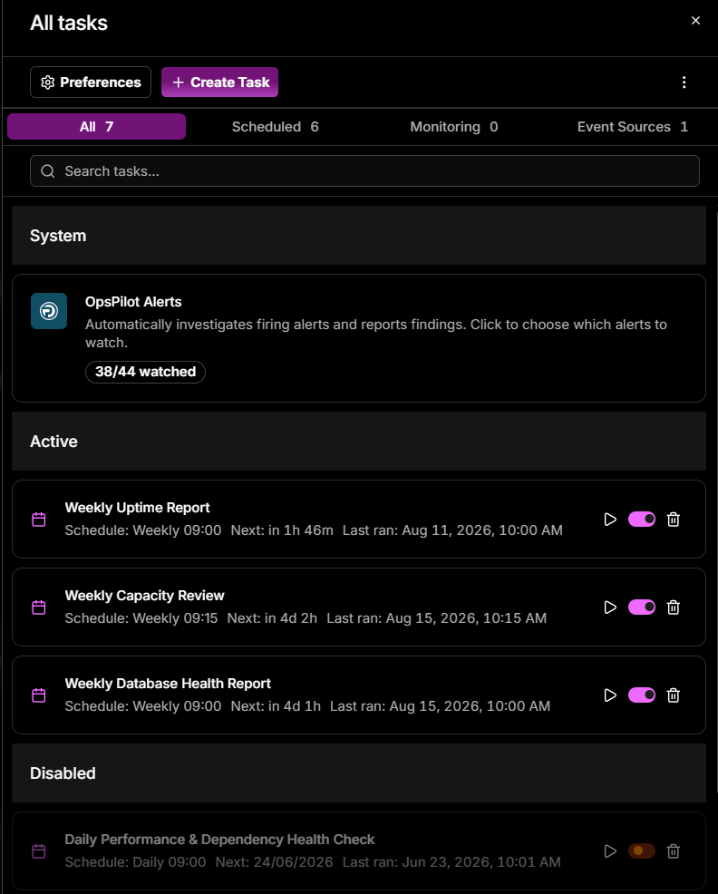
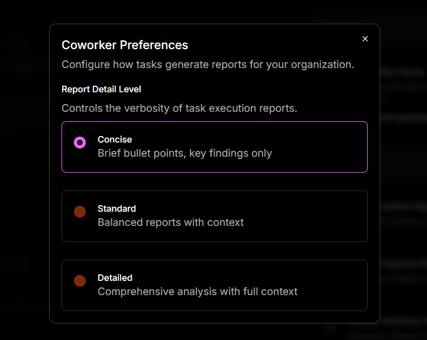

# Manage tasks

The **Tasks** page is one place to see and control everything Coworker runs - pause a noisy task, trigger one on demand, or check when each last fired - without hunting through the feed.

Navigate to **Coworker > Tasks** to open it, or click **All** on the Tasks panel of the Coworker dashboard.

## The Tasks page

- Click **Preferences** to open **Coworker Preferences** (see [Preferences](#preferences)), or **+ Create Task** to create a new task. **Disable all** turns off every task at once.
- Use the filter dropdown at the right of the search bar to narrow by category - it shows the total alongside, such as **All 12**.
- Search tasks by name using the search bar.
- The **System** section shows built-in tasks such as **OpsPilot Alerts**, with a badge showing the current state (e.g. *No alerts yet* if none are connected, or a watch count such as *38/44 watched* once alerts are enabled).
- The **Active** section lists your enabled tasks with their schedule, next run time, and last run date. Each task has a **Run** button to trigger it immediately, a toggle to disable it, and a delete button.
- The **Disabled** section lists tasks that have been turned off. They retain their configuration and can be re-enabled at any time using the toggle.

---

## Preferences

Click **Preferences** on the Tasks page to open **Coworker Preferences**, which controls how tasks generate reports for your organization.

Its one setting, **Report Detail Level**, sets the verbosity of task execution reports - **Concise**, **Standard**, or **Detailed**. This is the same organization-wide setting as [Report detail](Settings/behavior.md) in the Behavior tab, where each level is described in full.

---

!!! question "Need more help?"
    Contact support in the chat bubble and let us know how we can assist.
