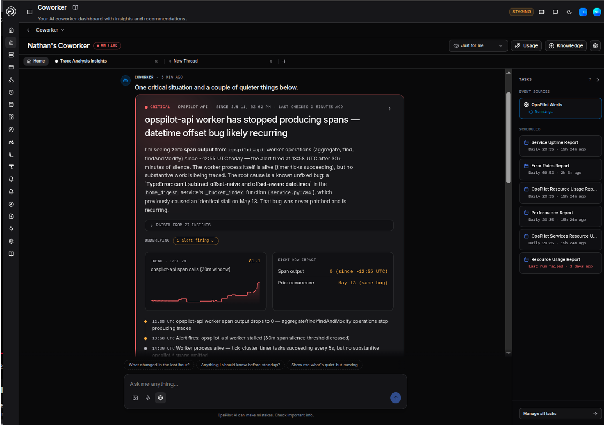
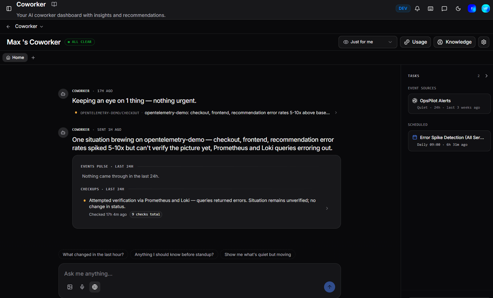
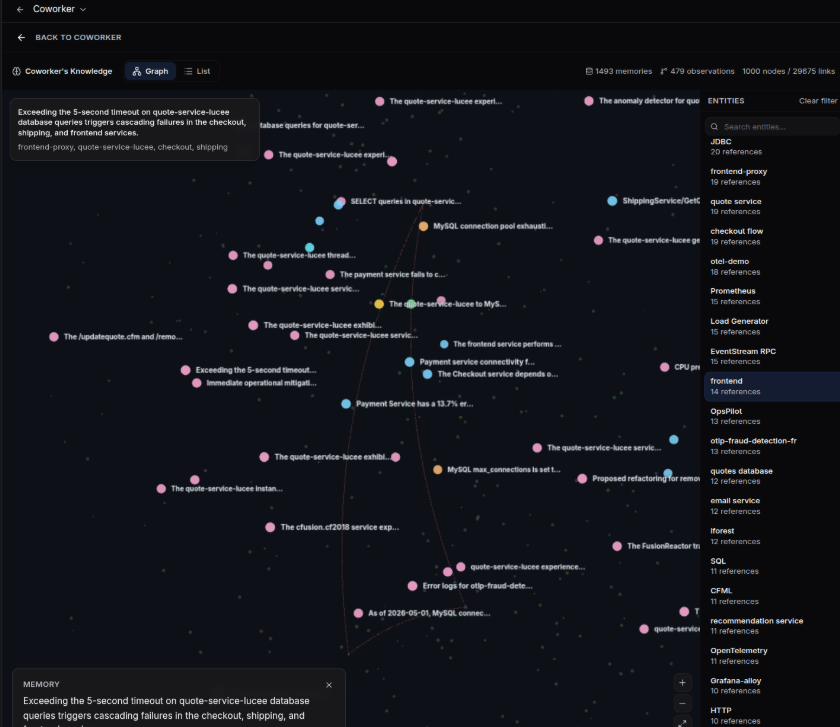

# Coworker

Coworker is the connective layer that binds your observability data, alerting, service knowledge, and incident response into one place. Rather than switching between dashboards, alert feeds, and runbooks, you get a single AI operations partner that watches your systems, investigates what it finds, and hands you a clear, prioritised picture of what needs attention - so your team spends less time fighting tools and more time fixing problems.

Each user gets their own personalised Coworker that learns what's relevant to them. It talks to you in the first person, remembers context, and keeps working between your visits.

## How to think about it

Think of Coworker as a single teammate rather than a monitoring tool. Behind that one voice it is doing several jobs at once: watching for signals, investigating them, writing down what it finds, and deciding what to tell you. You don't need to think about those internal jobs. You just get one Coworker who keeps you informed.

Coworker also shows you what it cannot see. Coverage gaps in your telemetry, unconnected alert rules, uncatalogued services - these surface in your feed so you know exactly what to fix to make Coworker more effective. The onboarding experience is not just setup; it is a diagnostic that tells you where your observability has blind spots.

## What Coworker does

| Capability | Description |
|---|---|
| **Insights** | The core of Coworker - atomic findings written every time Coworker investigates something, forming the foundation for everything it surfaces |
| **Situations** | Insights grouped into coherent stories with severity, evidence, and recommended actions - the thing you triage |
| **Continuous monitoring** | Watches your systems around the clock and re-investigates open situations on a regular cadence |
| **Alert response** | Automatically investigates firing alerts and posts one clean situation instead of a stream of raw alert noise |
| **Tasks** | Scheduled, monitoring, and webhook-driven jobs that run recurring analysis and report back proactively |
| **Memory** | Builds a growing understanding of your systems, your team, and your preferences over time |
| **Cost management** | Allowance tracking and optimisation suggestions to keep AI Token spend under control |

---

## Insights and situations

**Insights are the core of Coworker.** Everything Coworker does - investigating alerts, running scheduled checks, responding to webhooks - produces insights. An insight is one atomic finding: one observation, one anomaly, one error pattern. Each has a severity, a category, an affected service, and a short description with supporting evidence. Insights are how Coworker records what it has seen and reasoned about.

**Situations** are the editorial layer built on top of insights. Coworker groups related insights into one coherent story: a title, a plain-language summary, the affected service, severity, and impact. Situations are what you triage. Insights are how Coworker writes them up; situations are what it hands you.

A situation is not a static record. As new insights arrive, Coworker decides whether to extend an existing situation, merge it with another, escalate or de-escalate its severity, or close it out. That continuous editing is the difference between a useful picture of your operations and a noisy alert feed.

## Severity and status

Severity and status answer two different questions:

| | Question | Values |
|---|---|---|
| **Severity** | How bad is this? | Critical, Warning, Info |
| **Status** | Should you act on it right now? | Active, Watching, Resolved |

These don't always align the way you'd expect. A warning can be active if Coworker thinks you should look now. A critical is active by default, but once it's handled it moves to resolved. Splitting the two lets the page show "important but not urgent" items without either burying them or sounding false alarms.

---

## What runs in the background

Coworker is never just a snapshot. Three things run continuously:

**Investigating new signals.** When an alert fires or a task runs, Coworker pulls the relevant metrics, logs, and traces, writes insights, and decides what to do: raise a new situation, attach the finding to an existing one, or note that it looked and found nothing worth raising. Alerts that arrive close together are investigated as a group, so one underlying problem doesn't generate a wall of separate cards.

**Tidying up.** Every few minutes Coworker sweeps your active situations and consolidates them, merging two that turn out to be the same problem, escalating severity when a new signal warrants it, and attaching stray findings to the situation they belong to.

**Re-checking what's open.** Every active situation is re-investigated on a cadence that depends on its severity. Criticals are checked roughly every 10–15 minutes at first; warnings and quieter items less frequently. When a situation recovers on its own, Coworker resolves it and tells you why. As a situation stays stable, checks become less frequent; if something shifts, the cadence tightens back up. Once resolved, a situation gets a couple of follow-up checks over the next few hours to confirm the fix held.

---

## The home page

The home page is a feed of messages from your Coworker, more like a conversation with a colleague who has been working while you were away than a static dashboard. Everything arrives as a message in that feed: new situations, updates to existing ones, checks that came back clean, and pointers to coverage gaps.

A **WATCHING** badge in the header confirms Coworker is actively monitoring your environment.

The interface uses a tab bar across the top. **Home** is always the first tab. Each situation thread or conversation you open appears as an additional tab alongside it, so you can switch between multiple threads without losing context. Click **+** to open a new thread. Tabs with an orange dot indicate an active or critical situation.

### Your view or the team's

Use the **Just for me** dropdown at the top of the page to filter the feed to your personalised slice - situations relevant to your services and setup. Switch to a broader view when you're on call, covering someone else's area, or want the full picture across your organisation.

### How the feed adapts

Coworker changes how it leads depending on what it has to tell you:

| State | What you see |
|---|---|
| **Quiet** | An "all clear" note on what Coworker has been doing and watching. Silence means "checked and fine", not "nothing running" |
| **One critical** | A single focus card with the full story: summary, affected service, impact, latest checkup, and evidence |
| **A few criticals** | Prominent rows in urgency order, each with enough detail to triage at a glance |
| **Many criticals** | A status overview showing the count and affected services. When everything is urgent, a wall of full-size cards doesn't help |

Below the critical items sits the quieter list: warnings and lower-severity items Coworker is watching rather than actively raising. This is where tomorrow's situation often first appears. Recently resolved situations collapse into a short list near the bottom.

### Other message types

Alongside situations, the feed contains:

- **Coverage gaps**: one of Coworker's most useful signals. When it would have investigated something but couldn't - because a service has no telemetry, an alert rule isn't connected, or a catalog entry is missing - it tells you explicitly. Each gap names what's missing and includes a **Help me set this up** button that opens a guided thread. Coverage gaps turn Coworker into a diagnostic for your observability, not just a consumer of it.
- **The digest**: a snapshot Coworker keeps current, summarising the checks it ran and things it handled quietly in the background.
- **Debriefs**: short notes for when Coworker investigated something and concluded there was nothing worth raising, so the work is visible rather than silent.

### Sidebar

The right-hand sidebar gives a quick status view alongside the feed:

| Section | Description |
|---|---|
| **Tasks** | The number of open tasks currently assigned to you, with a link to the full Tasks board |
| **Event sources** | Your connected event sources and their recent activity - showing whether each has been quiet or firing, and when it last triggered |
| **Scheduled** | Your scheduled tasks, showing their run cadence and when they last ran |

---

## Situations and threads

Every situation opens into a thread: a dedicated conversation about that one problem, with all context already loaded. At the top sits the situation itself; below it runs the history of Coworker's checkups and state changes, interleaved with any messages between you and it.

From a situation thread you can:

| Action | Description |
|---|---|
| **Ask follow-ups** | Type any question. Coworker answers with the situation's full context already in hand |
| **Verify now** | Triggers a fresh investigation immediately, rather than waiting for the next scheduled checkup. The result lands in the thread when done |
| **Suggest a fix** | Prompts Coworker to propose concrete remediation steps based on what it has found |
| **Resolve / Dismiss** | Closes the situation. Coworker asks for a quick reason, which also teaches it what not to raise next time |
| **Share** | Copies a shareable link to the thread |
| **Copy** | Copies the full situation as a markdown brief, ready to paste into another tool or hand off to a teammate |

### Insight shortcuts

Click **Chat** on any insight for five quick actions:

| Action | Description |
|---|---|
| **Is this still an issue?** | Checks current state to see if the problem is ongoing or resolved |
| **Investigate root cause** | Kicks off a root cause analysis |
| **Create a ticket** | Creates a ticket for the issue |
| **Suggest a fix** | Recommends remediation steps or best practices |
| **Discuss this insight** | Opens a free-form conversation about the insight |

These shortcuts are available everywhere insights appear: the priority queue, insight lists, and insight detail views. You can also click **Help me triage** to send your current priority insights and recent activity to Coworker for a prioritisation recommendation.

---

## Chatting outside a situation

You can start a fresh thread at any time to ask about a service, a recent change, a metric, or anything else Coworker can investigate. These free-form chats have the full set of tools: attach images, use voice input, search the web, and pull context from your connected integrations.

Each task run produces a report with findings, the investigation process, and a final summary. An input field appears below each report (*Ask OpsPilot about this report...*) with the full report already in context, so you can ask follow-up questions without copying anything.

---

## Memory

Coworker gets smarter over time. Everything it does (investigating alerts, running tasks, talking to you) builds memory that carries forward.

| Memory type | What it holds |
|---|---|
| **System-wide** | How your services fit together, what's normal, and what tends to break. Shared across your whole organisation, so what Coworker learns helping one person makes it smarter for everyone |
| **Task-specific** | What recurring checks have turned up before and the patterns that matter. Can reduce token costs by up to 50% on long-running tasks |
| **Team** | Who owns what, where the runbook lives, what each channel is for |
| **User** | Your personal preferences and the way you like to work, learned from your conversations |

Browse what Coworker has learned via the **Knowledge** button on the dashboard. The Knowledge page shows a summary of total memories, observations, nodes, and links, and lets you explore the knowledge in two views:

| View | Description |
|---|---|
| **Graph** | A visual map of everything Coworker knows, with nodes representing entities (services, databases, concepts) and links between them showing relationships. Node size reflects how frequently an entity is referenced. The **Entities** panel on the right lists every entity ranked by reference count - use the search box to find a specific one. |
| **List** | A searchable, filterable list of individual memories. Use the **Search memories** bar to find specific facts, **Filter by entity** to scope the list to a particular service or concept, and the sort control to order by newest or oldest. Each memory shows the fact Coworker recorded, when it was added, and any entity tags attached to it. |

### Correcting Coworker

When Coworker raises something that isn't a problem, dismiss it with a quick reason, such as "this is expected" or "too noisy". Coworker turns your correction into a lasting fact: next time it sees the same pattern on the same service, it remembers and won't raise it again. A few early corrections go a long way towards tuning Coworker to your reality.

---

## Settings

Click the settings icon on the Coworker dashboard to open the Settings modal. Settings are split into two groups:

**You** — personal settings that apply only to your Coworker:

| Setting | Description |
|---|---|
| **Your preferences** | Controls what Coworker weights when deciding what to surface in your feed. See below. |
| **Re-run onboarding** | Walks through the getting-started flow again - useful for adding more scheduled tasks, picking up extra alerts, or refining your preferences. Re-running does not delete anything you already have; your tasks, situations, alert subscriptions, and preferences stay in place. Click **Open onboarding** to start. |

**Your organisation** — settings that apply across your whole team:

| Setting | Description |
|---|---|
| **Coworker activity** | Configure what Coworker monitors and how it responds to events |
| **Coworker behaviour** | Adjust how Coworker investigates and communicates |
| **Budget & cost** | Manage your AI Token allowance and cost controls (same as the [AI Tokens tab in Usage](#ai-tokens-tab)) |

### Your preferences

The **Your preferences** panel shapes what reaches your personal feed without changing what Coworker investigates. It still investigates everything - this just controls what surfaces for you versus what stays in the team view. You can also update these conversationally at any time by describing the change in any chat.

**Focus services** — add the service names or glob patterns (e.g. `opspilot-*`) for services you own or primarily work on. Situations affecting these services are prioritised in your feed.

**Focus areas** — select the kinds of issues you care about most. Toggle any that apply:

Errors and exceptions · Application performance · Infrastructure and runtime · Databases and data stores · Data pipelines and quality · Deploys and releases · Team and delivery health · Reliability and SLOs · Cost and capacity · Security and auth

**Custom keywords** — add any terms beyond the focus areas above. A match nudges related situations into your feed.

### Hiding insight types

To suppress a type of insight from your view, click **Hide similar** on any insight card. This opens a modal where you can match by category, severity, label, or title pattern. Coworker will stop surfacing insights that match your conditions.

---

!!! question "Need more help?"
    Contact support in the chat bubble and let us know how we can assist.
