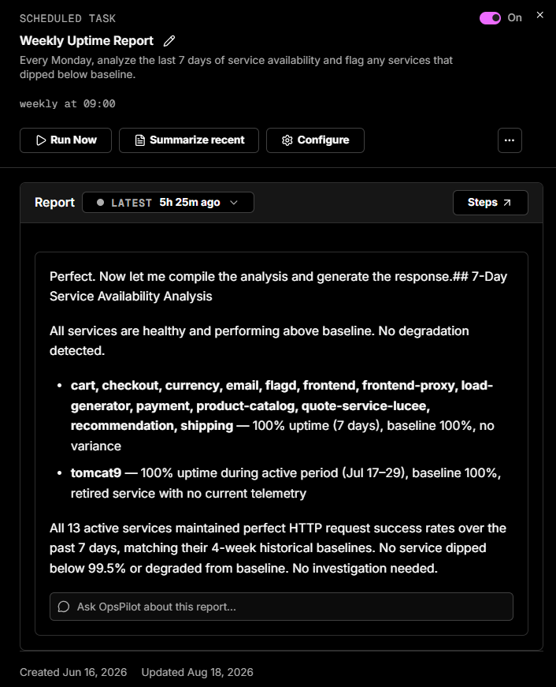

# Scheduled tasks

Scheduled tasks are how Coworker keeps watch so you don't have to - running a check on the cadence you choose and staying quiet unless there's something worth telling you. They're the core of Coworker's continuous analysis. Choose any interval - hourly, daily, weekly, monthly, or custom - and each run produces a report summarising what Coworker found. Scheduled tasks run until you turn them off.

Run any scheduled task on-demand with the **Run now** button, and view the full execution history to see what it found on each run.

Each run produces the report you set the task up for and also surfaces anything else worth flagging - see [What every task run does](tasks.md#what-every-task-run-does).

## Running and reviewing a task

Open a scheduled task to see its details and history. Alongside the **On/Off** toggle you can:

- **Run Now** - trigger the task immediately instead of waiting for the next scheduled run
- **Summarize recent** - get a quick summary of its recent runs
- **Configure** - edit its description, schedule, and settings

The **Report** panel shows the latest run, with a dropdown to browse previous runs (e.g. *Latest - 5h 25m ago*) and a **Steps** button to see the steps Coworker took to produce it. The **Ask OpsPilot about this report** box lets you ask follow-up questions with the full report already in context.

## Example

A task described as *"Every Monday, analyze the last 7 days of service availability and flag any services that dipped below baseline"*, scheduled **weekly at 09:00**, produces a report like this:

> **7-Day Service Availability Analysis**
>
> All services are healthy and performing above baseline. No degradation detected. All 13 active services maintained perfect HTTP request success rates over the past 7 days, matching their 4-week historical baselines. No service dipped below 99.5% or degraded from baseline. No investigation needed.

When everything is healthy, the report simply confirms it - Coworker stays quiet unless there's something worth telling you.

---

!!! question "Need more help?"
    Contact support in the chat bubble and let us know how we can assist.
