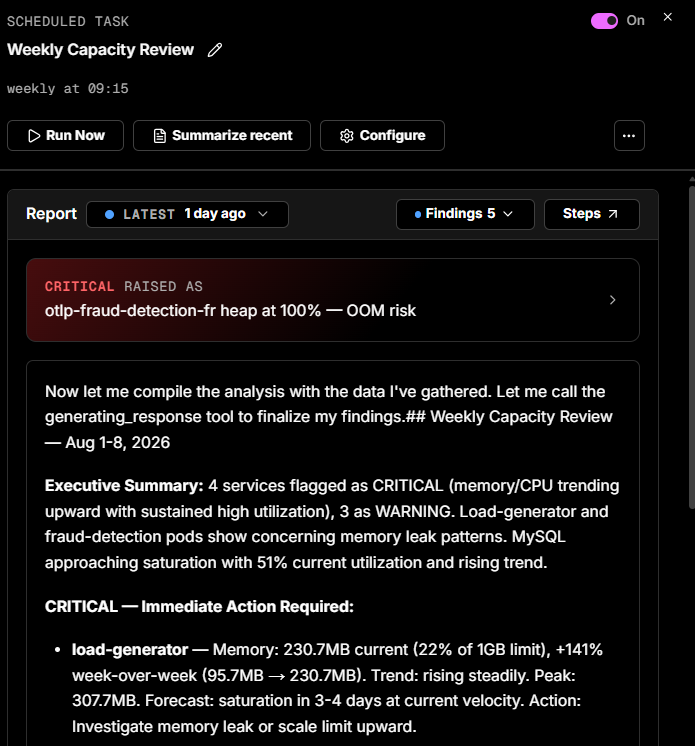

# Scheduled tasks

Scheduled tasks are how Coworker keeps watch so you don't have to - running a check on the cadence you choose and staying quiet unless there's something worth telling you. They're the core of Coworker's continuous analysis. Choose any interval - hourly, daily, weekly, monthly, or custom - and each run produces a report summarising what Coworker found. Scheduled tasks run until you turn them off.

Run any scheduled task on-demand with the **Run now** button, and view the full execution history to see what it found on each run.

Each run produces the report you set the task up for and also surfaces anything else worth flagging - see [What every task run does](tasks.md#what-every-task-run-does).

---

!!! question "Need more help?"
    Contact support in the chat bubble and let us know how we can assist.
