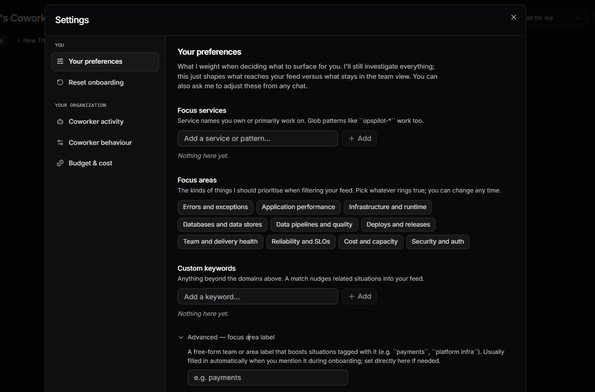
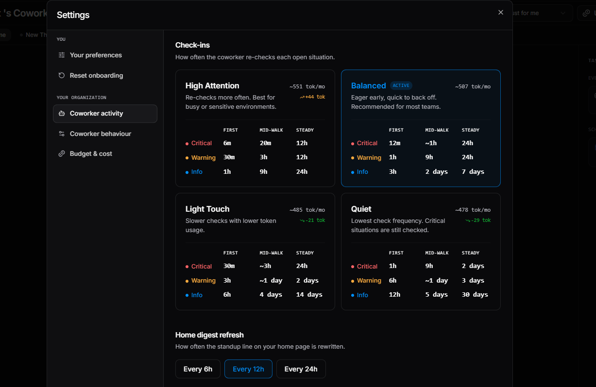
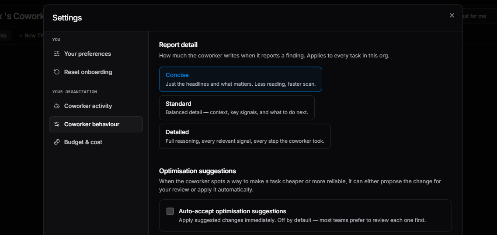
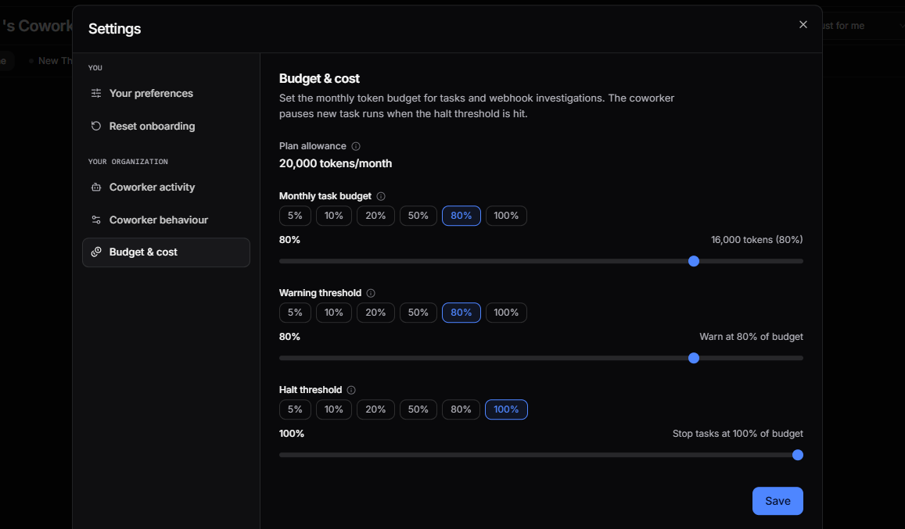

# Settings

Click the settings icon on the Coworker dashboard to open the Settings modal. Settings are split into two groups:

**You** - personal settings that apply only to your Coworker:

| Setting | Description |
|---|---|
| [**Your preferences**](#your-preferences) | Controls what Coworker weights when deciding what to surface in your feed |
| [**Reset onboarding**](#reset-onboarding) | Walks through the getting-started flow again without losing any existing setup |

**Your organisation** - settings that apply across your whole team:

| Setting | Description |
|---|---|
| [**Coworker activity**](#coworker-activity) | Configure what Coworker monitors and how it responds to events |
| [**Coworker behaviour**](#coworker-behaviour) | Adjust how Coworker investigates and communicates |
| [**Budget & cost**](#budget-cost) | Manage your AI Token allowance and cost controls (same as the [AI Tokens tab in Usage](usage.md#ai-token-allowance)) |

---

## Your preferences

The **Your preferences** panel shapes what reaches your personal feed without changing what Coworker investigates. Coworker still investigates everything - this just controls what surfaces for you versus what stays in the team view. You can also ask Coworker to adjust these from any chat.

| Setting | Description |
|---|---|
| **Focus services** | Service names you own or primarily work on. Glob patterns like `opspilot-*` work too. Situations affecting these services are prioritised in your feed |
| **Focus areas** | The kinds of things Coworker should prioritise when filtering your feed: Errors and exceptions, Application performance, Infrastructure and runtime, Databases and data stores, Data pipelines and quality, Deploys and releases, Team and delivery health, Reliability and SLOs, Cost and capacity, Security and auth |
| **Custom keywords** | Anything beyond the domains above. A match nudges related situations into your feed |
| **Advanced - focus area label** | A free-form team or area label that boosts situations tagged with it (e.g. `payments`, `platform infra`). Usually filled in automatically when you mention it during onboarding; set directly here if needed |

---

## Reset onboarding

Click **Reset onboarding** and then **Open onboarding** to walk through the setup flow again. Useful for adding more scheduled tasks, picking up extra alerts, or refining your preferences. Re-running does not delete anything you already have - your tasks, situations, alert subscriptions, and preferences stay in place.

---

## Coworker activity

Configure what Coworker monitors and how it responds to events across your organisation.

### Check-ins

Controls how often Coworker re-checks each open situation. Four modes are available:

| Mode | Description |
|---|---|
| **High Attention** | Re-checks more often. Best for busy or sensitive environments |
| **Balanced** | Eager early, quick to back off. Recommended for most teams (default) |
| **Light Touch** | Slower checks with lower token usage |
| **Quiet** | Lowest check frequency. Critical situations are still checked |

Each mode shows the First / Mid-walk / Steady check intervals for Critical, Warning, and Info situations.

### Home digest refresh

Controls how often the standup line on your home page is rewritten. Options: every 6h, every 12h, or every 24h.

---

## Coworker behaviour

Adjust how Coworker investigates and communicates across your organisation.

### Report detail

Controls how much Coworker writes when it reports a finding. Applies to every task in your organisation.

| Mode | Description |
|---|---|
| **Concise** | Just the headlines and what matters. Less reading, faster scan |
| **Standard** | Balanced detail - context, key signals, and what to do next |
| **Detailed** | Full reasoning, every relevant signal, every step Coworker took |

### Optimisation suggestions

When Coworker spots a way to make a task cheaper or more reliable, it can either propose the change for your review or apply it automatically.

**Auto-accept optimisation suggestions** - apply suggested changes immediately. Off by default; most teams prefer to review each one first.

---

## Budget & cost

Set the monthly token budget for tasks and webhook investigations. Coworker pauses new task runs when the halt threshold is hit.

| Control | Description |
|---|---|
| **Plan allowance** | Your organisation's total monthly token allowance (read-only) |
| **Monthly task budget** | The share of your plan allowance allocated to tasks. Set as a percentage: 5%, 10%, 20%, 50%, 80%, or 100% |
| **Warning threshold** | Sends a notification when spend reaches this percentage of your task budget |
| **Halt threshold** | Stops new task runs when spend reaches this percentage of your task budget. Defaults to 100% |

See [AI Tokens](usage.md#ai-token-allowance) for full usage details and optimisation suggestions.

---

## Hiding insight types

To suppress a type of insight from your view, click **Hide similar** on any insight card. This opens a modal where you can match by category, severity, label, or title pattern. Coworker will stop surfacing insights that match your conditions.

---

!!! question "Need more help?"
    Contact support in the chat bubble and let us know how we can assist.
