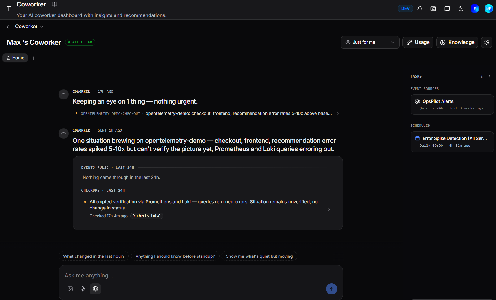
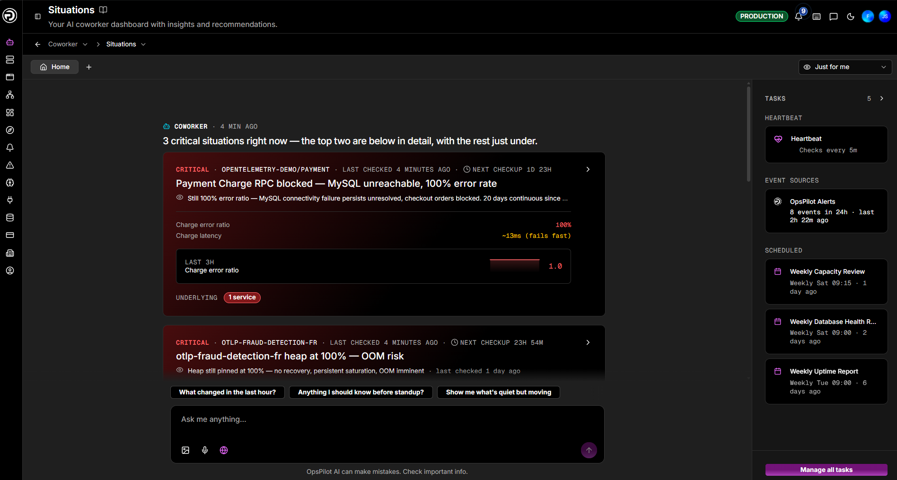
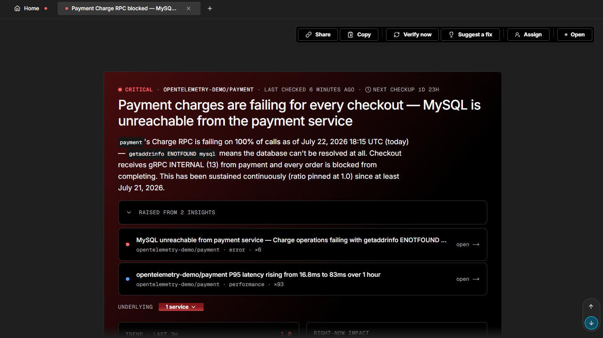
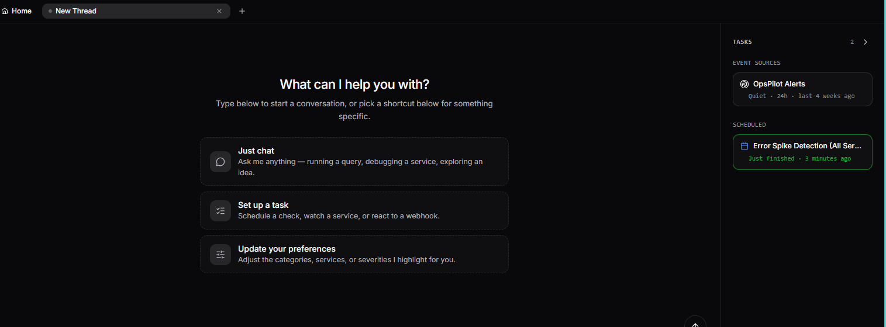

# Situations

Situations are what Coworker hands you to triage: coherent stories built from its findings and surfaced as a feed on your home page. This page covers how insights become situations, how severity and status work, what runs in the background to keep situations current, and how to work with them.

## Insights and situations

**Insights are the core of Coworker.** Everything Coworker does - investigating alerts, running scheduled checks, responding to webhooks - produces insights. An insight is one atomic finding: one observation, one anomaly, one error pattern. Each has a severity, a category, an affected service, and a short description with supporting evidence. Insights are how Coworker records what it has seen and reasoned about.

**Situations** are the editorial layer built on top of insights. Coworker groups related insights into one coherent story: a title, a plain-language summary, the affected service, severity, and impact. Situations are what you triage. Insights are how Coworker writes them up; situations are what it hands you.

A situation is not a static record. As new insights arrive, Coworker decides whether to extend an existing situation, merge it with another, escalate or de-escalate its severity, or close it out. That continuous editing is the difference between a useful picture of your operations and a noisy alert feed.

## Severity and status

Severity and status answer two different questions:

| | Question | Values |
|---|---|---|
| **Severity** | How bad is this? | Critical, Warning, Info |
| **Status** | Where is it in its lifecycle? | Open, In progress, Resolved, Dismissed |

A situation starts **Open**, moves to **In progress** while it's being worked, and ends as **Resolved** (handled) or **Dismissed** (not a real problem). Severity and status are independent: a Critical can be In progress while someone works it, and a Warning can sit Open if it's worth a look but not urgent. Keeping them separate lets the feed show what matters without conflating how bad something is with whether it's being handled.

---

## What runs in the background

Coworker is never just a snapshot. Three things run continuously:

**Investigating new signals.** When an alert fires or a task runs, Coworker pulls the relevant metrics, logs, and traces, writes insights, and decides what to do: raise a new situation, attach the finding to an existing one, or note that it looked and found nothing worth raising. Alerts that arrive close together are investigated as a group, so one underlying problem doesn't generate a wall of separate cards.

**Tidying up.** Every few minutes Coworker sweeps your open situations and consolidates them, merging two that turn out to be the same problem, escalating severity when a new signal warrants it, and attaching stray findings to the situation they belong to.

**Re-checking what's open.** Every open situation is re-investigated on a cadence that depends on its severity. Criticals are checked roughly every 10–15 minutes at first; warnings and quieter items less frequently. When a situation recovers on its own, Coworker resolves it and tells you why. As a situation stays stable, checks become less frequent; if something shifts, the cadence tightens back up. Once resolved, a situation gets a couple of follow-up checks over the next few hours to confirm the fix held.

---

## The home page

The home page is a feed of messages from your Coworker, more like a conversation with a colleague who has been working while you were away than a static dashboard. Everything arrives as a message in that feed: new situations, updates to existing ones, checks that came back clean, and pointers to coverage gaps.

A **WATCHING** badge in the header confirms Coworker is actively monitoring your environment.

The interface uses a tab bar across the top. **Home** is always the first tab. Each situation thread or conversation you open appears as an additional tab alongside it, so you can switch between multiple threads without losing context. Click **+** to open a new thread. Tabs with an orange dot indicate an active or critical situation.

### Your view or the team's

Use the **Just for me** dropdown at the top of the page to filter the feed to your personalised slice - situations relevant to your services and setup. Switch to a broader view when you're on call, covering someone else's area, or want the full picture across your organisation.

### How the feed adapts

Coworker changes how it leads depending on what it has to tell you:

| State | What you see |
|---|---|
| **Quiet** | An "all clear" note on what Coworker has been doing and watching. Silence means "checked and fine", not "nothing running" |
| **One critical** | A single focus card with the full story: summary, affected service, impact, latest checkup, and evidence |
| **A few criticals** | Prominent rows in urgency order, each with enough detail to triage at a glance |
| **Many criticals** | A status overview showing the count and affected services. When everything is urgent, a wall of full-size cards doesn't help |

Below the critical items sits the quieter list: warnings and lower-severity items Coworker is watching rather than actively raising. This is where tomorrow's situation often first appears. Recently resolved situations collapse into a short list near the bottom.

### Other message types

Alongside situations, the feed contains:

- **Coverage gaps**: one of Coworker's most useful signals. When it would have investigated something but couldn't - or spotted telemetry it can't trust - it tells you explicitly, grouped under a line like *"Some places I'd like more visibility - pointers below if you can help."* Gaps range from the broad (a service has no telemetry, an alert rule isn't connected, a catalog entry is missing) to the specific (a JVM pool with no metrics, a p95 query using the wrong label and inflating readings, an instance reporting no heap metrics, a service with no span metrics). Each gap names exactly what's missing, with a **Help me set this up** button that opens a guided thread, a **link** icon to copy it, and a **dismiss** (✕) to clear it. Coverage gaps turn Coworker into a diagnostic for your observability, not just a consumer of it.
- **The digest**: a snapshot Coworker keeps current, summarising the checks it ran and things it handled quietly in the background.
- **Debriefs**: short notes for when Coworker investigated something and concluded there was nothing worth raising, so the work is visible rather than silent.

### Sidebar

The right-hand sidebar gives a quick status view alongside the feed:

| Section | Description |
|---|---|
| **Tasks** | The number of open tasks currently assigned to you, with a link to the full Tasks board |
| **Event sources** | Your connected event sources and their recent activity - showing whether each has been quiet or firing, and when it last triggered |
| **Scheduled** | Your scheduled tasks, showing their run cadence and when they last ran. A green highlight indicates a task that just finished |

---

## Situations and threads

Every situation opens into a thread: a dedicated conversation about that one problem, with all context already loaded. At the top sits the situation itself; below it runs the history of Coworker's checkups and state changes, interleaved with any messages between you and it.

From a situation thread you can:

| Action | Description |
|---|---|
| **Ask follow-ups** | Type any question. Coworker answers with the situation's full context already in hand |
| **Verify now** | Triggers a fresh investigation immediately, rather than waiting for the next scheduled checkup. The result lands in the thread when done |
| **Suggest a fix** | Prompts Coworker to propose concrete remediation steps based on what it has found |
| **Assign** | Give the situation an owner. Click **I'll take this** to assign it to yourself, or search members and pick a teammate |
| **Set status** | Move the situation through its lifecycle - **Open**, **In progress**, **Resolved**, or **Dismissed**. Choosing Resolved or Dismissed asks for a quick reason, which also teaches Coworker what not to raise next time |
| **Share** | Copies a shareable link to the thread |
| **Copy** | Copies the full situation as a markdown brief, ready to paste into another tool or hand off to a teammate |

### Insight shortcuts

Click **Chat** on any insight for five quick actions:

| Action | Description |
|---|---|
| **Is this still an issue?** | Checks current state to see if the problem is ongoing or resolved |
| **Investigate root cause** | Kicks off a root cause analysis |
| **Create a ticket** | Creates a ticket for the issue |
| **Suggest a fix** | Recommends remediation steps or best practices |
| **Discuss this insight** | Opens a free-form conversation about the insight |

These shortcuts are available everywhere insights appear: the priority queue, insight lists, and insight detail views. You can also click **Help me triage** to send your current priority insights and recent activity to Coworker for a prioritisation recommendation.

---

## Chatting outside a situation

You can start a fresh thread at any time to ask about a service, a recent change, a metric, or anything else Coworker can investigate. Click **+** in the tab bar to open a new thread.

Three shortcuts are offered to get started quickly:

| Shortcut | Description |
|---|---|
| **Just chat** | Ask anything - running a query, debugging a service, exploring an idea |
| **Set up a task** | Schedule a check, watch a service, or react to a webhook |
| **Update your preferences** | Adjust the categories, services, or severities Coworker highlights for you |

These free-form chats have the full set of tools: attach images, use voice input, search the web, and pull context from your connected integrations.

Each task run produces a report with findings, the investigation process, and a final summary. An input field appears below each report (*Ask OpsPilot about this report...*) with the full report already in context, so you can ask follow-up questions without copying anything.

---

!!! question "Need more help?"
    Contact support in the chat bubble and let us know how we can assist.
