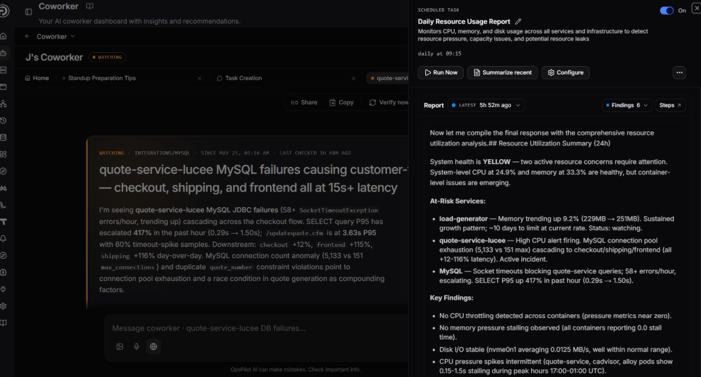

# Tasks

Tasks are the standing jobs you give Coworker to run in the background. Rather than filling in forms or learning configuration options, you describe what you want in plain language and Coworker shapes it into a task through conversation.

Coworker is not limited to your observability data. As an LLM, it can also search the web as part of an investigation, bringing in external context (documentation, known issues, best practices) alongside your metrics, logs, and traces.

!!! info
    Tasks are currently configured at the organisation level.

---

## Task types

### Scheduled tasks

Run on a recurring schedule you choose: hourly, daily, weekly, monthly, or a custom interval. Each run produces a report summarising what Coworker found. These are the core of Coworker's continuous analysis. Scheduled tasks run until you turn them off, and they're quiet unless there's something worth telling you.

Run any scheduled task on-demand with the **Run now** button, and view the full execution history to see what it found on each run.

### Monitoring tasks

Monitoring tasks are temporary. They run repeatedly for a limited window to keep an eye on one specific thing and report back as they go. For example, "keep checking the checkout error rate through this rollout" or "watch database connections for the next few hours while we drain the node."

You get progressive updates as the task runs. Once its window is up, the task winds down on its own. Use monitoring tasks when you want focused attention on something for a while rather than forever.

### Event sources

Event sources react to webhooks from external systems. Instead of running on a schedule, they wait for an event (a deploy notification, an incident raised in another tool, an alert from an external service) and immediately kick off an investigation each time.

---

## Creating tasks

To create a task, open a new thread and select **Set up a task**. Coworker asks *"What are you trying to achieve?"* and guides you through setup conversationally, with no forms to fill in. Suggested shortcuts help you get started:

- *"Create a scheduled task to check error rates every hour"*
- *"Watch a service and tell me when something looks off"*
- *"Listen to a webhook and run a check on every event"*

To edit an existing task, click **Configure** from the task panel in the sidebar.

---

## What every task run does

Every task run does two things at once:

1. **Produces the report** you set the task up for (a weekly resource review, a daily error summary, a post-deploy health check) which lands in the task's run history.
2. **Surfaces anything else worth flagging.** While it's working, Coworker notices other issues and turns them into insights that flow into your feed as situations, just like findings from an alert.

This means you can aim a task either at a report you want kept current, or purely at finding problems, and have Coworker proactively raise what it spots without an alert needing to fire at all.

---

## OpsPilot Alerts

One event source is always present for every user: **OpsPilot Alerts**. Connecting it is the single most valuable thing you can do, letting Coworker investigate your alerts the moment they fire, checking metrics and logs, working out what changed, and posting one clean situation instead of a stream of raw alert noise.

You're offered this during onboarding, but you can connect it at any time by opening the tasks panel, going to **Event Sources**, clicking **OpsPilot Alerts**, and then **Configure**.

From then on, every watched alert gets investigated automatically and shows up in your feed as a situation.

Use the toggle at the top to enable or disable OpsPilot Alerts entirely. Click **Done** to save and close the panel.

If Coworker has optimisation suggestions for your alert setup, a banner appears at the top of the configure panel showing the estimated monthly saving. Click **View** to see the suggestion.

Under **Alert Rules**, you can:

- Search alerts by name
- Filter by **All**, **Enabled**, or **Firing**
- **Enable All** or **Disable All** in bulk
- Toggle individual alerts on or off
- Expand an alert to add specific instructions (e.g. *"Check the Redis connection pool first"*)

You can also add **General Alert Instructions** that apply to every alert investigation - useful for pointing Coworker at common starting points or known patterns. These sit below the alert rules list.

---

## Model tier

Every task and event source has a **Model Tier** setting that controls how Coworker analyses the data:

| Tier | Description |
|---|---|
| **Thorough** | Best for critical alerts and complex events that need deep analysis |
| **Efficient** | Best for high-volume, routine events like health checks and simple notifications |

Use **Thorough** for critical alerts and complex investigations where depth matters. Use **Efficient** for routine or high-volume tasks to keep token costs down.

---

## Creating an event source

To set up a new event source, open a new thread, select **Set up a task**, and describe the webhook you want to connect.

| Field | Description |
|---|---|
| **Type** | The webhook type, e.g. Generic Webhook |
| **Name** | A name for the event source (e.g. Production Alerts) |
| **Description** | What events this webhook will receive |
| **Custom Instructions** (optional) | Guides how events are investigated, e.g. *"Focus on database-related issues and suggest query optimisations"* |
| **Model Tier** | Controls how the event is investigated. **Thorough** for critical or complex events; **Efficient** for high-volume, routine events |
| **Monthly Budget** (optional) | A token budget for this event source. If not set, the org budget is the only cap. |

---

## Managing tasks

The right-hand sidebar shows your active tasks, split into **Event Sources** and **Scheduled** sections. Each task shows its name, schedule, and when it last ran. Click **Manage all tasks** to open the full task management panel.

The **All tasks** panel lets you view and manage everything Coworker runs:

- Click **Preferences** to update your monitoring preferences, or **+ Create Task** to create a new task
- Filter using the tabs: **All**, **Scheduled**, **Monitoring**, **Event Sources** - each tab shows the count of tasks in that category
- Search tasks by name using the search bar
- The **SYSTEM** section shows built-in tasks such as **OpsPilot Alerts**. A badge shows the current state (e.g. *No alerts yet* if none are connected, or a watch count once alerts are enabled)
- The **ACTIVE** section lists your enabled tasks with their schedule, next run time, and last run date. Each task has a **Run** button to trigger it immediately, a toggle to disable it, and a delete button
- The **DISABLED** section lists tasks that have been turned off. They retain their configuration and can be re-enabled at any time using the toggle

---

!!! question "Need more help?"
    Contact support in the chat bubble and let us know how we can assist.
