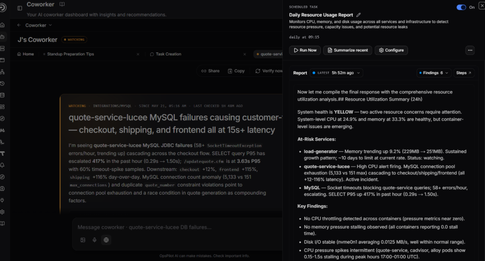

# Tasks

Tasks are the standing jobs you give Coworker to run in the background. Rather than filling in forms or learning configuration options, you describe what you want in plain language and Coworker shapes it into a task through conversation.

Coworker is not limited to your observability data. As an LLM, it can also search the web as part of an investigation, bringing in external context (documentation, known issues, best practices) alongside your metrics, logs, and traces.

!!! info
    Tasks are currently configured at the organisation level.

---

## Task types

### Heartbeat

Coworker's always-on health screen. Once your services are catalogued, it watches each one against learned baselines and investigates sustained deviations on its own - no alert rules required. See [Heartbeat](heartbeat.md) for details.

### Scheduled tasks

Run on a recurring schedule you choose: hourly, daily, weekly, monthly, or a custom interval. Each run produces a report summarising what Coworker found - the core of Coworker's continuous analysis. See [Scheduled tasks](scheduled.md) for details.

### Event sources

Event sources react to webhooks from external systems, kicking off an investigation on each event. This includes the always-on **OpsPilot Alerts**. See [Event sources](event-sources.md) for details.

### Monitoring tasks

Monitoring tasks are temporary. They run repeatedly for a limited window to keep an eye on one specific thing and report back as they go. For example, "keep checking the checkout error rate through this rollout" or "watch database connections for the next few hours while we drain the node."

You get progressive updates as the task runs. Once its window is up, the task winds down on its own. Use monitoring tasks when you want focused attention on something for a while rather than forever.

---

## Creating tasks

To create a task, open a new thread and select **Set up a task**. Coworker asks *"What are you trying to achieve?"* and guides you through setup conversationally, with no forms to fill in. Suggested shortcuts help you get started:

- *"Create a scheduled task to check error rates every hour"*
- *"Watch a service and tell me when something looks off"*
- *"Listen to a webhook and run a check on every event"*

To edit an existing task, click **Configure** from the task panel in the sidebar.

---

## What every task run does

Every task run does two things at once:

1. **Produces the report** you set the task up for (a weekly resource review, a daily error summary, a post-deploy health check) which lands in the task's run history.
2. **Surfaces anything else worth flagging.** While it's working, Coworker notices other issues and turns them into insights that flow into your feed as situations, just like findings from an alert.

This means you can aim a task either at a report you want kept current, or purely at finding problems, and have Coworker proactively raise what it spots without an alert needing to fire at all.

---

## Model tier

Every task and event source has a **Model Tier** setting that controls how Coworker analyses the data:

| Tier | Description |
|---|---|
| **Thorough** | Best for critical alerts and complex events that need deep analysis |
| **Efficient** | Best for high-volume, routine events like health checks and simple notifications |

Use **Thorough** for critical alerts and complex investigations where depth matters. Use **Efficient** for routine or high-volume tasks to keep token costs down.

---

!!! question "Need more help?"
    Contact support in the chat bubble and let us know how we can assist.
