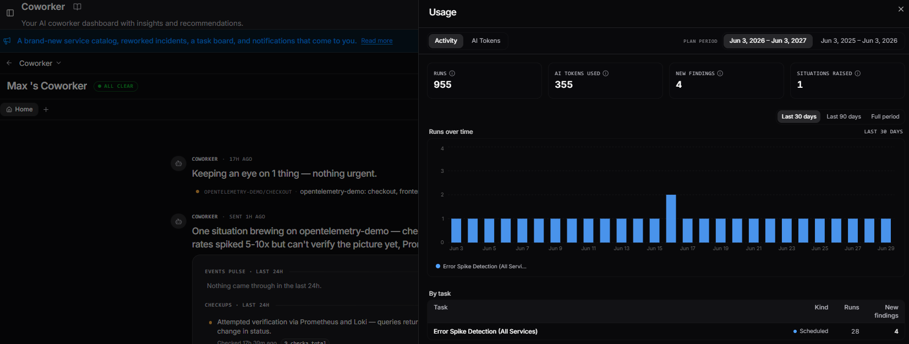
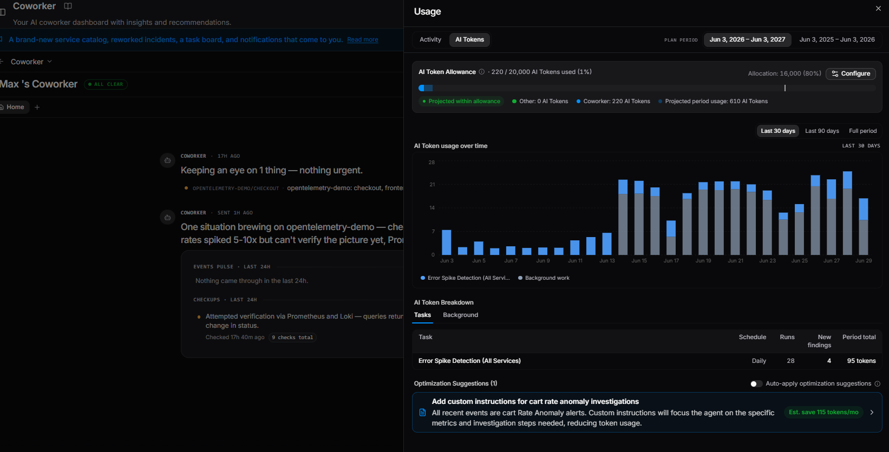
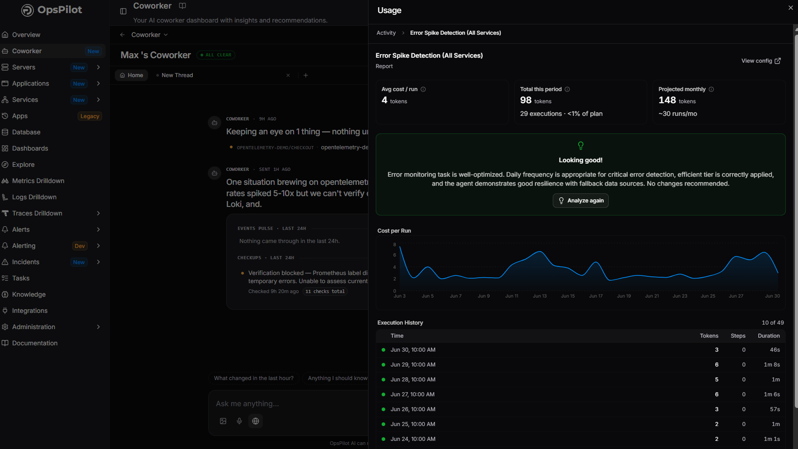

# Usage

Click **Usage** from the top right of the Coworker dashboard to open the Usage panel. It has two tabs: **Activity** and **AI Tokens**.

---

## Understanding OpsPilot AI Tokens

Your OpsPilot plan includes a monthly allowance of **OpsPilot AI Tokens**. These are the usage allowance for Coworker's AI-powered work. Every time Coworker investigates an alert, runs a scheduled check, analyses telemetry, generates a recommendation or answers a question in chat, it uses AI Tokens from your allowance.

Usage varies depending on the amount of context, telemetry and reasoning required. A simple chat question uses a small number of AI Tokens. A deeper investigation that reviews telemetry, prior findings, service context and generates recommended actions uses more.

### What uses AI Tokens

| Source | Description |
|---|---|
| **Chat** | AI Tokens used by direct questions and conversations with Coworker |
| **Coworker investigations** | AI Tokens used when Coworker investigates alerts, situations, telemetry patterns or service behaviour |
| **Scheduled checks** | AI Tokens used by recurring Coworker tasks, such as daily error checks, performance reviews or resource usage analysis |
| **Recommendations** | AI Tokens used to generate suggested fixes, explanations and next steps |

---

## Activity tab

The **Activity** tab shows what Coworker has done over a selected time range. Use the **Plan period** selector in the top right to switch between plan years, and the **Last 30 days / Last 90 days / Full period** toggle to adjust the window within that period.

Four summary metrics are shown at the top:

| Metric | Description |
|---|---|
| **Runs** | Number of task executions completed in the selected period |
| **AI Tokens used** | Total AI Tokens consumed in the selected period |
| **New findings** | Number of new findings generated across all runs |
| **Situations raised** | Number of situations Coworker raised in the selected period |

A **Runs over time** chart shows task execution frequency across the period.

The **By task** table breaks down activity per task:

| Column | Description |
|---|---|
| **Task** | The task name |
| **Kind** | The task type (Scheduled, Monitoring, or Event source) |
| **Runs** | Number of executions in the selected period |
| **New findings** | Number of new findings generated by that task |

OpsPilot always shows the operational work Coworker delivered alongside AI Token usage, so you can see what your allowance funded. AI Token usage is never shown in isolation.

---

## AI Tokens tab

The **AI Tokens** tab gives you full visibility into AI Token spend and the controls to manage it.

!!! tip
    One of the most effective ways to reduce AI Token usage over time is simply to let tasks run. As [task-specific memory](overview.md#memory) builds up, Coworker re-uses context it already knows rather than fetching it fresh on every run, reducing usage by up to 50% in some cases.

### AI Token Allowance

The **AI Token Allowance** bar at the top shows your current spend against your plan allowance (e.g. 94 / 20,000 AI Tokens used). The **Allocation** figure shows how much of your plan allowance is assigned to tasks (e.g. 16,000 — 80%). A **Projected within allowance** status confirms whether your current usage trajectory is on track.

Below the bar, a legend breaks down usage by source:

- **Chat**: AI Tokens used by direct conversations
- **Coworker**: AI Tokens used by task runs
- **Projected period usage**: estimated total by end of the current period

Click **Configure** to go to **Settings > Allowance & cost**.

Your **Plan allowance** is shown as a fixed value set by your plan (e.g. 5,000 tokens/month). The remaining settings are configurable:

| Setting | Description |
|---|---|
| **Monthly task allowance** | The percentage of your plan allowance allocated to tasks and webhook investigations. Select a preset (5%, 10%, 20%, 50%, 80%, 100%) or use the slider |
| **Warning threshold** | The percentage of your task allowance at which Coworker warns you about spend (e.g. "Warn at 50% of allowance") |
| **Halt threshold** | The percentage at which Coworker stops running tasks (e.g. "Stop tasks at 50% of allowance") |

Click **Save** to apply your changes. Coworker pauses new task runs when the halt threshold is reached. Click **Save** to apply your changes.

### AI Token usage over time

A bar chart showing AI Token consumption per day across the selected period. Use the **Last 30 days / Last 90 days / Full period** toggle to adjust the window. The chart legend identifies spend by task and includes a **Background work** category for AI Token usage from Coworker's continuous monitoring activity (situation re-checks, tidying, and debriefs) that runs outside of named tasks.

### AI Token Breakdown

The **AI Token Breakdown** table has two sub-tabs:

**Tasks** — shows your named tasks. Each row shows:

| Column | Description |
|---|---|
| **Task** | The task name |
| **Schedule** | How often the task runs |
| **Runs** | Number of executions in the selected period |
| **New findings** | Findings generated by this task in the period |
| **Period total** | Total AI Tokens consumed by this task in the period |

**Background** — shows AI Token usage from Coworker's continuous monitoring work that runs outside of named tasks. Each row shows the activity type, period total, and projected monthly cost:

| Activity | Description |
|---|---|
| **Following up on situations** | Re-checking open situations on a regular cadence |
| **Writing your daily summary** | Generating the digest of what Coworker handled |
| **Triaging new alerts** | Initial investigation of incoming alerts |
| **Tidying the inbox** | Consolidating, merging, and closing situations |

### Optimization Suggestions

Optimization suggestions appear at the bottom of the AI Tokens tab. Each suggestion shows a title, a plain-language explanation of the proposed change, and an estimated monthly AI Token saving (e.g. *Est. save 115 tokens/mo*). Click the chevron to expand the full detail, which includes:

- **Why this suggestion** - Coworker's reasoning, including the pattern it observed and the estimated reduction per run
- **Instruction changes** - the exact proposed instructions that would be applied, so you can review the change before accepting

From an expanded suggestion you can:

- **Apply**: apply the change immediately
- **Dismiss**: ignore it. Coworker won't keep pushing the same suggestion.

Suggestions never come at the expense of monitoring quality. Coworker won't suggest anything that would reduce its ability to catch real problems. Where a task is already running efficiently, it will say so.

Toggle **Auto-apply optimization suggestions** to have Coworker automatically apply future suggestions as they are generated. This is off by default.

### On-demand analysis

Click **Analyse & Optimise** to trigger an on-demand optimisation review at any time. If no optimisations are needed, you'll see a **Looking good!** confirmation.

---

!!! question "Need more help?"
    Contact support in the chat bubble and let us know how we can assist.
