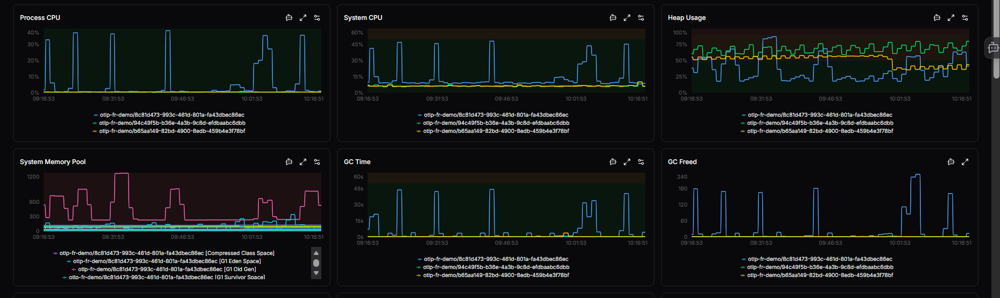

# Metrics

The **Metrics** tab provides an historic view of your server's performance and health. Data updates automatically if an auto-refresh interval is set, or manually when a new time range is selected.

The **Stats** section displays key performance metrics as a grid of cards across the top of the page. Use the **Stat show as** dropdown in the filter bar to control which aggregate function is applied to the values shown:

| Option | Description |
|---|---|
| **Last** | The most recent value recorded in the selected time range |
| **First** | The first value recorded in the selected time range |
| **Min** | The lowest value recorded |
| **Max** | The highest value recorded |
| **Mean** | The arithmetic average across the time range |
| **Median** | The middle value when all data points are sorted |
| **Mode** | The most frequently occurring value |
| **Total** | The sum of all values across the time range |

Use the **Select Group**, **Select Job**, and **Select Instance** dropdowns alongside **Stat show as** to filter the stats and graphs to a specific server or service.

| **Metric** | **Description** | **Why It's Useful** |
|---|---|---|
| **Process CPU Usage** | Percentage of CPU used by this specific process. | Detects CPU-intensive applications or bottlenecks. |
| **System CPU Usage** | Overall CPU usage across the system. | Helps identify if the host system is under load. |
| **Memory Heap Usage** | Amount of heap memory currently in use. | Useful for monitoring memory leaks or high memory consumption. |
| **GC Collection Time** | Time spent performing garbage collection. | High values may indicate inefficient memory management. |
| **Web Request Duration** | Average time to complete a web request. | Reveals latency or slow response trends. |
| **Web Request Throughput** | Number of requests handled per minute. | Shows traffic volume and server load. |
| **Database Throughput** | Number of database operations per minute. | Helps track query load and database responsiveness. |
| **Error Count / 4xx / 5xx Errors** | Number of failed or client/server-side errors per minute. | Quickly highlights failing transactions or service issues. |

!!! note
    Panels refresh automatically if an auto-refresh interval is set using the top icon. Otherwise, they update when a new time range is selected.

## Detailed graphs

Each graph provides **historical trends** for the metrics shown below.

You can:

* **Zoom in or out** on a time range to analyze spikes or anomalies.
* **Hover over data points** to see exact metric values.
* **Compare multiple metrics** to find correlations (e.g., CPU spikes vs. increased error count).

Graphs include:

* CPU and Memory trends
* Garbage Collection behavior
* Request and error rates
* Database and trace throughput

This helps with **root-cause analysis** - understanding what led to a performance change or incident.

### Metric graph actions

The top-right corner of each metric graph contains three action icons:

1. **Ask AI** - Send this metric to OpsPilot AI for natural language explanations and analysis of patterns or anomalies.

2. **Full screen** - Open the metric in full-screen view for detailed analysis and extended time ranges.

3. **Edit thresholds** - Configure warning and critical thresholds for this metric inline using the toggle. When a metric exceeds a threshold, it is highlighted visually in the stat cards and graphs.

!!! question "Need more help?"
    Contact support in the chat bubble and let us know how we can assist.
