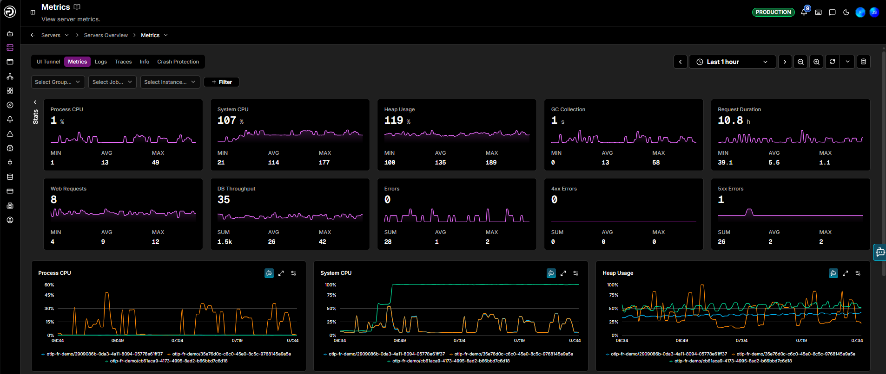
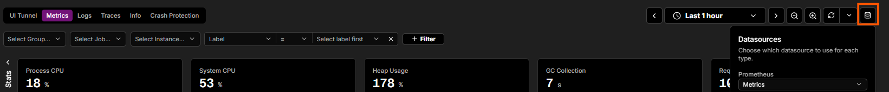
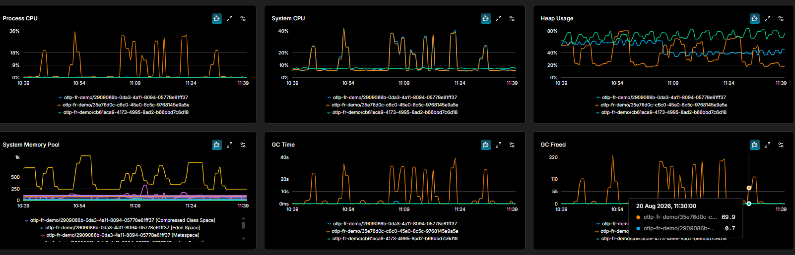
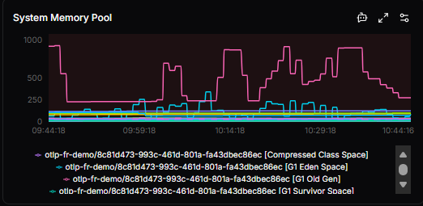
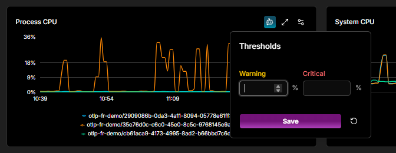

# Metrics

The **Metrics** tab provides an historic view of your server's performance and health. Data updates automatically if an auto-refresh interval is set, or manually when a new time range is selected.

The **Stats** section displays key performance metrics as a grid of cards across the top of the page. Each card shows the current headline value plus its **MIN**, **AVG**, and **MAX** across the selected time range. Count-based metrics - **DB Throughput**, **Errors**, **4xx Errors**, and **5xx Errors** - show **SUM**, **AVG**, and **MAX** instead.

| **Metric** | **Description** | **Why It's Useful** |
|---|---|---|
| **Process CPU** | Percentage of CPU used by this specific process. | Detects CPU-intensive applications or bottlenecks. |
| **System CPU** | Overall CPU usage across the system. | Helps identify if the host system is under load. |
| **Heap Usage** | Amount of heap memory currently in use. | Useful for monitoring memory leaks or high memory consumption. |
| **GC Collection** | Time spent performing garbage collection. | High values may indicate inefficient memory management. |
| **Web Request Duration** | Average time to complete a web request. | Reveals latency or slow response trends. |
| **Web Request Throughput** | Number of requests handled per minute. | Shows traffic volume and server load. |
| **Database Throughput** | Number of database operations per minute. | Helps track query load and database responsiveness. |
| **Error Count / 4xx / 5xx Errors** | Number of failed or client/server-side errors per minute. | Quickly highlights failing transactions or service issues. |

!!! note
    Panels refresh automatically if an auto-refresh interval is set using the top icon. Otherwise, they update when a new time range is selected.

Use the **Select Group**, **Select Job**, and **Select Instance** dropdowns to scope the stats and graphs to a specific server or service. Click **+ Filter** to add a label filter - pick a **Label**, an operator (e.g. `=`), and a value - to narrow the data further by any metric label. Use the time-range picker (e.g. **Last 1 hour**) in the top right to set the window, and the separate auto-refresh control beside it to reload the data on a set interval.

The **Datasources** icon in the top right opens a panel where you choose which datasource to use for each type - for example, which **Prometheus** source backs the **Metrics** data.

## Detailed graphs

Each graph provides **historical trends** for the metrics shown below.

You can:

* **Zoom in or out** on a time range to analyze spikes or anomalies.
* **Hover over data points** to see exact metric values.
* **Compare multiple metrics** to find correlations (e.g., CPU spikes vs. increased error count).

Graphs include:

* **JIT** - just-in-time compilation time
* **Request Duration** and **Web Requests** - request latency and throughput
* **Request Status** - responses by status code
* **Errors**, **4xx Errors**, and **5xx Errors** - error rates by type
* **DB Throughput** - database operations over time
* **Trace Throughput** - traces by endpoint

This helps with **root-cause analysis** - understanding what led to a performance change or incident.

### Metric graph actions

The top-right corner of each metric graph contains three action icons:

1. **Ask AI** - Send this metric to OpsPilot AI for natural language explanations and analysis of patterns or anomalies.

2. **Full screen** - Open the metric in full-screen view for detailed analysis and extended time ranges.

3. **Edit thresholds** - Open the **Thresholds** popover to set a **Warning** and **Critical** value for this metric inline (for example, as a percentage for Process CPU). Click **Save** to apply, or use the reset button to restore the defaults. When a metric exceeds a threshold, it is highlighted visually in the stat cards and graphs.

    

!!! question "Need more help?"
    Contact support in the chat bubble and let us know how we can assist.
