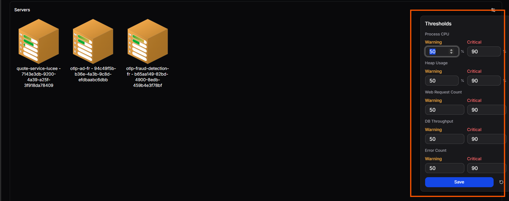

# Servers Overview

View and manage your FusionReactor agent servers and instances.

Navigate to **Servers** from the left-hand sidebar to see a visual overview of all monitored servers. The System Overview provides quick identification of performance issues and health states at a glance.

## Key features

- **Quick status check**: Visually assess the health and performance of your server fleet without needing to drill down into individual metrics.

- **Group organisation**: Servers are grouped by their FusionReactor group name, allowing for easy filtering and group-specific health checks.

- **Immediate issue identification**: Color-coding and visual states quickly draw attention to servers or groups experiencing issues.

### Component breakdown

This table describes the key elements you'll see on the **Overview** dashboard.

| **Component** | **Description** |
|----------------|-----------------|
| **Filter Bar (Group, All)** | Use this bar to filter the displayed server cubes based on server groups. |
| **System Overview** | The main area where all monitored servers or server groups are displayed as 3D cube icons. |
| **Server Cube Icon** | Each cube represents an individual server or a cluster/group of servers (e.g., `group: canary`). |
| **Cube Labeling** | Provides the FusionReactor group name (top line) and the **instance name** on the bottom line for clear identification. |
| **Live Toggle** | Indicates if the view is displaying real-time data updates. |

## Visual indicators

The visual elements attached to each cube are the most critical tools for rapid assessment.

### Color codes (Health status)

The main color of the server cube or an indicator light changes to signal overall health or alert level.

| **Color** | **Indication** | **Notes** |
|------------|----------------|------------|
| 🟦 **Blue** | Healthy / Optimal | All key metrics are within normal operating thresholds. |
| 🟧 **Orange** | Warning / Elevated Risk | One or more metrics (e.g., CPU, Memory) are approaching their critical threshold. Action may be required. |
| 🟥 **Red** | Critical / Alert | One or more key metrics have exceeded the critical threshold, potentially impacting service availability or performance. Immediate action is required. |

### Metric bars (M, C, R, D)

Small indicator bars displayed on the cube provide instantaneous utilization and performance data. The color intensity or fill level of each bar shows the current load or alert status for that specific metric.

| **Metric bar** | **Meaning** | **What it Measures** |
|-----------------|-----------------------------------------------|----------------------|
| **M** | **Memory** Usage | Current usage of heap and non-heap memory. |
| **C** | **CPU** Load | Current processor utilization. |
| **R** | Web **Request** count | The rate of incoming requests or the average time taken to process a request. |
| **D** | App **Database** Throughput Count | Monitors the number of database operations/queries handled by the application per unit time. |

## Thresholds

You can configure warning and critical thresholds for key metrics directly from the Servers Overview page.

Click the thresholds icon in the top right of the overview to open the **Thresholds** panel. For each metric - **Process CPU**, **Heap Usage**, **Web Request Count**, **DB Throughput**, and **Error Count** - set a **Warning** and **Critical** value inline. Click **Save** to apply, or use the **reset** button to restore all values to their defaults. When a server's metric exceeds a configured threshold, its cube colour updates to reflect the alert level - orange for warning, red for critical.

## Server Details

When you click on a Server cube from the System Overview dashboard, you'll be taken to a detailed management and monitoring view for that specific instance.

This detailed view is organised into top-level tabs:

- [**UI Tunnel**](ui-tunnel.md) - Access your on-premises application's user interface directly through FusionReactor Cloud.
- [**Metrics**](metrics.md) - Performance metrics and resource utilization data.
- [**Traces**](traces.md) - Deep-dive request tracing for diagnostics.
- [**Logs**](logs.md) - Application and system log analysis.
- [**Info**](info.md) - Client and server configuration information.
- [**Crash Protection**](crash-protection.md) - Runtime crash diagnostics and snapshots.

!!! question "Need more help?"
    Contact support in the chat bubble and let us know how we can assist.
