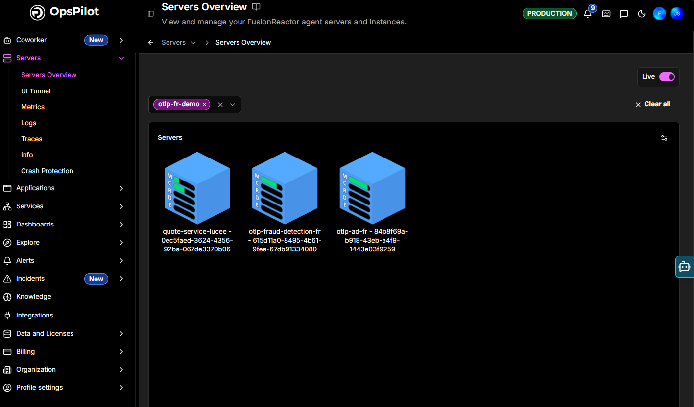
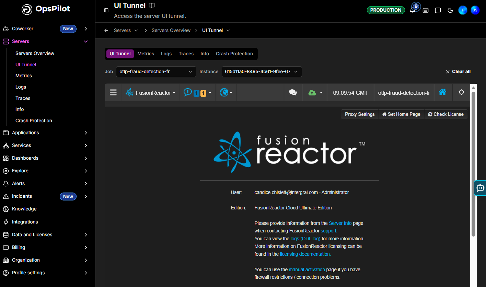
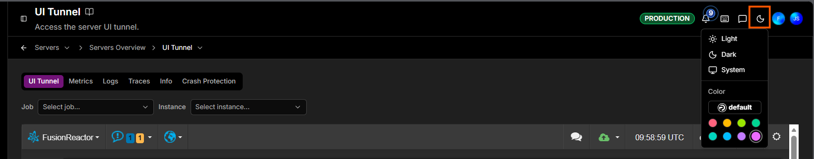

# UI Tunnel

The **UI Tunnel** opens the full FusionReactor Agent UI for one of your servers directly inside OpsPilot - the same detailed, local interface you would see on the server itself, without exposing the server to the public internet.

It brings the on-premise agent and the cloud together in one place: the complete power of the local FusionReactor tooling with the convenience of OpsPilot, so you can monitor and manage your ColdFusion and Java applications from a single, familiar interface. Because the environment stays the same as the on-premise agent, there's no learning curve as you move to the cloud.

!!! note "Requires the FusionReactor Agent"
    The UI Tunnel shows the interface of a running **FusionReactor Agent**, so it's available only for servers that have the agent installed, updated to the latest version, and reporting to OpsPilot. See [FusionReactor Agent](../Integrations/SDKs/fusionreactor.md) for download and installation steps.

## Opening the UI Tunnel

There are two ways in:

- From **Servers > Servers Overview**, click a server's blue tile to open its tunnel.
- From the **Servers** menu, click **UI Tunnel**, then choose the server you want.

## Choosing a server

At the top of the UI Tunnel, two selectors control which agent you are viewing:

- **Job** - the service or application (e.g. `otlp-fraud-detection-fr`).
- **Instance** - the specific agent instance for that job.

Use **Clear all** to reset the selection.

## What you can access

The tunnelled view is the agent's own FusionReactor UI, live - the complete on-premise feature set, exactly as if you were logged into FusionReactor on the server, including:

- **[Metrics](https://docs.fusionreactor.io/Data-insights/Features/Metrics/Metrics-Page/)**, **[Requests](https://docs.fusionreactor.io/Data-insights/Features/Requests/Request-Activity/)**, and **[Transactions](https://docs.fusionreactor.io/Data-insights/Features/Transactions/Transactions/)** - live application and request performance
- **[JDBC](https://docs.fusionreactor.io/Data-insights/Features/JDBC/JDBC-Monitoring/)** - database activity
- **[UEM & Sessions](https://docs.fusionreactor.io/Data-insights/Features/UEM/User-Experience-Monitoring/)** - user experience monitoring and sessions
- **[Resources](https://docs.fusionreactor.io/Data-insights/Features/Resources/Garbage-Collection/)** and **[Memory](https://docs.fusionreactor.io/Data-insights/Features/Resources/Heap-Non-Heap-Memory/)** - system resources and memory analysis
- **[Debug](https://docs.fusionreactor.io/Data-insights/Features/Debugger/Overview/)** and **[Profiler](https://docs.fusionreactor.io/Data-insights/Features/Profiler/Profiler/)** - troubleshoot and profile issues directly
- **Settings management** and the agent's own toolbar (Proxy Settings, Set Home Page, Check License)

Alongside the tunnel, the **Metrics**, **Logs**, **Traces**, **Info**, and **Crash Protection** tabs give you OpsPilot's own views for the same server.

## Changing the theme

Use the theme control (the sun/moon icon) in the top header bar to switch the interface between **Light**, **Dark**, and **System** (match your operating system), and to pick an accent **Color**. Dark mode is handy for extended monitoring sessions.

!!! question "Need more help?"
    Contact support in the chat bubble and let us know how we can assist.
