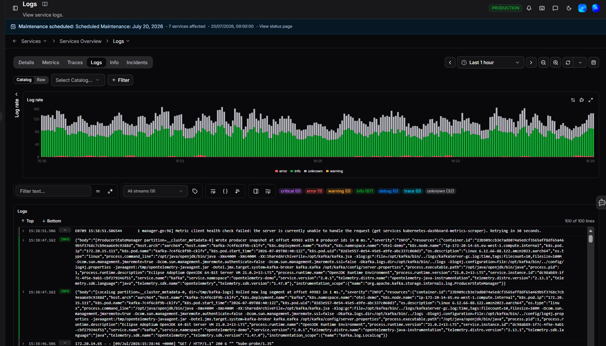
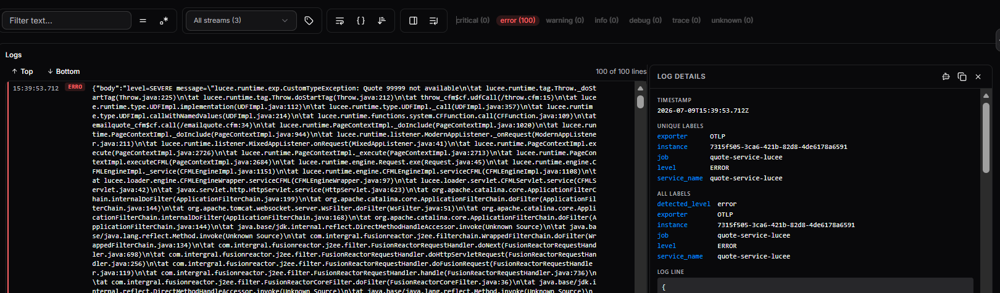

# Logs

When metrics tell you something is wrong, logs tell you why. The Logs tab shows all log output for the selected service within the chosen time range. Use it to investigate errors, trace log patterns, and filter down to specific severity levels or log content.

## Filters

| Filter | Description |
|---|---|
| **Catalog / Raw** | Switch between catalog services and all detected services |
| **Select Catalog** | Filter logs to a specific service |
| **+ Filter** | Add additional filter conditions |

Click **Clear all** to reset all active filters.

## Log Rate chart

The **Log Rate** bar chart shows log volume over time, colour-coded by severity:

- **Red**: Error logs
- **Green**: Info logs
- **Grey**: Unknown severity

Hover over a bar to see the exact counts per severity at that timestamp. Use this chart to quickly spot spikes in error output.

Three icons appear in the top right corner of the chart:

| Icon | Description |
|---|---|
| **Sync** | Refresh the chart data |
| **Ask AI** | Opens a Coworker conversation with this chart in context |
| **Fullscreen** | Expands the chart to full screen |

## Log list toolbar

Between the filters and the log list, a toolbar gives you additional controls:

| Control | Description |
|---|---|
| **Filter text** | Search log content by keyword or pattern |
| **All streams** | Select which log streams to include |
| **Show stream labels** | Toggle display of log stream labels on each entry |
| **Wrap lines** | Toggle line wrapping for long log messages |
| **Prettify JSON** | Format JSON log entries for easier reading |
| **Newest first** | Toggle sort order between newest-first and oldest-first |
| **Show details in sidebar** | Open the Log Details panel alongside the log list |
| **Tail logs** | Live-follow log output as it arrives |

## Log Details sidebar

Clicking into a log entry gives you the full label set for that entry and a direct path to Coworker analysis, useful when you want to understand the context around a specific error or anomaly.

Click **Show details in sidebar** or click a log entry to open the **Log Details** panel.

 The panel shows:

- **Timestamp**: the exact time of the log entry
- **Unique labels**: key labels attached to the entry (e.g. exporter, instance, job, level, service name)
- **All labels**: the full set of labels for the entry
- **Log line**: the raw log content

Two buttons in the top right of the sidebar:

| Button | Description |
|---|---|
| **Ask AI** | Opens a Coworker conversation with this log entry in context |
| **Copy to clipboard** | Copies the log entry details |

## Severity filters

Above the log list, severity badges show the count for each level in the current view:

**Critical, Error, Warning, Info, Debug, Trace, Unknown**

Click a badge to filter the log list to that severity level only.

## Logs list

The **Logs** list displays log entries in chronological order. Each entry shows:

- **Timestamp**
- **Severity badge** (e.g. INFO, ERROR)
- **Log content**: the full log message, expandable for long entries

The list shows up to 100 lines at a time. Use the **Top** and **Bottom** buttons to jump to the start or end of the list.

!!! question "Need more help?"
    Contact support in the chat bubble and let us know how we can assist.
