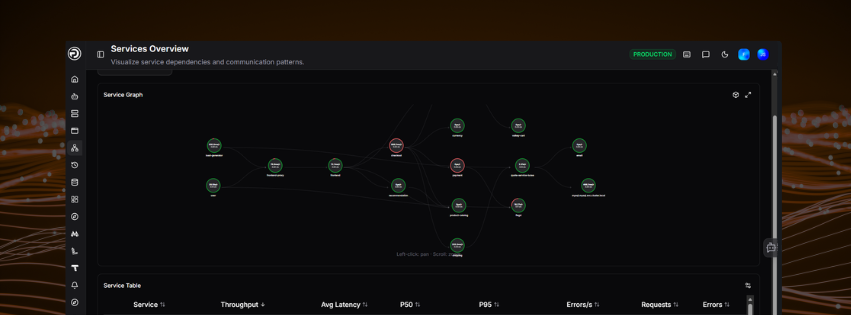
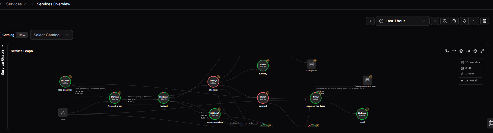
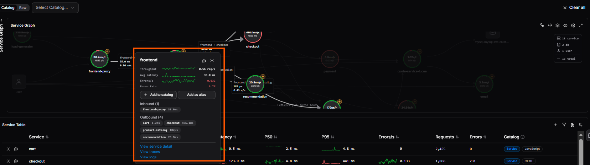
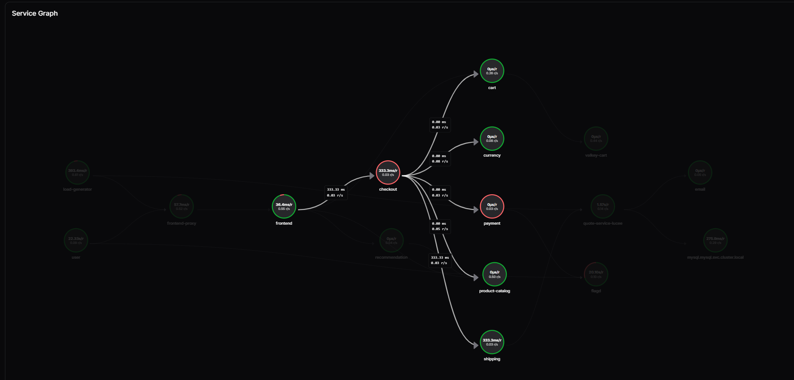
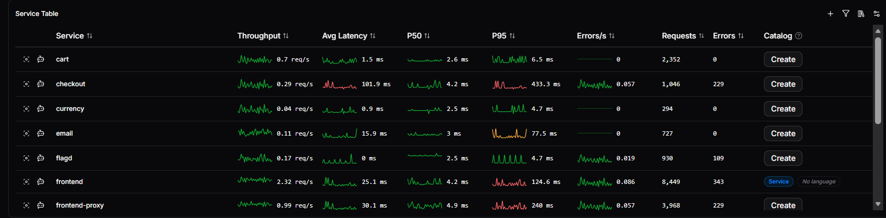
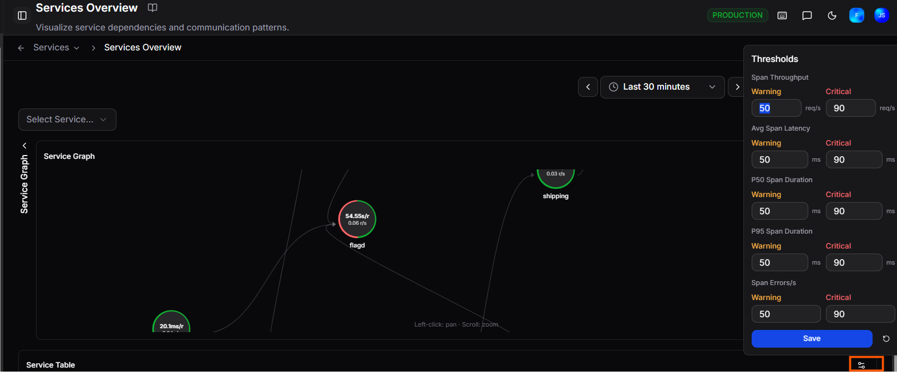

# Services Overview

 

The **Services** page gives you full visibility into your OpenTelemetry-instrumented services - how they connect, how they perform, and where problems are occurring.

 

  

    <iframe src="https://player.vimeo.com/video/1192175205?badge=0&autopause=0&player_id=0&app_id=58479" frameborder="0" allow="autoplay; fullscreen; picture-in-picture; clipboard-write; encrypted-media" allowfullscreen></iframe>
  

  

    
Watch this short walkthrough to see the Services view in action - covering the service graph, dependency mapping, latency and error metrics, and how to drill into individual services for deeper investigation.

  

## View modes

Two tabs at the top of the page control how services are sourced:

| Tab | Description |
|---|---|
| **Catalog** | Shows services registered in your OpsPilot catalog |
| **Raw** | Shows all services detected from your Tempo trace data, whether catalogued or not |

Use the **Select Tempo service** dropdown to filter the graph and table to a single service and its dependencies.

## Service Graph

The **Service Graph** displays your services as an interactive network diagram, showing the communication patterns and dependencies between them. Each node represents a service. Connections between nodes show how services call each other.

Use the graph to quickly identify which services are upstream or downstream of a problem area. You can pan by clicking and dragging, and zoom using the scroll wheel.

Each node shows the service's **average latency** and **request rate** directly on it. A red arc around the node indicates the **error rate** - the larger the arc, the higher the proportion of erroring requests. Connection lines between nodes show the latency and request rate for that specific call path, and arrows indicate the direction of the call.

An orange **+** badge on a node indicates the service has not yet been added to your catalog. Clicking it opens the node tooltip where you can add it.

### Node types

Nodes are visually differentiated by type so you can understand your environment at a glance:

| Type | Description |
|---|---|
| **Service** | A standard instrumented service |
| **Database** | A database dependency (shown with a cylinder icon) |
| **User** | An external user or client entry point |
| **Virtual** | A virtual node representing a grouped or inferred dependency |

The legend in the top right of the graph shows a count of each node type present. Click a node type in the legend to filter the graph to only that type.

### Grouping peers

Similar services can be grouped together using the **Group peers by name similarity** toggle. When enabled, nodes with similar names are collapsed into a single group node, reducing visual clutter in large environments. Toggle it off to expand all groups and see individual nodes.

### Node tooltip

Click any node to open a detailed panel.

 The top section shows live sparklines and current values for:

| Metric | Description |
|---|---|
| **Throughput** | Current request rate (req/s) |
| **Avg Latency** | Average response time (ms) |
| **Errors/s** | Current error rate |
| **Error Rate** | Percentage of requests resulting in errors |

Two action buttons appear below the metrics:

| Button | Description |
|---|---|
| **+ Add to catalog** | Registers this service in your OpsPilot catalog |
| **Add as alias** | Attaches this service as a tempo alias on an existing catalog entry instead of creating a new one. Useful when the service name is a shard, alternate environment, or renamed instance of a service that is already catalogued |

Below the actions, the panel shows:

- **Inbound** connections - the upstream services calling this one, each with their latency
- **Outbound** connections - the downstream services this one calls, each with their latency
- Quick links to **View service detail**, **View traces**, and **View logs**

Use the **Focus** button in the top right of the panel to isolate that service in the graph. Focus mode hides all unrelated nodes, leaving only the selected service and its direct inbound and outbound connections. A **Clear focus: [service name]** button appears in the top right of the graph panel - click it to return to the full graph.

### Graph controls

The icons in the top right corner of the graph panel give you additional viewing options:

- **Layout (hierarchy icon)**: opens a dropdown to change how nodes are arranged in the graph. Available layouts are:

    | Layout | Description |
    |---|---|
    | **Hierarchy (left-to-right)** | Columns by topological order; sources on the left (default) |
    | **Hierarchy (top-to-bottom)** | Rows by topological order; sources at the top |
    | **Force-directed** | Physics simulation; springs along edges, repulsion between nodes |
    | **Circle** | All nodes on a single ring |
    | **Concentric** | Rings keyed by topological rank - sources at the centre |
    | **Radial tree** | Subtrees fan out as angular slices from the root |
    | **Grid** | Uniform grid, row-major insertion order |

<iframe src="https://player.vimeo.com/video/1198737284?badge=0&amp;autopause=0&amp;player_id=0&amp;app_id=58479" frameborder="0" allow="autoplay; fullscreen; picture-in-picture; clipboard-write; encrypted-media; web-share" referrerpolicy="strict-origin-when-cross-origin" style="position:absolute;top:0;left:0;width:100%;height:100%;" title="Services Graph Layout Options"></iframe>

- **Node spacing**: opens a slider to adjust how far apart nodes are spread. Useful for reducing overlap in dense graphs
- **Catalog aliases**: toggles whether tempo aliases are collapsed onto their catalog entry or shown as separate nodes. When collapsed, aliased services appear as a single node; click to expand and show each tempo name individually
- **Offline services**: toggles visibility of offline (catalog-only) services. These are services registered in your catalog but not currently seen in telemetry. Click to show or hide them in the graph
- **3D toggle**: switches the graph between a flat 2D layout and a 3D view
- **Expand**: opens the graph in full screen for a clearer view of complex environments

Use **Clear all** to reset any active service filters.

## Service Table

Below the graph, the **Service Table** lists all services with key performance metrics:

Four icons in the top right of the table provide additional controls:

| Icon | Description |
|---|---|
| **Add catalog** | Add a new service to your catalog manually |
| **Type** | Filter the table by catalog type: All types, Service, Database, Messaging, Cache, or External |
| **Service catalog** | Open the service catalog |
| **Edit thresholds** | Open the thresholds panel to set warning and critical values |

| Column | Description |
|---|---|
| **Service** | The service name, with quick-action icons |
| **Throughput** | Request rate with a sparkline showing recent trend |
| **Avg Latency** | Average response time across all requests |
| **P50** | Median latency |
| **P95** | 95th percentile latency |
| **Errors/s** | Error rate per second |
| **Requests** | Total request count in the selected time range |
| **Errors** | Total error count in the selected time range |
| **Catalog** | Shows the catalog status for the service - a **Create** button if not yet catalogued, or the catalog type badge (e.g. **Service**) and language once registered |

Each row has two icons to the left of the service name:

| Icon | Description |
|---|---|
| **Focus** | Isolates this service in the graph, showing only its direct connections |
| **Ask AI** | Opens a Coworker conversation with this service already in context |

Once a service is added to the catalog, the orange **+** badge also disappears from its node in the graph.

Click any service name to open the [Service Detail](service-detail.md) view with that service pre-selected, giving you an immediate breakdown of its performance, errors, logs, and alerts.

Use the time range selector in the top right to adjust the period shown.

## Thresholds

You can configure warning and critical thresholds for key service metrics directly from the Services Overview page.

Click the thresholds icon in the top right of the Service Graph panel to open the **Thresholds** panel.

 Set **Warning** and **Critical** values for each metric:

| Metric | Unit |
|---|---|
| **Span Throughput** | req/s |
| **Avg Span Latency** | ms |
| **P50 Span Duration** | ms |
| **P95 Span Duration** | ms |
| **Span Errors/s** | errors/s |

Click **Save** to apply your changes, or use the reset button to restore all values to their defaults.

!!! question "Need more help?"
    Contact support in the chat bubble and let us know how we can assist.
