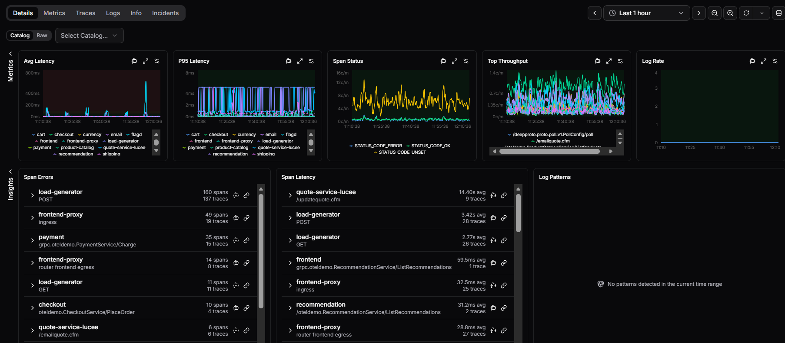

# Service Detail

This is where you go when the overview tells you something is wrong and you need to understand exactly what. The Service Detail page gives you a deep breakdown of a single service: its performance, errors, log patterns, catalog metadata, and active incidents. Arrive here by clicking a service name in the [Services Overview](overview.md).

Use the **Catalog** dropdown at the top to switch between services. The time range selector in the top right adjusts the period shown across all tabs. Click **Clear all** to reset filters.

The page is organised into six tabs: **Details**, **Metrics**, **Traces**, **Logs**, **Info**, and **Incidents**.

## Details tab

### Performance charts

Together, these five charts cover latency distribution, error volume, request load, and log output, giving you a complete picture of service health at a glance.

Five charts give you an at-a-glance view of the service's health:

| Chart | Description |
|---|---|
| **Avg Latency** | Average response time across all requests, broken down by operation |
| **P95 Latency** | 95th percentile latency, highlighting worst-case response times |
| **Span Status** | Breakdown of span outcomes: STATUS_CODE_ERROR, STATUS_CODE_OK, STATUS_CODE_UNSET |
| **Top Throughput** | Request rate by endpoint, showing which operations are busiest |
| **Log Rate** | Volume of log output over time |

Each chart has three icons in its top right corner:

| Icon | Description |
|---|---|
| **Ask AI** | Opens a Coworker conversation with this chart in context |
| **Fullscreen** | Expands the chart to full screen |
| **Edit threshold** | Set warning and critical thresholds for the metric |

### Span Errors

This section surfaces where errors are concentrated across your operations, so you don't have to trawl through individual spans to find what's failing.

Lists the operations generating the most errors. Each row shows the service and operation name, span count, and trace count. Two icons appear on each row:

| Icon | Description |
|---|---|
| **Ask AI** | Opens a Coworker conversation with this operation in context |
| **Explore traces** | Opens the traces view filtered to this operation |

### Span Latency

Lists the operations with the highest average latency. Each row shows the operation, average duration, and trace count. The same **Ask AI** and **Explore traces** icons are available on each row.

### Log Patterns

Surfaces recurring patterns in log output. Displays "No patterns detected in the current time range" when nothing is found.

## Metrics tab

Coming soon.

## Traces tab

See **[Traces](traces.md)** for full documentation of the trace explorer.

## Logs tab

See **[Logs](logs.md)** for full documentation of the log explorer.

## Info tab

The Info tab is where you answer "who owns this, what does it depend on, and what does OpsPilot know about it." It surfaces the context you need when you're in the middle of an incident. It shows the catalog record for the selected service: ownership, classification, dependencies, and OpsPilot's accumulated knowledge.

### Service card

At the top of the tab, a card summarises the catalog entry:

| Field | Description |
|---|---|
| **Owner** | The person or team responsible for the service |
| **Language** | The primary language (if set) |
| **Repository** | The linked source repository (if set) |

Status badges on the right show the service's current classification at a glance:

| Badge | Description |
|---|---|
| **Service / Database / etc.** | The catalog type |
| **Tier 1 / Tier 2** | Criticality tier. Tier 1 is customer-facing or revenue-critical; Tier 2 is important but not directly customer-facing |
| **Active** | Lifecycle state |
| **Human-managed / OpsPilot-managed** | Whether the catalog entry is maintained manually or by OpsPilot |

Action buttons on the card:

| Button | Description |
|---|---|
| **Watch this service** | Toggle watching this service |
| **Manage watched services** | Open your [watched services settings](../../../Admin-and-data/Account/Cloud/watched-services.md) |
| **Let OpsPilot manage** | Allows OpsPilot to refresh aliases, type, and other auto-populated fields. Your manual edits are preserved; OpsPilot only updates fields it has new evidence for. The entry reverts to human-managed the next time someone edits it manually |
| **Re-audit** | Re-discover this service from telemetry |
| **Edit** | Manually edit the catalog entry |
| **Delete** | Remove the service from the catalog |

### Editing a catalog entry

Click **Edit** to open the full catalog form for the service. Fields available:

| Field | Description |
|---|---|
| **Type** | The catalog type (Service, Database, etc.) |
| **Name** | The display name for this entry |
| **Tier** | Criticality tier. Tier 1 is customer-facing or revenue-critical; Tier 2 is important but not directly customer-facing |
| **Owner (user)** | The person responsible for this service |
| **Icon** | An optional icon for the entry |
| **Language** | The primary programming language |
| **Repository** | URL of the source repository (e.g. `https://gitlab.com/org/repo`) |
| **Workload type** | Free-text classification of how the service runs (e.g. `api`, `worker`, `cron`) |
| **Telemetry identity (service)** | The service name as it appears in telemetry, used to match this catalog entry to trace and metric data |
| **Description** | A free-text description of what the service does |
| **Purpose** | A free-text description of why the service exists |
| **Aliases (per-source observed names)** | Observed or custom names that should fold onto this catalog entry, used by the graph view and reverse-lookup. Click **+ Add alias** to add one |
| **Depends on** | Other catalog entries this service depends on |
| **Used by** | Other catalog entries that depend on this service |
| **Deprecated** | Marks the entry as superseded. Display-only; does not hide the row or block new dependents |

Click **Save** to apply changes, or **Cancel** to discard them.

### Request flow

Shows the operations and dependencies that OpsPilot has observed in telemetry for this service. Displays a placeholder message until telemetry data arrives.

### Metadata

Key/value pairs attached to the catalog entry. Useful for storing context that isn't captured elsewhere: links, team contacts, or custom classification data.

Click **+** to expand the editor. Each entry has a **key**, a **type** (string by default), and a **value**. Use **+ Add entry** to add multiple entries at once, then click **Save** to apply.

### Runbooks

Runbooks linked to this service. Displays the count and a list of attached runbooks. Use the **+** button to attach one.

### What OpsPilot remembers

OpsPilot's memory is what makes it useful over time. The more context it has about a service, the better it can help when things go wrong.

OpsPilot builds up a memory of each service as it runs tasks, investigates alerts, and chats about it. This panel shows that accumulated knowledge.

Use the text input to tell OpsPilot something about the service directly. For example, known quirks, recent changes, or context that isn't visible in telemetry.

## Incidents tab

Lists all incidents that have referenced the selected service. Use the **Catalog** dropdown to switch services. The count in the top right shows the total number of linked incidents; click the arrow to open the full incidents list.

Displays "No incidents have referenced this service" when none exist.

!!! question "Need more help?"
    Contact support in the chat bubble and let us know how we can assist.
