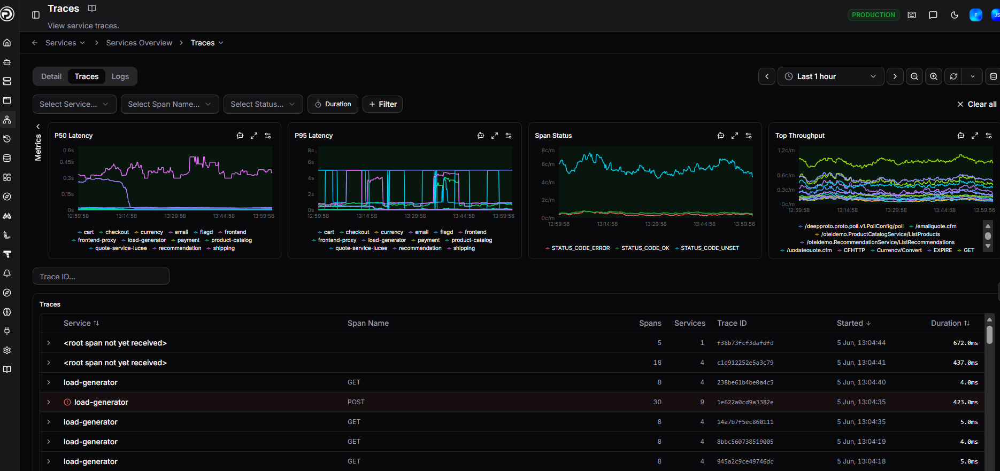
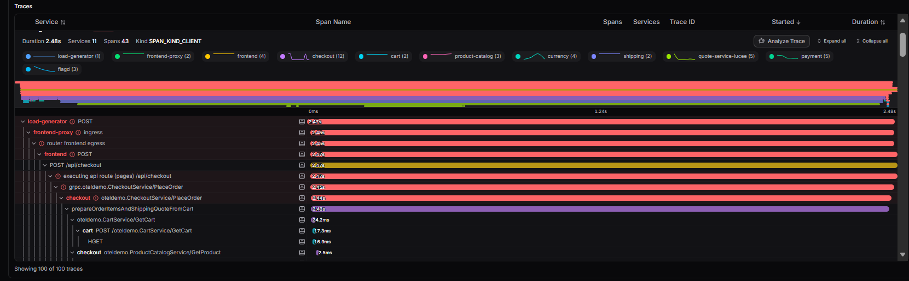
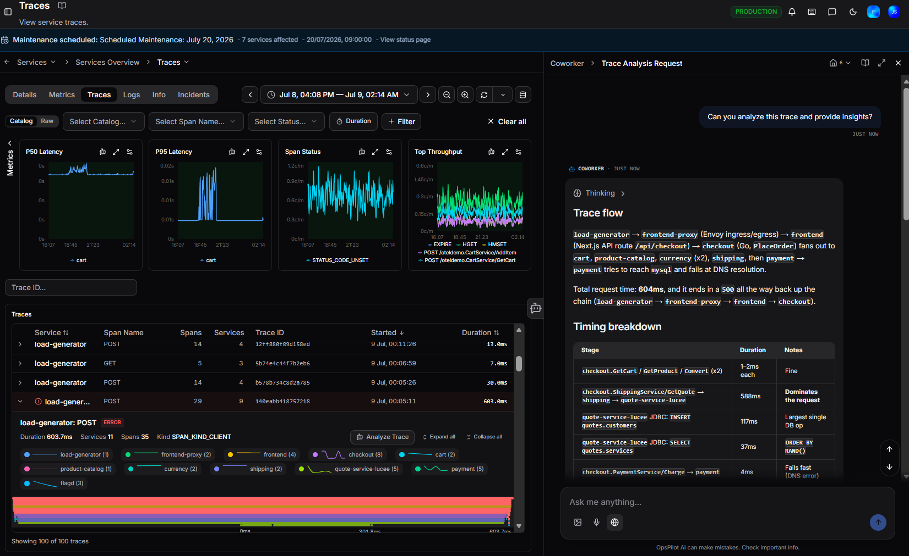

# Traces

Traces answer the question "what actually happened during this request." You can follow a single request across every service it touched, see exactly where time was spent, and identify which operation or dependency caused the slowdown. The Traces tab shows all traces for the selected service, with performance charts and a filterable trace list. Use it to investigate slow requests, errors, and individual spans in detail.

## Filters

At the top of the page, use the filter bar to narrow the trace list:

| Filter | Description |
|---|---|
| **Select Service** | Filter by service name |
| **Select Span Name** | Filter by a specific operation or endpoint |
| **Select Status** | Filter by span status (e.g. error, ok) |
| **Duration** | Sort or filter by trace duration |
| **+ Filter** | Add additional filter conditions |

Click **Clear all** to reset all filters.

Use the **Filter traces...** search box to search within the trace list by keyword.

## Performance charts

Four charts give you an overview of trace performance across the selected time range:

| Chart | Description |
|---|---|
| **P50 Latency** | Median trace duration, broken down by service |
| **P95 Latency** | 95th percentile duration, highlighting slower traces |
| **Span Status** | Breakdown of span outcomes across all traces |
| **Top Throughput** | Most active endpoints by request volume |

Each chart has three icons in its top right corner:

| Icon | Description |
|---|---|
| **Ask AI** | Opens a Coworker conversation with this chart in context |
| **Fullscreen** | Expands the chart to full screen |
| **Edit threshold** | Set warning and critical thresholds for the metric |

## Traces list

The **Traces** table lists individual traces with:

| Column | Description |
|---|---|
| **Service** | The service that originated the trace |
| **Span Name** | The operation or endpoint name |
| **Spans** | Total number of spans in the trace |
| **Services** | Number of services involved in the trace |
| **Trace ID** | The unique identifier for the trace |
| **Started** | When the trace began |
| **Duration** | Total end-to-end duration |

Traces with errors are highlighted in red with an **ERROR** badge.

!!! info "`<root span not yet received>`"
    This entry appears when child spans have been received but the root span hasn't arrived yet. This is usually transient - the root span typically arrives shortly after.

## Expanded trace view

Drilling into a single trace shows you the full span waterfall: where time went, which services were involved, and exactly which span failed or was slow.

Click the `>` arrow on any row to expand it and see a summary and waterfall timeline for that trace:

- **Service and span name** with an ERROR badge if the trace contains errors
- **Duration**, **Services**, **Spans**, and **Kind** (e.g. `SPAN_KIND_CLIENT`)
- A **waterfall timeline** showing how time was spent across spans
- A service breakdown showing each service involved and its span count

Three buttons in the top right of the expanded view let you:

- **Analyze Trace** - send the trace to Coworker for analysis
- **Expand all** - expand all spans in the waterfall at once
- **Collapse all** - collapse all spans in the waterfall at once

!!! question "Need more help?"
    Contact support in the chat bubble and let us know how we can assist.
