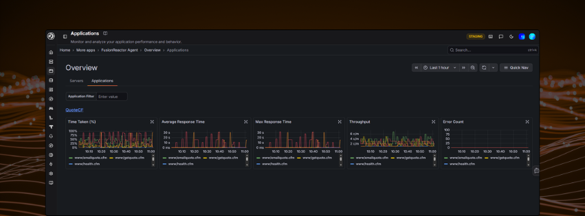

# Applications

Monitor and analyze your application performance and behavior.

Navigate to **Applications** from the left-hand sidebar to view performance metrics across all your instrumented applications.

---

## Overview

The Applications page displays an **Overview** of your applications, with two tabs:

- **Servers** — view metrics grouped by server
- **Applications** — view metrics grouped by application

Use the **Application Filter** to search for a specific application by name.

---

## Metrics cards

Each application is displayed as a set of metric cards showing performance data over the selected time range:

| Metric | Description |
|---|---|
| **Time Taken (%)** | Percentage of time the application spent processing requests |
| **Average Response Time** | Average response time across all transactions |
| **Max Response Time** | The slowest response time recorded in the period |
| **Throughput** | Number of requests per minute (c/m) |
| **Error Count** | Number of errors returned by the application |

Each card displays a time-series graph. Hover over any graph to see the values at a specific point in time.

---

## Time range

Use the **time picker** in the top right to adjust the time range for all graphs on the page. You can also highlight a specific section of a graph to zoom into that timeframe.

---

## Application detail view

Clicking into an application opens the detail view, showing deeper performance data for that specific application.

### Filters

| Filter | Description |
|---|---|
| **Application** | The selected application (e.g. QuoteCF) |
| **Show by** | Switch the top 20 ranking between Throughput, Average Response Time, Max Response Time, and Error Count |
| **Status** | Filter transactions by HTTP status code |
| **Flavor** | Filter by transaction type (e.g. web request, JDBC) |
| **Min / Max Duration** | Filter transactions by duration range |
| **Adhoc Filters** | Add custom label-based filters |

### Top 20

The **Top 20** panel on the left ranks individual transactions by the selected **Show by** metric, with a bar chart showing relative volume.

### Metrics graphs

The same five metrics cards from the overview are shown here, scoped to the selected application:

- Time Taken (%)
- Average Response Time
- Max Response Time
- Throughput
- Error Count

### Traces

Below the graphs, a **Traces** table lists recent transactions with:

| Column | Description |
|---|---|
| **Trace ID** | Unique identifier — click to open the full trace |
| **Start time** | When the transaction began |
| **Service** | The service that handled the request |
| **Name** | HTTP method (GET, POST, etc.) |
| **Duration** | How long the transaction took |

---

!!! question "Need more help?"
    Contact support in the chat bubble and let us know how we can assist.
