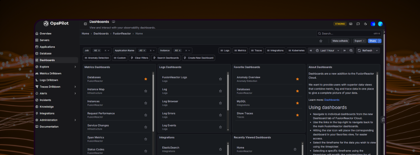

# Dashboards

View and interact with your observability dashboards.

Dashboards combine metrics, logs, and trace data in one place to give you a complete picture of your data.

---

## Using dashboards

Navigate to individual dashboards from the **Dashboards** tab in OpsPilot.

- Use the links in the top right to navigate back to the main dashboards.
- Click the **star icon** to add a dashboard to your **Favorites** for easier access.
- Select a timeframe using the **time picker**. Highlighting a specific timeframe on a chart will modify the selected time for all graphs on the dashboard.
- **Create dashboards** in OpsPilot to tailor your data visualization to meet your specific needs. You must be on the Pro AI plan or higher to create custom dashboards. You can upgrade your plan [here](https://app.opspilot.com).

!!! info
    Dashboards will continue to evolve — over time we will add new sets of dashboards and improve existing dashboards provisioned to your account. Some dashboards are marked as **experimental**, allowing us to continually roll out new concepts.

---

## Dashboard categories

### Metrics dashboards

| Dashboard | Category | Description |
|---|---|---|
| Databases | FusionReactor | Observe database activity including throughput, time, total queries and error rate, broken down by database, collection/table, and action. |
| Instance Map | Infrastructure | Observe instance health based on process CPU, system CPU, or JVM memory usage. |
| Instances | FusionReactor | Observe throughput, response time, and error count broken down per instance. |
| Request Performance | FusionReactor | Observe throughput, response time, and error count broken down by application, transaction route, and status code. |
| Service Changes | Infrastructure | Observe infrastructure-level service change events. |
| Span Metrics | FusionReactor | Observe span-level metrics from distributed traces. |
| Status Codes | FusionReactor | Observe HTTP status code breakdown across your applications. |

### Logs dashboards

| Dashboard | Category | Description |
|---|---|---|
| FusionReactor Logs | Logs | View and filter logs shipped from the FusionReactor agent. |
| Log | Logs | General log browser for all ingested log data. |
| Log Browser | Logs | Browse and search logs with advanced filtering. |
| Log Errors | Logs | Focus view on error-level log entries. |
| Log Events | Logs | Observe log event volume and patterns over time. |

### Traces dashboards

| Dashboard | Category | Description |
|---|---|---|
| Show Status Traces | Traces | View traces filtered by status code. |
| Show Traces | Traces | Browse all ingested trace data. |
| Trace Lookup | Traces | Look up a specific trace by ID or URL. |

### Kubernetes dashboards

| Dashboard | Category | Description |
|---|---|---|
| Kubernetes / Compute Resources / Cluster | Kubernetes | Observe CPU and memory usage across the entire cluster. |
| Kubernetes / Compute Resources / Pod | Kubernetes | Observe CPU and memory usage broken down per pod. |

### Integration dashboards

| Dashboard | Category | Description |
|---|---|---|
| ElasticSearch | Integrations | Observe metrics from your ElasticSearch cluster. |
| IIS | Integrations | Observe metrics from IIS web server. |
| Kafka | Integrations | Observe metrics from the Kafka exporter. |
| MongoDB | Integrations | Observe metrics from MongoDB. |
| MSSQL | Integrations | Observe metrics from the MSSQL exporter. |
| MySQL | Integrations | Observe metrics from the MySQL exporter. |
| NGINX | Integrations | Observe metrics from the NGINX community exporter. |
| NGINX Pro | Integrations | Observe metrics from the NGINX Pro exporter. |
| Node Exporter | Integrations | Observe host-level metrics from the Node exporter. |
| OracleDB | Integrations | Observe metrics from the OracleDB monitor. |
| Postgres | Integrations | Observe metrics from the Postgres exporter. |

### Billing dashboards

| Dashboard | Category | Description |
|---|---|---|
| Data Usage | Billing | Monitor your data ingestion usage against your plan limits. |

### Experimental dashboards

Some dashboards are marked as experimental. This allows us to continually roll out new concepts before they are fully production-ready. These dashboards may contain issues as we continue to refine and develop them.

---

## Build custom dashboards

Transform your raw data into actionable insights by building custom dashboards. Using the dashboard builder, you can connect to multiple data sources, write targeted queries (LogQL, PromQL, or TraceQL), and arrange visualizations to create a real-time view of your application's health.

!!! info
    [Learn how to create a dashboard →](/Getting-started/Tutorials/create-dashboard/)

## Go deeper with Explore

View all metrics, logs, and traces ingested into your OpsPilot account within [Explore](/Data-insights/Features/explore/). Create new data views and filter data in any way you require, for example:

- Searching for traces using a transaction ID
- Searching for traces with a specific URL
- Viewing and processing any metric ingested into your OpsPilot account
- Creating customized log filters to view ingested log data

---

!!! question "Need more help?"
    Contact support in the chat bubble and let us know how we can assist.
