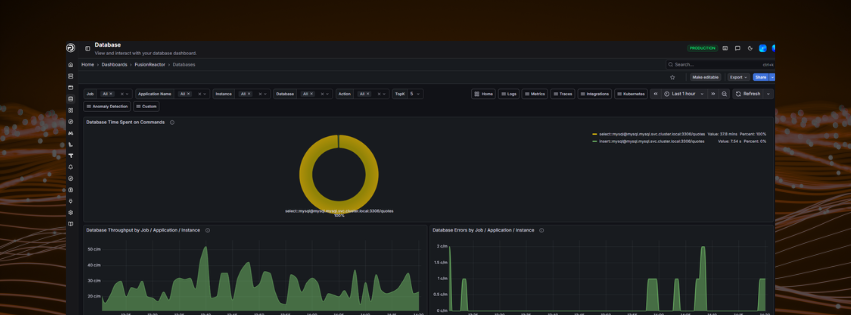

# Database

The **Database** page gives you full visibility into how your databases are performing across your entire environment. Use it to pinpoint slow or expensive queries, detect errors before users report them, understand which applications are generating the most database load, and compare performance across multiple instances - all from a single dashboard.

## Filters

Use the filter bar to focus the dashboard on exactly what you need:

| Filter | Description |
|---|---|
| **Job** | Isolate metrics for a specific job label |
| **Application Name** | See which application is responsible for the database traffic |
| **Instance** | Compare performance across individual database instances |
| **Database** | Drill into a specific database by name |
| **Action** | Filter by SQL action type (e.g. SELECT, INSERT) |
| **TopK** | Limit results to the top K entries by value |
| **Time range** | Control the time window for all panels - defaults to the last 1 hour but can be adjusted to cover longer periods for trend analysis |

## Tabs

| Tab | Description |
|---|---|
| **Metrics** | Pre-built panels showing database performance metrics |
| **Traces** | Distributed traces for individual database calls |
| **Integrations** | View database integration status |
| **Kubernetes** | Database metrics scoped to Kubernetes workloads |
| **Anomaly Detection** | Anomaly alerts detected on database signals |
| **Custom** | Add and arrange your own panels |

## Metrics panels

### Database Time Spent on Commands

Shows the proportion of total execution time spent on each command type (e.g. SELECT, INSERT). If one command type dominates - for example SELECT accounting for 95% of time - this is a strong signal of where to focus optimisation efforts.

### Database Throughput by Job / Application / Instance

Tracks the rate of database commands per minute over time. Use this to identify which services are generating the most database traffic, spot unexpected spikes, and support capacity planning decisions.

### Database Errors by Job / Application / Instance

Shows the rate of database errors per minute. Spikes here typically precede or coincide with user-facing failures - catching them early means you can act before users report problems.

### Database Query Throughput per Job / Application / Instance

Shows query volume per minute broken down by job, application, and instance. Useful for understanding load distribution and identifying a specific application that may be overwhelming the database.

### Database Total Query Time by Command / Job / Application / Instance

Shows cumulative query execution time broken down by SQL command, job, application, and instance. This is the most direct panel for identifying slow or expensive query patterns - a sharp increase here points to a query that needs attention.

---

!!! tip "Troubleshooting slow applications"
    If an application feels sluggish, filter by **Application Name** and check the Total Query Time and Error panels first. A spike in either confirms the database is the bottleneck.

---

!!! question "Need more help?"
    Contact support in the chat bubble and let us know how we can assist.
