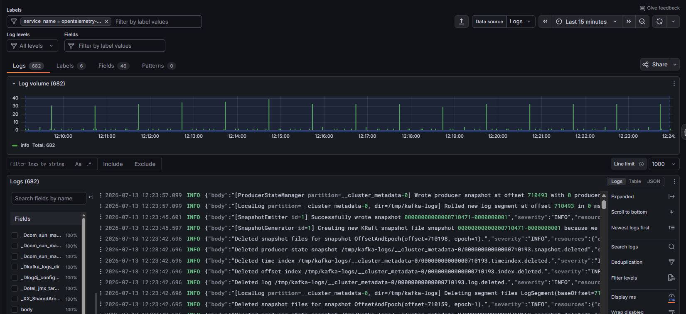
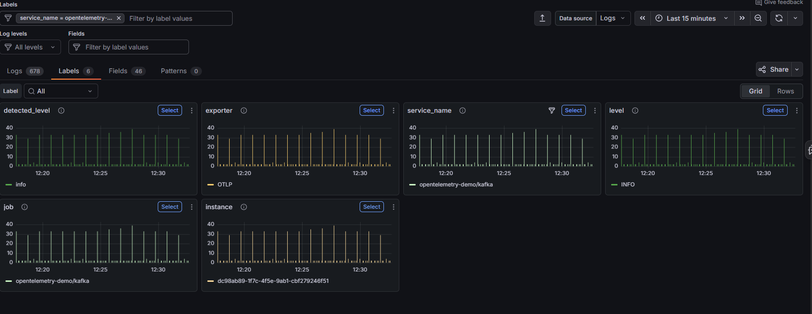
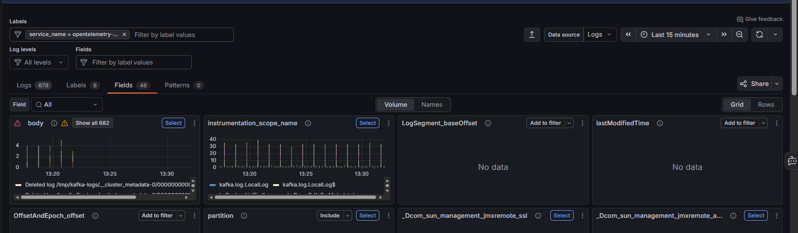

# Logs Drilldown

Search, filter, and analyze logs across services.

Navigate to **Logs Drilldown** from the left-hand sidebar to explore your log data without writing LogQL queries.

---

## Filters

| Filter | Description |
|---|---|
| **Filter by label values** | Narrow services by label (e.g., `service`, `namespace`) |
| **Show logs** | Display raw log lines alongside service charts |
| **Data source** | Select the Logs data source (top right) |
| **Time range** | Set the time window using the picker in the top right. Use **«** / **»** to step the range backwards and forwards, the **zoom out** icon to widen it, and the **refresh** icon to reload |

---

## Browsing services

The main view displays a list of services, each showing:

- A **log volume time series chart** for the selected time range
- A **Name / Total** breakdown listing the log levels in that service (e.g., `info`, `unknown`) with a count for each
- A **log preview panel** on the right with recent log lines
- A **star icon** to favourite the service
- An **Include** button to scope the view to that service
- A **Show logs** button to open the full log stream for that service

---

## Filtering by label

Use the **Labels** section at the top to filter services by a specific label dimension.

1. Click **Filter by label values** and select a label (e.g., `service`).
2. The view updates to show matching services. The active label filter appears as a tab (e.g., `service`), along with a count of results (e.g., Showing 9 of 9).
3. Use the **Search values** dropdown to search within the label values.
4. Click **Include** on a service to scope the view to that service only.
5. Click **+ Add label** to add another label dimension as a tab and filter across multiple labels.

---

## Viewing logs for a service

Click **Show logs** on any service to open its full log stream. The breadcrumb updates to Home > Drilldown > Grafana Logs Drilldown > Logs, and the active service filter is shown at the top. Click **Share** (top right) to generate a link to the current view. Use the **collapse/expand filters** icon (left of the Data source dropdown) to hide or show the filter controls.

### Tabs

| Tab | Description |
|---|---|
| **Logs** | The default view. Shows all log lines matching the current filters, with a log volume chart above. |
| **Labels** | Log volume broken down by label. |
| **Fields** | Detected fields and their frequency across log lines. |
| **Patterns** | Automatically detected log patterns. Useful for spotting common issues or noise. |

### Labels tab

The **Labels** tab shows log volume broken down by label, with one panel per label (e.g., `detected_level`, `exporter`, `service_name`, `level`, `job`, `instance`).

- Use the **Label** dropdown to focus on a specific label, or leave it on **All**.
- Switch between **Grid** and **Rows** layout using the view toggle.
- Click **Select** on any panel to drill into that label's values.

### Fields tab

The **Fields** tab shows detected fields, with one panel per field (e.g., `body`, `instrumentation_scope_name`, `partition`). Fields with no values in the current range show **No data**.

- Use the **Field** dropdown to focus on a specific field, or leave it on **All**.
- Toggle between **Volume** and **Names** at the top.
- Switch between **Grid** and **Rows** layout using the view toggle.
- Click **Select** to drill into a field's values, or **Add to filter** (with **Include**) to filter logs by that field.

### Patterns tab

The **Patterns** tab groups similar log lines into patterns, making it easier to reduce noise and find hard-to-locate logs. Each pattern keeps the static text of a log line while replacing variable values with placeholders (e.g., `duration=<_> trace_id=<_>`), and shows a volume chart so you can spot spikes and trends at a glance.

- Patterns are detected automatically by Loki as logs are ingested (mined from recent logs).
- Use the search field to find patterns containing specific text.
- Click **Include** or **Exclude** on a pattern to show only those lines or hide noisy ones.

If no patterns are available for the current service and time range, the tab appears empty.

### Log volume chart

The chart at the top shows log volume over the selected time range, colour-coded by log level (e.g., INFO). The total count is shown below the chart (e.g., INFO Total: 232).

### Filtering log lines

- Use **Filter logs by string** to search for specific text within log lines. Toggle **Aa** for case-sensitive matching and **.*** to use a regular expression.
- Click **Include** or **Exclude** to scope or remove matching lines.
- Use the **Log levels** dropdown to filter by severity (e.g., INFO, ERROR, WARN).
- Use the **Fields** filter to narrow logs by a specific field value.
- Set a **Line limit** (top right) to control how many lines are loaded at once.

### Fields panel

The **Fields** panel on the left lists all detected fields across your logs, along with the percentage of log lines that contain each field. Click any field to explore its values.

### Display options

Switch between **Logs**, **Table**, and **JSON** views using the toggle at the top right of the logs panel.

The controls down the right-hand side adjust how the logs are displayed, including **Expanded**, **Scroll to bottom**, **Newest logs first**, **Search logs**, **Deduplication**, **Filter levels**, **Display ms** (millisecond timestamps), and **Wrap** (line wrapping).

You can click and drag on the log volume chart to zoom into a specific time window.

---

!!! info "Learn more"
    [Logs Drilldown](https://grafana.com/docs/grafana/latest/explore/simplified-exploration/logs/)

!!! question "Need more help?"
    Contact support in the chat bubble and let us know how we can assist.
