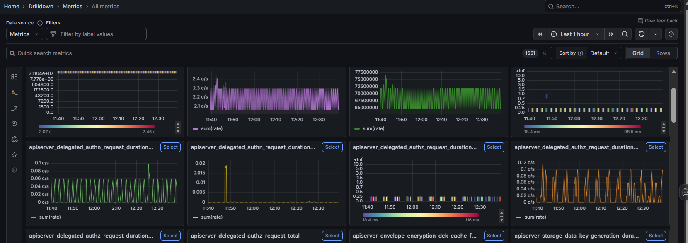
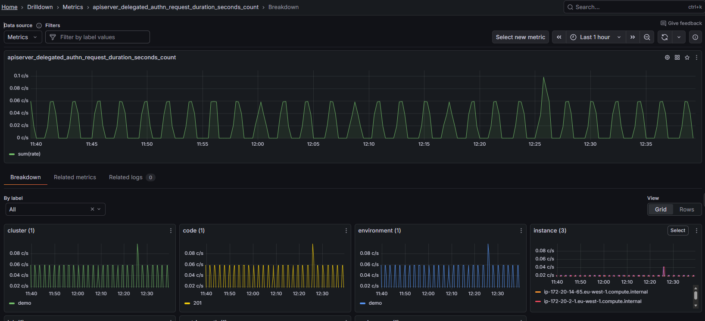
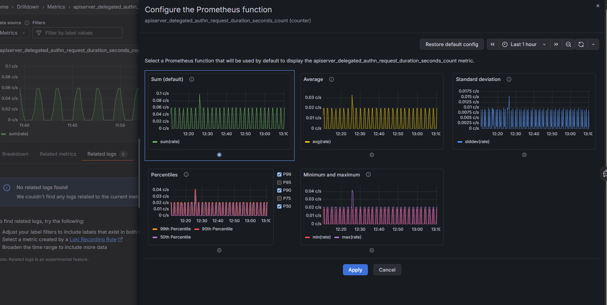

# Metrics Drilldown

Drill down into metrics to find trends and anomalies.

Navigate to **Metrics Drilldown** from the left-hand sidebar to explore Prometheus-compatible metrics without writing PromQL queries.

---

## Filters

| Filter | Description |
|---|---|
| **Data source** | Select the Metrics data source |
| **Filter by label values** | Narrow metrics by label |
| **Quick search metrics** | Type to search across all available metrics |
| **Sort by** | Order results by Default or other criteria |
| **View** | Switch between Grid and Rows layout |
| **Time range** | Set the window using the picker in the top right |

The total number of matching metrics is shown next to the search bar (e.g., 1613).

---

## Browsing metrics

A dynamic grid of metric panels is displayed, each representing a specific Prometheus metric. Click **Select** on any panel to drill into that metric in more detail.

### Search & filter metrics

Use search and filters to quickly narrow down the metrics you want to investigate - by system, service, or time frame. This helps you focus on what matters most.

To filter:

* Use the **Filter by label values** dropdown to select specific services or tags.
* Or type in the **Quick search metrics** box (e.g., `cpu`), then press **Enter**.

Matching metrics will appear. From here, you can dive deeper into your analysis.

###  Investigate the data

Once you’ve filtered your metrics, it’s time to analyze the data for patterns or unusual behavior. Understanding your system’s normal (baseline) performance makes it easier to spot issues.

1. Review the metric panels and look for ones with noticeable changes.

    * Metrics with little variation (e.g., JVM Uptime) are typically less insightful.
    * Focus on dynamic and performance-critical metrics (e.g., CPU Usage, Heap Memory Used, or Request Throughput) to uncover trends and potential issues.

2. Click **Select** on a metric to open the detail view.

3. Adjust the time range using the time picker in the top right if needed.

---

## Metric detail view

Clicking **Select** on a metric opens the detail view. The breadcrumb updates to show your current path (e.g., Home > Drilldown > Metrics > `metric_name` > Breakdown).

The main graph shows the selected metric over the chosen time range. Use **Select new metric** (top right) to switch to a different metric without going back.

The icons in the top-right corner of the graph panel let you:

| Icon | Action |
|---|---|
| **⚙ (gear)** | Configure the Prometheus function |
| **Grid** | Add to dashboard |
| **☆ (star)** | Add to bookmark |
| **⋮ (more)** | Open in **Explore** or **Copy URL** |

### Configure the Prometheus function

Click the **⚙ (gear)** icon to choose the default Prometheus function used to display the metric. Each option shows a preview so you can compare before applying:

| Function | Description |
|---|---|
| **Sum (default)** | Total across all series (`sum(rate)`) |
| **Average** | Mean across series (`avg(rate)`) |
| **Standard deviation** | Spread of values across series (`stddev(rate)`) |
| **Percentiles** | Selected percentiles (P99, P95, P90, P75, P50) |
| **Minimum and maximum** | Lowest and highest values across series (`min(rate)` / `max(rate)`) |

Click **Apply** to use the selected function, or **Restore default config** to revert to Sum.

### Tabs

| Tab | Description |
|---|---|
| **Breakdown** | Breaks the metric down by label. Use the **By label** dropdown to choose a label (e.g., `cluster`, `instance`, `job`). Each label value appears as its own panel. |
| **Related metrics** | Lists similar metrics based on shared keywords. Use this to discover related signals. |
| **Related logs** | Shows log entries correlated with the selected metric. |

### Breakdown view

The Breakdown tab is the default view after selecting a metric. It displays a grid of panels - one per label value - so you can see how the metric differs across instances, environments, jobs, or other dimensions.

- Use the **By label** dropdown to switch between label dimensions.
- Switch between **Grid** and **Rows** layout using the view toggle.
- Click the **⋮** (more) icon on any panel to open its menu, which includes **Explore** (Navigation) and **Copy URL** (Actions).

### Open a metric in Explore

To drill deeper into a specific label panel:

1. Click the **⋮** (more) icon on the panel to open its menu.
2. Under **Navigation**, click **Explore** to open it in Explore view with the full query pre-filled.
3. From here, modify the query, adjust the time range, or switch between graph and table views.

Explore is great for experimenting with queries and uncovering deeper insights without needing to build a full dashboard.

Under **Actions**, click **Copy URL** to copy a direct link to the panel.

### Add metrics visualization to a dashboard

From the metric detail view, you can add the graph directly to a dashboard using the icon in the top-right corner of the panel.

1. In the top-right corner of the metric graph, click the **Add to dashboard** icon (grid icon).

2. Choose one of the following:

    * **New dashboard** – to create a new one
    * **Existing dashboard** – and pick one from the list

3. Click **Open dashboard** to view it.

4. Click **Save dashboard** in the top-right corner.

5. Give your dashboard a name and description, choose a folder (if needed), and click **Save**.

!!! info "Learn more"
    [Metrics](https://grafana.com/docs/grafana/latest/explore/simplified-exploration/metrics/)