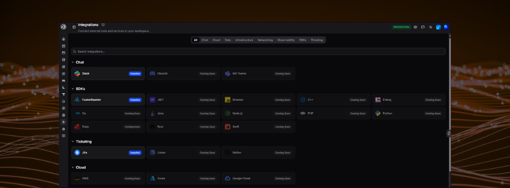

# Integrations

The **Integrations** page lets you connect external tools and services to your OpsPilot workspace.

Navigate to **Integrations** from the left-hand sidebar to browse and manage all available integrations.

---

## Browsing integrations

Integrations are grouped into categories. Use the filter tabs at the top of the page to narrow the list:

| Tab | Description |
|---|---|
| **All** | Shows every available integration |
| **Chat** | Messaging and notification tools |
| **Cloud** | Cloud platform providers |
| **Data** | Databases and data streaming services |
| **Infrastructure** | Infrastructure and orchestration tools |
| **Networking** | Service mesh and proxy tools |
| **Observability** | Third-party monitoring and observability platforms |
| **SDKs** | Language SDKs and FusionReactor agent |
| **Ticketing** | Issue tracking and project management tools |

You can also use the **Search integrations** bar to find a specific integration by name.

---

## Available integrations

### Chat

| Integration | Status |
|---|---|
| Slack | Available |
| Discord | Coming Soon |
| MS Teams | Coming Soon |

### SDKs

| Integration | Status |
|---|---|
| [FusionReactor](/Getting-started/install-fr/) | Installed |
| [.NET](/Monitor-your-data/OpenTelemetry/Instrumentation/DotNet/) | Coming Soon |
| Browser | Coming Soon |
| [C++](/Monitor-your-data/OpenTelemetry/Instrumentation/Cpp/) | Coming Soon |
| [Erlang](/Monitor-your-data/OpenTelemetry/Instrumentation/Erlang/) | Coming Soon |
| [Go](/Monitor-your-data/OpenTelemetry/Instrumentation/Go/) | Coming Soon |
| [Java](/Monitor-your-data/OpenTelemetry/Instrumentation/Java/) | Coming Soon |
| [Node.js](/Monitor-your-data/OpenTelemetry/Instrumentation/node/) | Coming Soon |
| [PHP](/Monitor-your-data/OpenTelemetry/Instrumentation/PHP/) | Coming Soon |
| [Python](/Monitor-your-data/OpenTelemetry/Instrumentation/Python/) | Coming Soon |
| [Ruby](/Monitor-your-data/OpenTelemetry/Instrumentation/Ruby/) | Coming Soon |
| [Rust](/Monitor-your-data/OpenTelemetry/Instrumentation/Rust/) | Coming Soon |
| [Swift](/Monitor-your-data/OpenTelemetry/Instrumentation/Swift/) | Coming Soon |

### Ticketing

| Integration | Status |
|---|---|
| Jira | Available |
| Linear | Coming Soon |
| Notion | Coming Soon |

### Cloud

| Integration | Status |
|---|---|
| AWS | Coming Soon |
| Azure | Coming Soon |
| Google Cloud | Coming Soon |

### Data

| Integration | Status |
|---|---|
| Altinity ClickHouse Operator | Coming Soon |
| Kafka | Coming Soon |
| MongoDB | Coming Soon |
| MySQL | Coming Soon |
| PostgreSQL | Coming Soon |
| RabbitMQ | Coming Soon |
| Redis | Coming Soon |
| Strimzi Kafka | Coming Soon |
| TigerData | Coming Soon |

### Infrastructure

| Integration | Status |
|---|---|
| ArgoCD | Coming Soon |
| Host Metrics | Coming Soon |
| KEDA | Coming Soon |
| Kubernetes | Coming Soon |
| Terraform | Coming Soon |

### Networking

| Integration | Status |
|---|---|
| Cilium | Coming Soon |
| Istio | Coming Soon |
| Linkerd | Coming Soon |
| NGINX | Coming Soon |
| Traefik | Coming Soon |

### Observability

| Integration | Status |
|---|---|
| AppDynamics | Coming Soon |
| Dash0 | Coming Soon |
| Datadog | Coming Soon |
| Grafana | Coming Soon |
| Loki | Coming Soon |
| Mimir | Coming Soon |
| New Relic | Coming Soon |
| Sentry | Coming Soon |
| Tempo | Coming Soon |

---

!!! question "Need more help?"
    Contact support in the chat bubble and let us know how we can assist.
