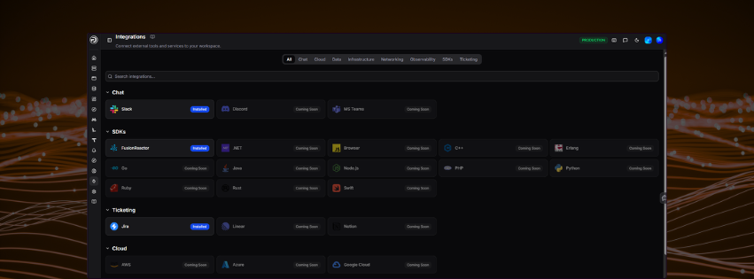
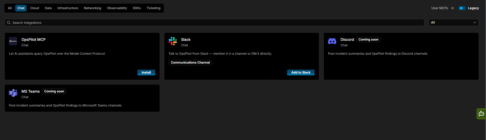
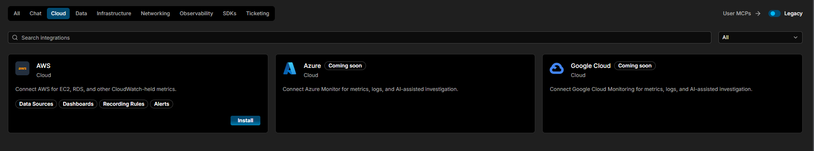
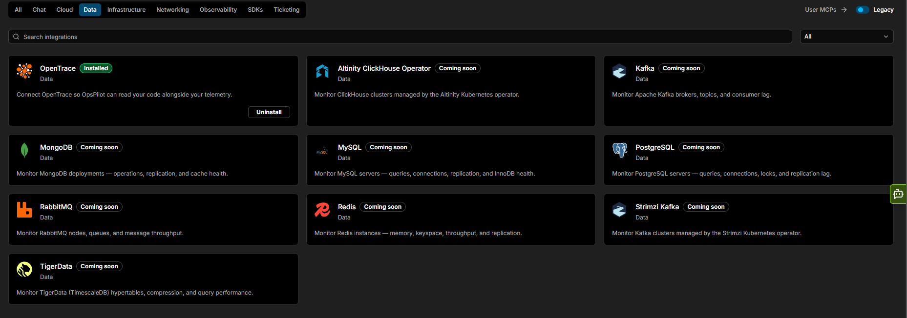
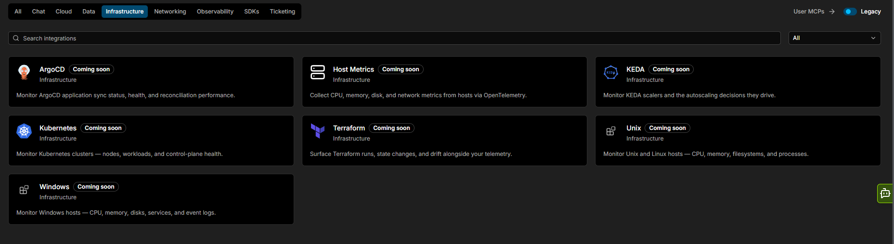
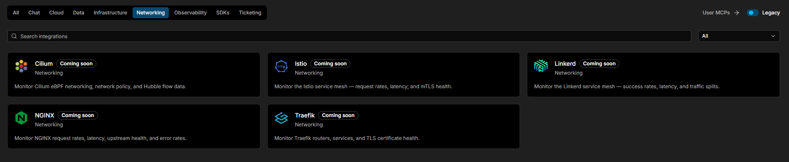
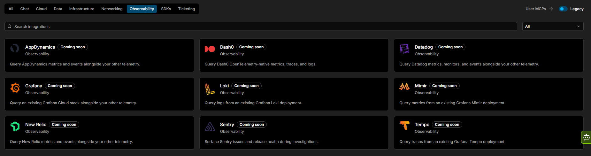
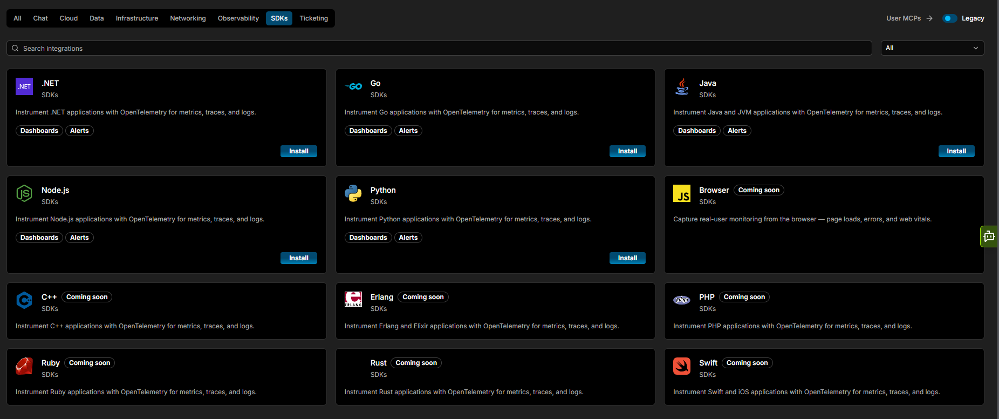
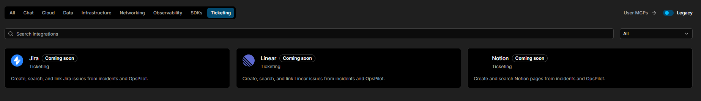

# Integrations Hub

=== "Integrations Hub"

    

=== "Chat"

    

=== "Cloud"

    

=== "Data"

    

=== "Infrastructure"

    

=== "Networking"

    

=== "Observability"

    

=== "SDKs"

    

=== "Ticketing"

    

Integrations bring your data into OpsPilot from wherever it lives - chat tools, cloud providers, language SDKs, Kubernetes, databases, and more - so you can work with all of it in one place. Most install in a single click and arrive with dashboards and alerts already set up for you.

Navigate to **Integrations** from the left-hand sidebar to browse the integration catalog and manage what you've installed.

---

## Browsing integrations

Integrations are grouped into categories, each showing how many it holds. Use the filter tabs at the top of the page to narrow the list:

| Tab | Description |
|---|---|
| **All** | Shows every integration |
| **Chat** | Messaging and notification tools |
| **Cloud** | Cloud platform providers |
| **Data** | Databases and data streaming services |
| **Infrastructure** | Infrastructure and orchestration tools |
| **Networking** | Service mesh and proxy tools |
| **Observability** | Third-party monitoring and observability platforms |
| **SDKs** | Language SDKs |
| **Ticketing** | Issue tracking and project management tools |

Use the **Search integrations** bar to find one by name, and the status dropdown beside it to filter by whether an integration is installed. The **Legacy** toggle, at the right-hand end of the category tabs, switches to the legacy integrations - earlier ones that are still available and still work. The legacy view lists those integrations on their own, without the category tabs, search, or state counters.

Each card shows the integration's name, its category, a short description, and its current status - **Coming soon** for one not yet released, or **Installed** for one already connected.

## User MCPs

**User MCPs**, in the toolbar beside the Legacy toggle, is a separate page for MCP integrations. These work differently from the rest of the catalog. Rather than being set up once for the organisation, **each person connects their own account**, and OpsPilot uses that connection only when answering that person in chat:

> These connect your own account, not your organisation's. The agent uses them only in chat, never in scheduled work or on anyone else's behalf.

That boundary is deliberate rather than a current limitation - MCP is not used for organisation-wide integrations.

The page is laid out like the integration catalog, and lists every MCP integration whether you have connected it or not: category tabs, a **Search MCP servers** bar, and a status filter offering **connected**, **not connected**, and **needs attention** for a connection whose authorisation has gone stale and needs renewing. Each card carries a **Connect** button and a link to the provider.

Disconnecting wipes that connection's data entirely.

### User MCPs and OpsPilot MCP

Both carry MCP in the name, and they point in opposite directions:

| | Direction | Where it is set up |
|---|---|---|
| **[OpsPilot MCP](Integrations/Chat/opspilot-mcp.md)** | Your assistant connects **in** to OpsPilot | In your client - Claude, Claude Code, or VS Code |
| **User MCPs** | OpsPilot connects **out** to your account | In OpsPilot, by connecting an external account |

So OpsPilot MCP does not appear under User MCPs. It is not something OpsPilot consumes - it is what OpsPilot offers.

## Installing an integration

For most integrations, onboarding is a single click. Click **Install** on an integration's card or from its detail view to open the install dialog, which shows:

- The **Permission tier** to install with, and what that tier requires
- Whether any configuration is needed - *This integration needs no configuration* means there is nothing else to set up
- Which account the install will serve, where that applies

Click **Install** to confirm, or **Cancel** to back out. Confirming takes you straight to [Manage integration](#managing-an-installed-integration), where you can check the installation's health and change its permission tier.

Once connected, the integration's card in the integration catalog shows an **Installed** badge and its button changes to **Uninstall**. On the integration's own detail view, the **Install** button is replaced - by **Installed**, or by the actions that integration offers once it is in place, such as **Connect** and **Add instance**.

Some integrations need more than a permission tier - credentials, endpoints, or other configuration. Where that applies, the steps are built into the UI, so you can work through them without leaving OpsPilot. [Slack](Integrations/Chat/slack.md) has its own **Add to Slack** button, which starts the Slack authorisation flow, and [AWS](Integrations/Cloud/aws.md) needs an IAM role or key with the right CloudWatch permissions.

### What you get

Installing an integration does more than connect a data source. OpsPilot automatically loads a set of default **dashboards** and **alerts** onto your account for that integration, so you have useful monitoring in place with nothing to build by hand.

How much you get for that click varies. Some integrations are self-contained - install one and it starts working. Others provision dashboards only, and depend on a collector you run and configure yourself, so their dashboards stay empty until you have set that up. [Docker](Integrations/Infrastructure/docker.md), [Proxmox VE](Integrations/Infrastructure/proxmox-ve.md), [Unix](Integrations/Infrastructure/unix.md) and [Windows](Integrations/Infrastructure/windows.md) are of the second kind: each needs Grafana Alloy collecting and forwarding the metrics before anything appears. Their **Installation guide** tab carries the steps.

The **Capabilities** panel on an integration's detail view names what it provisions. AWS, for example, declares **Data Sources**, **Dashboards**, **Recording Rules**, and **Alerts**. Some integrations declare none.

What arrives, and whether it is active straight away, varies by integration. The SDK integrations provision a runtime dashboard for each upstream metric-set version, plus a handful of runtime alert rules - Java installs 26 dashboards, Node.js nine, .NET eight, Go six, and Python five. Those alert rules ship **paused**, so you opt in per rule rather than being alerted on everything from day one, and once you enable a rule that choice persists across upgrades. Every threshold is either scale-free or derived from the runtime itself, so the rules apply unchanged whatever the size of your service.

Each SDK's rules sit in their own alert group, named after the language - `java_runtime_alerts`, for example. Check the **Versions** tab on an integration's detail view for what its current version installs.

Provisioned dashboards are tagged `integration` along with a tag for the integration itself, so you can find everything one of them added. Where an integration needs a shared resource such as a metrics data source, it adopts the account's existing one rather than creating its own - uninstalling the integration leaves that source in place.

### The integration detail view

Click any integration to open its detail view - this is where you'll find how to use it. The header shows the integration's name, its **category**, its **version**, and the **Install** button, with the same short description that appears on its card.

Below the header, the detail view is made up of these panels. Not every integration shows all of them - some have no **Overview**, for example:

| Panel | Description |
|---|---|
| **Overview** | What the integration does and why you'd use it |
| **Permission tiers** | The access levels the integration can run with, what each one requires, and which is applied by **default**. Tiers vary by integration - AWS offers **Read-only** and **Read + Write**, each needing different AWS IAM permissions, while OpsPilot MCP offers **Read-only** and **Read + Act** |
| **Capabilities** | Badges naming what the integration provisions, such as **Data Sources**, **Dashboards**, **Recording Rules**, and **Alerts**. Some integrations declare none |

Below those panels sit three tabs:

| Tab | Description |
|---|---|
| **Installation guide** | Any setup needed beyond installing the integration. For the SDK integrations this is a full walkthrough of instrumenting your application - the Go guide covers adding the `opentelemetry-go-contrib` runtime instrumentation and registering it at startup, then points you to the dashboard to open. Where nothing further is needed, the tab reads *This integration needs no setup beyond installing it* |
| **Versions** | Each released version, what upgrading from the previous one involves (**Initial version**, **Automatic**, or **Manual** where the upgrade takes action), and what changed in each. The current version is marked **latest** |
| **Licenses** | Any third-party work the integration includes, and the terms it carries. Where there is none, the tab reads *This integration includes no third-party work* |

### Your installation

Once you have installed an integration, a **Your installation** panel appears at the top of its detail view, above **Permission tiers**, listing what you have installed:

| Column | Description |
|---|---|
| **Name** | The name of your installation - the language for an SDK (such as, `dotnet`), or an identifier where the integration has no natural name |
| **Version** | The version you have installed |
| **Tier** | The active permission tier (such as, `read` or `act`) |
| **Health** | The installation's current health, such as **Healthy** |

Click the row to open **Manage integration**. Some installations also carry a **Manage** button, and the **...** menu at the right-hand end offers **Manage** and **Uninstall**.

An integration that supports more than one installation shows **Add instance** in the header, so it can be installed again - [AWS](Integrations/Cloud/aws.md), for example, is installed once per region.

### Managing an installed integration

**Manage integration** opens as soon as you confirm an install, and you can return to it later from the **Your installation** panel. It shows the installation's name and health, with the integration it was installed from, its category, and the installed version beneath, and an **Uninstall** button in the top right.

The **Permission tier** panel shows the **Active tier**, which you can change after installing:

- **Narrowing** the tier, granting the integration less access, applies straight away
- **Widening** it needs fresh credentials, so it means reinstalling the integration

The **Capabilities** panel shows what the integration provisions, the same as on its detail view.

---

## Available now

-   :material-robot-outline: **[OpsPilot MCP](Integrations/Chat/opspilot-mcp.md)** - Chat

    ---

    Let AI assistants query OpsPilot over the Model Context Protocol.

-   :material-chat-outline: **[Slack](Integrations/Chat/slack.md)** - Chat

    ---

    Talk to OpsPilot from Slack - mention it in a channel or DM it directly.

-   :material-cloud-outline: **[AWS](Integrations/Cloud/aws.md)** - Cloud

    ---

    Connect AWS for EC2, RDS, and other CloudWatch-held metrics.

-   :material-code-tags: **[OpenTrace](Integrations/Data/opentrace.md)** - Data

    ---

    Connect OpenTrace so OpsPilot can read your code alongside your telemetry.

-   :material-server-network: **[Docker](Integrations/Infrastructure/docker.md)** - Infrastructure

    ---

    Monitor Docker containers - CPU, memory against limit, network and disk IO.

-   :material-server-network: **[Proxmox VE](Integrations/Infrastructure/proxmox-ve.md)** - Infrastructure

    ---

    Monitor Proxmox VE clusters, nodes, guests, and storage pools.

-   :material-server-network: **[Unix](Integrations/Infrastructure/unix.md)** - Infrastructure

    ---

    Monitor Unix and Linux hosts - CPU, memory, filesystems, and processes.

-   :material-server-network: **[Windows](Integrations/Infrastructure/windows.md)** - Infrastructure

    ---

    Monitor Windows hosts - CPU, memory, disks, and network.

### SDKs

Each SDK instruments your applications with OpenTelemetry for metrics, traces, and logs, and provisions runtime dashboards and alert rules for them. See [SDK Integrations](Integrations/SDKs/sdk-integrations.md) for what each one installs.

-   :material-code-braces: **Go**

    ---

    [OpenTelemetry instrumentation](/Monitor-your-data/OpenTelemetry/Instrumentation/Go/)

-   :material-dot-net: **.NET**

    ---

    [OpenTelemetry instrumentation](/Monitor-your-data/OpenTelemetry/Instrumentation/DotNet/)

-   :material-code-braces: **Java**

    ---

    Instruments Java and JVM applications. [OpenTelemetry instrumentation](/Monitor-your-data/OpenTelemetry/Instrumentation/Java/)

-   :material-nodejs: **Node.js**

    ---

    [OpenTelemetry instrumentation](/Monitor-your-data/OpenTelemetry/Instrumentation/node/)

-   :material-language-python: **Python**

    ---

    [OpenTelemetry instrumentation](/Monitor-your-data/OpenTelemetry/Instrumentation/Python/)

### FusionReactor

The [FusionReactor agent](Integrations/SDKs/fusionreactor.md) is **managed automatically** - it cannot be modified or removed. It provides:

- Discovery of services
- Application performance monitoring, to identify bottlenecks and optimize response times
- Centralized log collection, search, and analysis across all your applications
- Real-time code-level profiling to detect resource consumption patterns
- Visibility into servers, Kubernetes, and system-level resource utilization
- Intelligent anomaly detection and alerting for rapid incident response

---

## Coming soon

=== "Chat"

    Discord · MS Teams

=== "Cloud"

    Azure · Google Cloud

=== "Data"

    Altinity ClickHouse Operator · Kafka · MongoDB · MySQL · PostgreSQL · RabbitMQ · Redis · Strimzi Kafka · TigerData

=== "Infrastructure"

    ArgoCD · Host Metrics · iDRAC · KEDA · Kubernetes · Terraform · TrueNAS SCALE

=== "Networking"

    Cilium · Istio · Linkerd · NGINX · Traefik

=== "Observability"

    AppDynamics · Dash0 · Datadog · Grafana · Loki · Mimir · New Relic · Sentry · Tempo

=== "SDKs"

    Browser · C++ · Erlang · PHP · Ruby · Rust · Swift

=== "Ticketing"

    Jira · Linear · Notion

!!! note "Jira"
    Jira is listed as **Coming soon** because the new integration has not shipped yet. A [legacy Jira integration](Integrations/Ticketing/jira.md) is available today - switch on **Legacy**, at the right-hand end of the category tabs, to find it.

---

!!! question "Don't see the integration you need?"
    If the integration you're looking for isn't in the list, contact support in the chat bubble and let us know which one you need.
