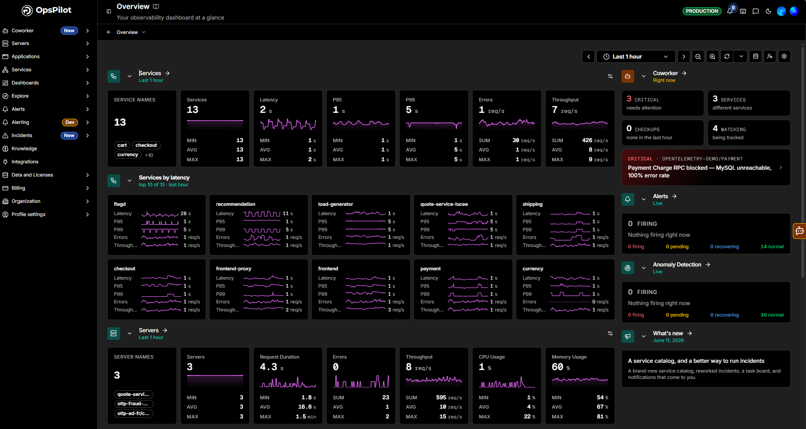
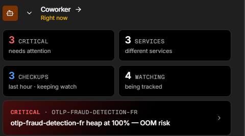
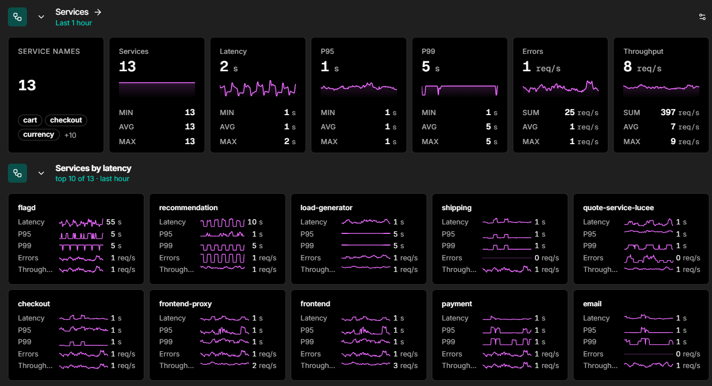
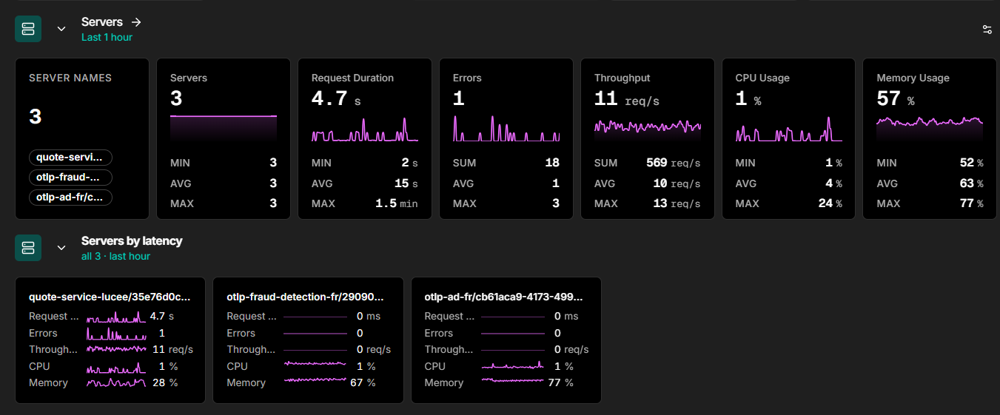
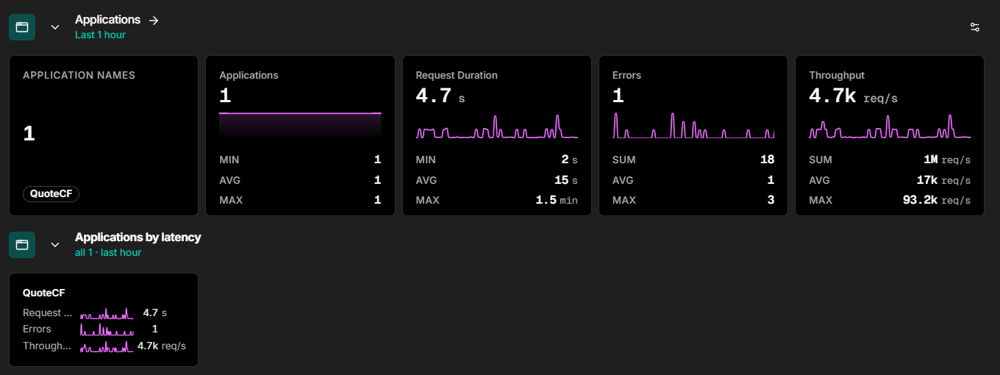
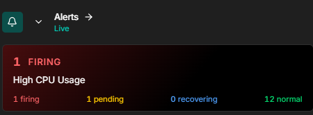
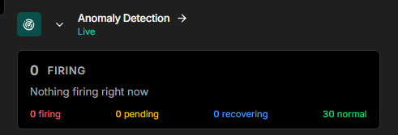

# Overview

The **Overview** page is your observability dashboard at a glance. It gives you an immediate, high-level summary of your entire environment - services, servers, applications, alerts, anomaly detection, and usage - all in one place.

## Active account view

Once your environment is sending data, the Overview page shows a full observability summary.

## Customising your dashboard

Click the **My dashboard** icon in the top right of the Overview to choose which sections are visible. Tick or untick any section to show or hide it:

- Coworker
- Services
- Services by latency
- Servers
- Servers by latency
- Applications
- Applications by latency
- Alerts
- Anomaly Detection

Click **Reset to org defaults** to restore the default layout.

### Coworker

The **Coworker** panel gives you a live summary of your AI teammate's activity, directly from the Overview page. A **Right now** label shows it reflects the current state.

Four cards summarise what Coworker is doing:

| Card | Description |
|---|---|
| **Critical** | Number of critical situations currently needing attention |
| **Services** | How many different services are currently affected |
| **Checkups** | Checks Coworker has run recently while keeping watch (for example, in the last hour) |
| **Watching** | Number of services and signals Coworker is actively tracking |

Below the cards, Coworker surfaces its top **critical situations** - each showing the severity, the affected service, and a one-line summary (for example, *"otlp-fraud-detection-fr heap at 100% - OOM risk"*). Click a situation to open it in the full Coworker view.

Click **Coworker →** to go to the full Coworker dashboard.

### Services

The **Services** section displays key performance metrics aggregated across all your monitored services for the last hour, shown as a row of stat cards. Each card shows the current value plus its **MIN**, **AVG**, and **MAX** across the range; count-based cards (**Errors** and **Throughput**) show **SUM**, **AVG**, and **MAX** instead.

| Card | Description |
|---|---|
| **Service names** | The services included in the summary, with a count and a sample of names |
| **Services** | Total number of monitored services |
| **Latency** | Average request latency across all services |
| **P95** | 95th percentile latency |
| **P99** | 99th percentile latency |
| **Errors** | Number of errors per second across all services |
| **Throughput** | Number of requests per second |

#### Services by latency

Below the summary metrics, **Services by latency** lists your top 10 services ranked by average latency over the last hour. Each service card shows:

- **Latency**
- **P95 / P99**
- **Errors**
- **Throughput**

Click any service card to drill into that service's detailed performance data.

### Servers

The **Servers** section provides a summary of all servers running a FusionReactor agent, shown as stat cards with each value's **MIN**, **AVG**, and **MAX** (count-based cards show **SUM**, **AVG**, and **MAX**):

- **Server names** - the servers included, with a count and a sample of names
- **Servers** - total number of servers
- **Request Duration**
- **Errors**
- **Throughput**
- **CPU Usage**
- **Memory Usage**

#### Servers by latency

Lists your servers ranked by average latency. Each card shows **Request Duration**, **Errors**, **Throughput**, **CPU**, and **Memory**.

Click **Servers ->** to go to the full [Servers](/Data-insights/Features/Servers/overview/) view.

### Applications

The **Applications** section summarises all monitored applications, shown as stat cards with each value's **MIN**, **AVG**, and **MAX** (count-based cards show **SUM**, **AVG**, and **MAX**):

- **Application names** - the applications included, with a count and a sample of names
- **Applications** - total number of applications
- **Request Duration**
- **Errors**
- **Throughput**

#### Applications by latency

Lists your applications ranked by average latency. Each card shows **Request Duration**, **Errors**, and **Throughput**.

Click **Applications ->** to go to the full [Applications](/Data-insights/Features/applications/) view.

### Alerts

The **Alerts** panel shows a live count of alerts grouped by state:

| State | Description |
|---|---|
| **Firing** | Alerts currently breaching their threshold |
| **Pending** | Alerts that have triggered but not yet confirmed |
| **Recovering** | Alerts returning to a normal state |
| **Normal** | Alert rules currently within threshold |

Click **Alerts ->** to go to the full [Alerts](/Data-insights/Features/Alerting/Active-alerts/) view.

### Anomaly Detection

The **Anomaly Detection** panel shows a live count of anomaly alerts by state, mirroring the same Firing / Pending / Recovering / Normal breakdown.

Click **Anomaly Detection ->** to go to the full [Anomaly Detection](/Data-insights/Features/Anomaly-Detection/ADoverview/) view.

### Usage

The **Usage** panel shows your current consumption against your plan limits for the current pay period:

| Signal | Description |
|---|---|
| **Logs** | Log volume ingested (MB / GB) |
| **Traces** | Trace volume ingested (MB / GB) |
| **Metrics** | Active metric series |
| **Agents** | Number of connected FusionReactor agents |
| **OpsPilot** | OpsPilot AI tokens consumed |

A progress bar indicates how much of your plan allowance has been used.

### What's new

The **What's new** panel surfaces the latest OpsPilot product announcements, each with a release date and a short summary of what changed.

## No Data view

If your account has no data yet, each section of the Overview displays a **Get Started** prompt to guide you through setup:

| Section | Prompt |
|---|---|
| **Services** | You'll need an API key to instrument your application with OpenTelemetry. |
| **Servers** | Install FusionReactor on your servers to start monitoring. You'll need a license key. |
| **Applications** | Install FusionReactor to monitor your applications. You'll need a license key. |
| **Coworker** | Set up your AI coworker to investigate alerts and track ongoing situations across the services you care about. |
| **Alerts** | Configure alert rules to monitor your infrastructure. |
| **Anomaly Detection** | Enable anomaly detection to automatically detect unusual behavior in your data. |

The **Servers** and **Applications** prompts also display your **OpsPilot license key** directly on the page so you can copy it for use during agent installation.

The **Usage** panel shows your plan limits with all values at zero until data starts flowing (for example, `0 bytes / 27 GB` for Logs).

Once data starts flowing in, the Overview automatically populates with your live metrics and telemetry.

!!! tip "Getting started"
    Follow the prompts on the Overview page to install the right agent or instrumentation for your stack, then return to the Overview to see your data appear.

---

!!! question "Need more help?"
    Contact support in the chat bubble and let us know how we can assist.
