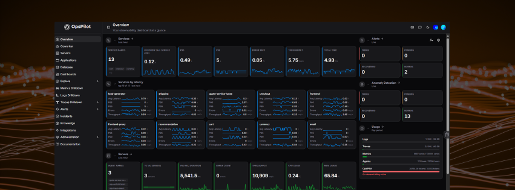

# Get Started with OpsPilot

From sign-up to your first insights in minutes.

This guide walks you through creating your account, connecting your first data source, and exploring your initial views in OpsPilot.

!!! info "Already have an account?"
    [Sign in](https://app.opspilot.com/auth/login) and head to your dashboard to start exploring your data. If you have an invitation, follow the link in your invitation email to access your organization.

---

## Step 1 — Create Your Account

Navigate to [app.opspilot.com/auth/register](https://app.opspilot.com/auth/register) and sign up. Once signed in, you will be prompted to set up your organization.

!!! tip
    Once signed in, you are prompted to define the name of your organization before proceeding to the dashboard.

---

## Step 2 — Send Your First Data

The fastest way to start sending data is through the in-app onboarding, which provides step-by-step instructions tailored to your platform.

!!! tip
    Each integration in the in-app onboarding includes your endpoint and authorization token pre-filled, so you can copy and run them directly — no need to hunt through Settings.

OpsPilot supports a wide range of integrations across SDKs, cloud providers, technologies, and observability pipelines. Find detailed setup instructions for your specific stack in the [Integrations Hub](/Data-insights/Features/integrations/).

---

## Step 3 — Explore Your Data

Once data is flowing, OpsPilot gives you full visibility across your stack.

| Where to look | What you'll find |
|---|---|
| [Servers](/Data-insights/Features/Explore-servers/) | Live and historic server health |
| [Applications](/Data-insights/Features/applications/) | Request rates, errors, and latency |
| [Dashboards](/Data-insights/Features/dashboards/) | Pre-built and custom visualizations |
| [Explore](/Data-insights/Features/explore/) | Ad-hoc metrics, logs, and traces |
| [Alerts](/Data-insights/Features/Alerting/Alerts-overview/) | Set up rules and get notified |

---

!!! question "Need more help?"
    Contact support in the chat bubble and let us know how we can assist.
