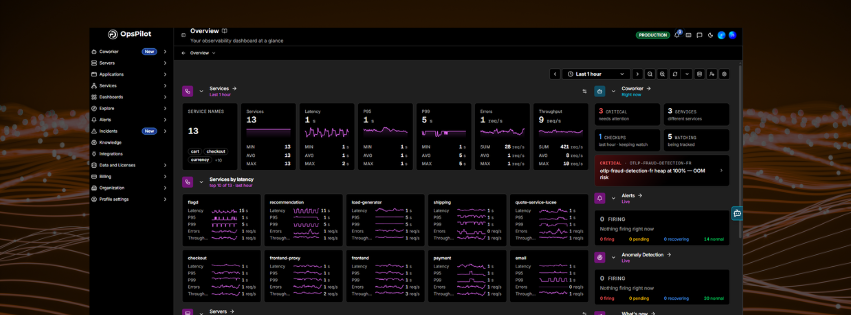
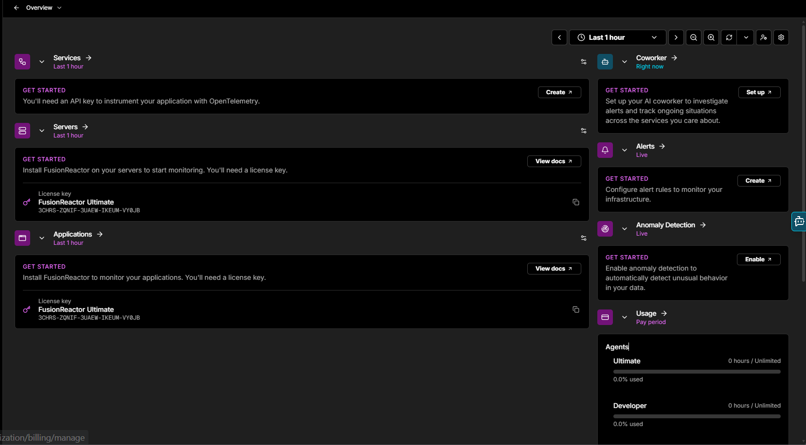

# Get Started with OpsPilot

OpsPilot, formerly FusionReactor Cloud, is an AI-powered observability and SRE platform. This guide walks you through creating your account, connecting your first data source, and exploring your initial views - from sign-up to your first insights in minutes.

!!! info "Already have an account?"
    [Sign in](https://app.opspilot.com/auth/login) and head to your dashboard to start exploring your data. If you have an invitation, follow the link in your invitation email to access your organization.

---

## Step 1 - Create your account

Navigate to [app.opspilot.com/auth/register](https://app.opspilot.com/auth/register) and sign up. You're then guided through a short setup:

1. **Name your organization.**
2. **Invite colleagues** (optional) - add their email addresses to bring your team in, or skip for now.
3. OpsPilot sets up your account. While you wait, use the **See the instrumentation guide** link to get a head start on [instrumenting your application](#step-2-instrument-your-application).

### What you'll see first

When setup finishes, you land on the **Overview** - your observability dashboard. With no data connected yet, each section shows a **Get Started** prompt telling you exactly what to install or configure:

- **[Coworker](/Data-insights/Features/OpsPilot/Coworker/getting-started/)** - set up your AI SRE teammate to investigate alerts and track ongoing situations across the services you care about.
- **[Servers](/Data-insights/Features/Servers/overview/)** and **[Applications](/Data-insights/Features/applications/)** - install the FusionReactor agent to start monitoring. Your **license key** is shown here, ready to copy.
- **[Services](/Data-insights/Features/Services/overview/)** - instrument with OpenTelemetry using an **API key**.
- **[Alerts](/Data-insights/Features/Alerting/Alerts-overview/)** and **[Anomaly Detection](/Data-insights/Features/New-alerting/anomaly-detectors/)** - create alert rules or enable anomaly detection once data is flowing.

---

## Step 2 - Instrument your application

Send telemetry from your applications using OpenTelemetry or the [FusionReactor agent](/Data-insights/Features/Integrations/SDKs/fusionreactor/).

!!! info "You'll need an API key"
    OpenTelemetry data is authenticated with an OpsPilot **API key**. Create one from the [API Keys](/Admin-and-data/api-keys/) page - or click **Create** on the **Services** card on your Overview - then add it to your exporter configuration.

Select your language:

  <a href="/Monitor-your-data/OpenTelemetry/Instrumentation/Cpp/" class="lang-btn">
    C++
  </a>
  <a href="/Monitor-your-data/OpenTelemetry/Instrumentation/DotNet/" class="lang-btn">
    .NET
  </a>
  <a href="/Monitor-your-data/OpenTelemetry/Instrumentation/Erlang/" class="lang-btn">
    Erlang
  </a>
  <a href="/Monitor-your-data/OpenTelemetry/Instrumentation/Go/" class="lang-btn">
    Go
  </a>
  <a href="/Monitor-your-data/OpenTelemetry/Instrumentation/Java/" class="lang-btn">
    Java
  </a>
  <a href="/Monitor-your-data/OpenTelemetry/Instrumentation/Kotlin/" class="lang-btn">
    Kotlin
  </a>
  <a href="/Monitor-your-data/OpenTelemetry/Instrumentation/node/" class="lang-btn">
    Node.js
  </a>
  <a href="/Monitor-your-data/OpenTelemetry/Instrumentation/PHP/" class="lang-btn">
    PHP
  </a>
  <a href="/Monitor-your-data/OpenTelemetry/Instrumentation/Python/" class="lang-btn">
    Python
  </a>
  <a href="/Monitor-your-data/OpenTelemetry/Instrumentation/Ruby/" class="lang-btn">
    Ruby
  </a>
  <a href="/Monitor-your-data/OpenTelemetry/Instrumentation/Rust/" class="lang-btn">
    Rust
  </a>
  <a href="/Monitor-your-data/OpenTelemetry/Instrumentation/Swift/" class="lang-btn">
    Swift
  </a>
  <a href="https://docs.fusionreactor.io/Getting-started/install-fr/" class="lang-btn">
    CF
  </a>

Or deploy an [OpenTelemetry Collector](/Monitor-your-data/OpenTelemetry/Shipping/Collector/) to receive and forward telemetry from your services.

---

## Step 3 - Connect your infrastructure

Get metrics, logs, and traces flowing from your infrastructure using **Grafana Alloy** or standalone **OpenTelemetry exporters**.

| Signal | How to ship it |
|---|---|
| **Metrics** | Run an OTel-compatible exporter (e.g. Node Exporter, cAdvisor) and forward via [Grafana Alloy](/Monitor-your-data/OpenTelemetry/Shipping/Collector/) or the [OTel Collector](/Monitor-your-data/OpenTelemetry/Shipping/Collector/) |
| **Logs** | Use the Alloy `loki.source` component or the OTel `filelog` receiver to tail and forward log files |
| **Traces** | Configure your collector or Alloy pipeline to receive and forward spans to OpsPilot |

[Grafana Alloy](https://grafana.com/docs/alloy/latest/) is a flexible, vendor-neutral collector that can scrape, transform, and forward all three signal types in a single agent.

!!! info "Integration Hub - coming soon"
    A full self-serve Integration Hub with one-click setup for cloud providers, databases, Kubernetes, and more is on the way. Watch this space.

---

## Step 4 - Get answers with AI

Once data is flowing, OpsPilot's AI works in two ways:

- **Coworker** - your AI SRE teammate that runs automated investigations in the background, surfaces prioritised insights, and flags issues before they escalate. [Learn more](/Data-insights/Features/OpsPilot/Coworker/overview/)
- **OpsPilot Chat** - ask questions in plain English to query your telemetry, investigate specific issues, or get on-demand AI analysis across metrics, logs, and traces.

---

## Step 5 - Explore your data

Dive deeper into your data using the built-in drilldown tools.

| Where to look | What you'll find | Required integration |
|---|---|---|
| [UI Overview](/Data-insights/Features/overview/) | A tour of the OpsPilot interface | Any |
| [Servers](/Data-insights/Features/Servers/overview/) | Live and historic server health | FusionReactor agent |
| [Applications](/Data-insights/Features/applications/) | Request rates, errors, and latency | FusionReactor agent |
| [Dashboards](/Data-insights/Features/Dashboards/about-dashboards/) | Pre-built and custom visualizations | Any |
| [Metrics Drilldown](/Data-insights/Features/explore-metrics/) | Explore Prometheus metrics without PromQL | OpenTelemetry / Prometheus |
| [Logs Drilldown](/Data-insights/Features/explore-logs/) | Filter and analyze logs without LogQL | OpenTelemetry / Loki |
| [Traces Drilldown](/Data-insights/Features/explore-traces/) | Trace requests across services | OpenTelemetry |
| [Alerts](/Data-insights/Features/Alerting/Alerts-overview/) | Set up rules and get notified | Any |

---

!!! question "Need more help?"
    Contact support in the chat bubble and let us know how we can assist.
